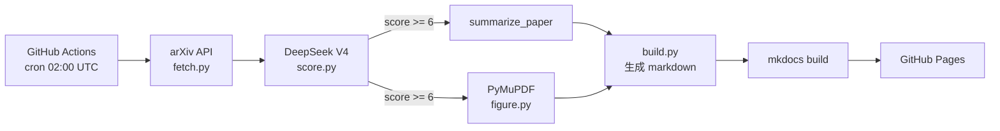

# 关于本站

## 这是什么

**Embodied arXiv 雷达** 每天自动从 arXiv 抓取**具身智能（Embodied AI）**相关的新论文，调用 DeepSeek V4 生成中文摘要、提炼核心 trick、用 PyMuPDF + 启发式自动抽取论文中的 framework 图，发布为静态网站。

## 数据流

1. **抓取**：每天 UTC 02:00（北京 10:00）GitHub Actions 自动触发
2. **筛选**：覆盖 `cs.RO` 全量 + `cs.AI/CV/LG` 中含具身智能关键词的论文
3. **打分**：DeepSeek V4 对每篇论文 0-10 分相关性评分
4. **总结**：对得分 ≥ 6 的论文生成结构化中文摘要
5. **抽图**：PyMuPDF 抽取所有嵌入图 + 启发式选 framework 图
6. **发布**：构建 MkDocs 站点并部署到 GitHub Pages

## Trick 字段是什么

每篇笔记中的 **Trick** 字段是 DeepSeek 提炼的"核心技术 trick / 关键 insight"，目的是让你**1 分钟决定一篇论文值不值得精读**。

## 自己 fork 一份追自己的方向

仓库 MIT 开源：[github.com/hyyyyyyz/embodied-arxiv](https://github.com/hyyyyyyz/embodied-arxiv)

Fork 之后只需要：
1. 改 `config.yaml` 里的 `categories` 和 `keywords`（比如换成 NLP / 理论 / CV）
2. 改 `scripts/score.py` 里两个 system prompt（领域知识）
3. 在你 fork 的 repo 里加 `DEEPSEEK_API_KEY` secret
4. 启用 GitHub Pages（Source: GitHub Actions）

就能跑起一份你自己方向的 arXiv 雷达。

## 引用

- 论文数据：[arXiv.org](https://arxiv.org)
- 摘要/打分：[DeepSeek](https://www.deepseek.com)
- 站点框架：[MkDocs Material](https://squidfunk.github.io/mkdocs-material/)
- 部署：GitHub Pages + GitHub Actions

## 免责声明

本站所有 AI 生成的中文摘要、trick 提炼、评价仅供参考，可能存在误读。研究决策请以原论文为准。论文版权归原作者所有。
