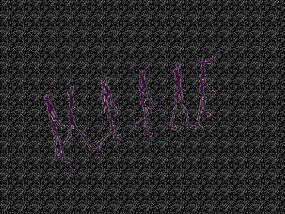
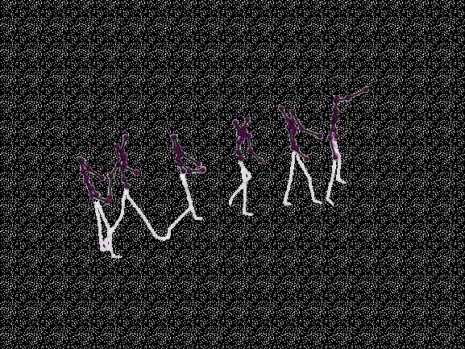
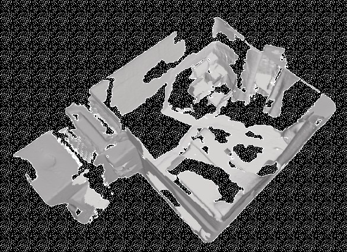
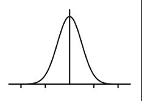
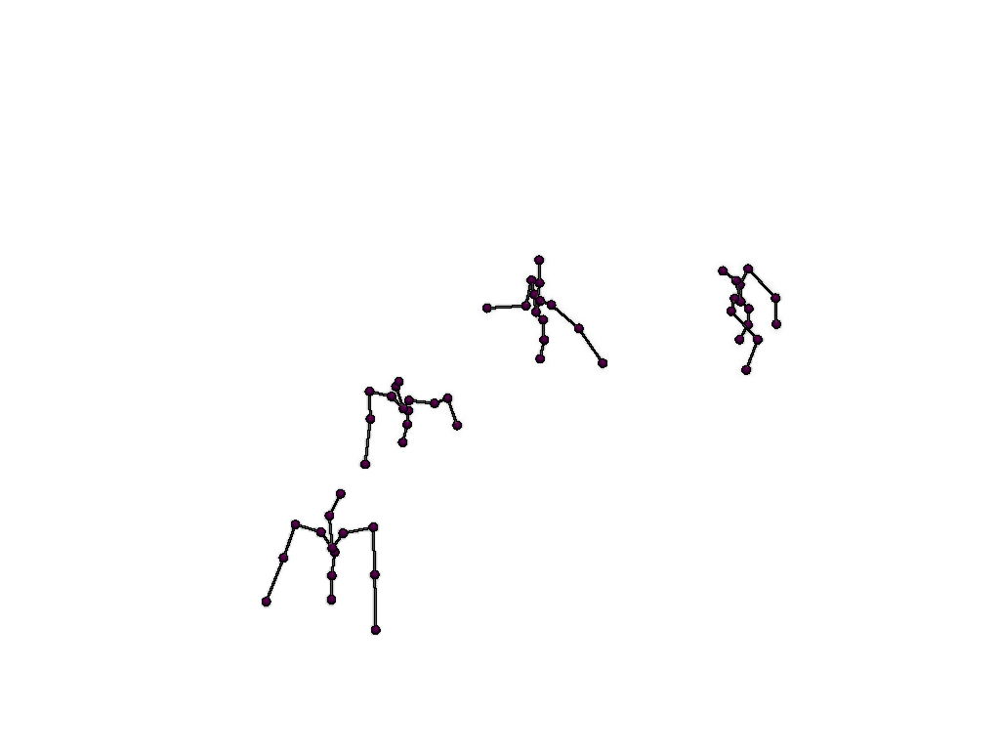

# 扩散模型统一人体运动跟踪与预测，提升MAV导航

[← 返回 2026-05-27 列表](index.md){ .back-link }

### HumanFlow -- Diffusion-Driven MAV Navigation Among Humans via Tightly-Coupled Motion Tracking, Forecasting, and Control

  ⭐ 9.0
  navigation
  2605.25685

*Simon Schaefer, Joshua Näf, Stefan Leutenegger*

<figure markdown>
  
  <figcaption>Fig. 2. Overview of HumanFlow. First, clean human motion is encoded into a compact latent space (I). Subsequently, a latent diffusion model is trained to denoise, complete, and forecast human motion sequences, conditioned on scene context a</figcaption>
</figure>

!!! tip "💡 Trick — 关键技术 insight"
    1. 使用潜在扩散模型同时进行人体运动跟踪和预测，并以3D场景上下文为条件，解决遮挡和部分可见性问题。2. 将扩散模型的潜在表示与基于流匹配的近似MPC策略紧密耦合，实现控制与感知的联合优化。

## 摘要

本文提出HumanFlow，一种潜在扩散模型，统一了人体运动跟踪和预测，并以3D场景上下文为条件。在严重遮挡等挑战条件下，该模型能生成平滑准确的预测，跟踪精度优于现有方法，且效率更高。此外，通过将HumanFlow的潜在空间与基于流匹配的近似MPC策略耦合，实现了控制与感知的紧密集成。在仿真中使用真实人体轨迹进行MAV社交导航验证，表明该方法在部分可观测条件下仍能保持无碰撞，导航性能优越。

**Tags**: `diffusion-model` `human-motion-prediction` `mav-navigation` `model-predictive-control` `social-navigation`

## 📝 我的评价

值得精读。贡献在于将扩散模型用于人体运动跟踪与预测的统一框架，并与控制策略紧密耦合，解决了遮挡下的鲁棒性问题。与现有工作相比，创新性地将感知与控制在潜在空间结合，提升了导航安全性和效率。

## 📷 论文中其他图

---

[📄 arXiv 摘要页](http://arxiv.org/abs/2605.25685v1) &nbsp;·&nbsp; [📑 PDF 全文](https://arxiv.org/pdf/2605.25685v1)
