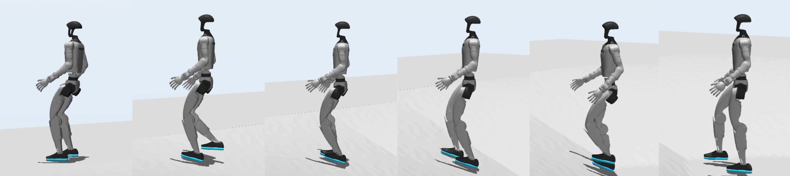
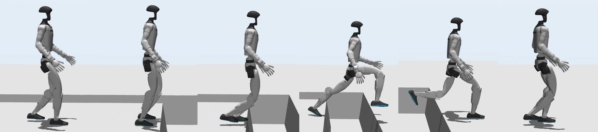
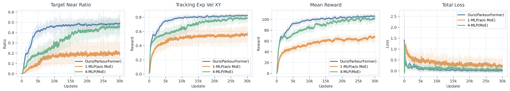
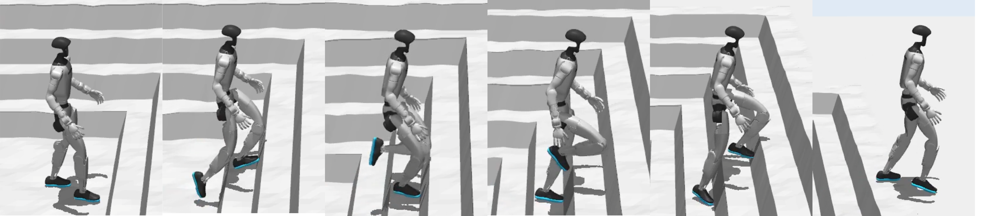
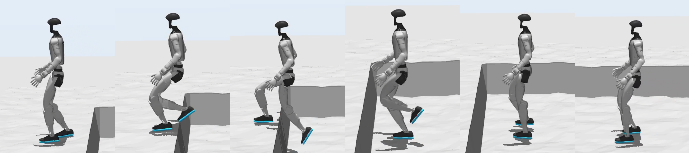

# Transformer序列建模+未来状态预测的人形机器人跑酷策略

[← 返回 2026-05-27 列表](index.md){ .back-link }

### ParkourFormer: Integrating Predictive Supervision and Sequence Modeling into Parkour Locomotion

  ⭐ 10.0
  locomotion
  2605.25782

*Yanheng Mai, Wenhao Xu, Zirui Huang, Yifei Fu 等 9 位*

<figure markdown>
  
  <figcaption>Figure 3: ParkourFormer Seq2Seq locomotion pipeline. ParkourFormer is a Transformer-based Seq2Seq framework for parkour locomotion. It processes historical observations via cross-attention, fuses terrain features using conditional SwiGLU FF</figcaption>
</figure>

!!! tip "💡 Trick — 关键技术 insight"
    核心创新在于将人形机器人敏捷运动建模为未来条件决策问题：通过交叉注意力机制让当前状态查询历史轨迹，同时用轻量级预测头预测短时域未来本体感受状态，并将预测的未来状态与时间特征融合生成动作。这使得策略能够同时推理运动历史和预期未来动态，克服了传统强化学习策略仅依赖当前观测的局限性。

## 摘要

人形机器人跑酷需要协调全身动力学应对楼梯、间隙、斜坡等快速变化地形。现有强化学习策略多为反应式，直接映射观测到动作，缺乏对未来身体状态的显式建模。本文提出ParkourFormer，一种基于Transformer的序列建模框架，将人形机器人运动重构为未来条件决策问题：当前状态通过交叉注意力查询历史传感器运动轨迹，同时轻量级预测头预测短时域未来本体感受状态，预测的未来状态与时间特征融合生成动作。在包含楼梯、间隙、斜坡、粗糙地形和障碍物穿越的多地形人形机器人跑酷基准上评估，仿真和实物实验表明，ParkourFormer在极具挑战性地形上平均穿越成功率达93.85%，相比强MLP、基于MoE的MLP和普通Transformer基线提升高达42.73%，且所有地形类型使用单一统一策略。结果表明显式未来状态建模显著提升了敏捷全身运动的鲁棒性和泛化性。

**Tags**: `transformer` `humanoid-locomotion` `parkour` `sequence-modeling` `future-state-prediction`

## 📝 我的评价

值得精读。该工作将未来状态预测显式引入人形机器人敏捷运动策略，与常见隐式建模方法有本质区别，且实物验证成功率高。贡献在于提出了一种可解释的预测-控制框架，对复杂地形泛化性提升显著。

## 📷 论文中其他图

---

[📄 arXiv 摘要页](http://arxiv.org/abs/2605.25782v2) &nbsp;·&nbsp; [📑 PDF 全文](https://arxiv.org/pdf/2605.25782v2)
