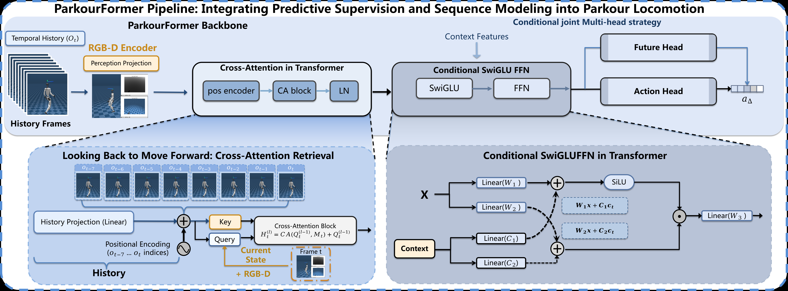

<a class="back-btn" href="../">← 返回 2026-05-27</a>

# 提出Transformer序列建模框架，显式预测未来状态提升人形机器人跑酷运动能力

### ParkourFormer: Integrating Predictive Supervision and Sequence Modeling into Parkour Locomotion

⭐ 10.0
locomotion
2605.25782

📄 <a href="http://arxiv.org/abs/2605.25782v2">arXiv 摘要页</a> &nbsp;·&nbsp; 📑 <a href="https://arxiv.org/pdf/2605.25782v2">PDF 全文</a>

*Yanheng Mai, Wenhao Xu, Zirui Huang, Yifei Fu 等 9 位*

<figure markdown>
  
  <figcaption>Figure 3: ParkourFormer Seq2Seq locomotion pipeline. ParkourFormer is a Transformer-based Seq2Seq framework for parkour locomotion. It processes historical observations via cross-attention, fuses terrain features using conditional SwiGLU FF</figcaption>
</figure>

## 💡 关键 Tricks

- ⭐ 核心 — **核心：将人形机器人运动重新定义为未来条件化的决策问题，通过轻量级预测头显式预测短时未来本体感受状态，并与时序特征融合生成动作，使策略能联合推理运动历史和预期未来动态。**
- 使用Transformer架构，通过交叉注意力机制让当前机器人状态查询历史传感器运动轨迹，有效利用时序信息。
- 预测的未来状态通过监督信号训练，确保预测准确性，从而提升动作生成的鲁棒性。
- 采用单一统一策略处理所有地形类型（楼梯、间隙、斜坡、粗糙地形、障碍物），无需切换策略，简化部署。
- 在仿真和真实人形机器人上验证，平均穿越成功率93.85%，相比MLP、MoE-MLP和普通Transformer基线提升高达42.73%。

## 📝 摘要

=== "中文"

    人形机器人跑酷需要运动策略协调全身动力学，以应对楼梯、间隙、斜坡和障碍物等快速变化的地形。现有的强化学习策略大多是反应式的，直接将观测映射到动作，没有显式建模未来身体状态。这种建模在敏捷运动任务中至关重要，因为成功的运动执行强烈依赖于预测即将到来的接触转换和身体动力学。我们提出了ParkourFormer，一个基于Transformer的序列建模框架，将人形机器人运动重新定义为未来条件化的决策问题。当前机器人状态通过交叉注意力查询历史传感器运动轨迹，同时一个轻量级预测头预测短时未来本体感受状态。预测的未来状态通过监督信号训练，与时序特征融合生成动作，使策略能够联合推理运动历史和预期未来动态。我们在一个包含楼梯、间隙、斜坡、粗糙地形和障碍物穿越的多样化多地形人形机器人跑酷基准上评估了ParkourFormer。在仿真和真实人形机器人上的实验表明，ParkourFormer在极具挑战性的地形上实现了93.85%的平均穿越成功率，相比强MLP、基于MoE的MLP和普通Transformer基线提升了高达42.73%，同时在所有地形类型上保持单一统一策略。这些结果表明，显式的未来状态建模显著提高了敏捷全身运动的鲁棒性和泛化能力。

=== "English"

    Humanoid parkour requires locomotion policies to coordinate whole-body dynamics across rapidly changing terrains such as stairs, gaps, slopes, and obstacles. Existing reinforcement learning policies are largely reactive, mapping observations directly to actions without explicitly modeling future body states. Such modeling becomes critical in agile locomotion tasks where successful motion execution depends strongly on anticipating upcoming contact transitions and body dynamics. We present ParkourFormer, a Transformer-based sequence modeling framework that reformulates humanoid locomotion as a future-conditioned decision-making problem. The current robot state queries historical sensorimotor trajectories through cross-attention, while a lightweight prediction head forecasts short-horizon future proprioceptive states. The predicted future states, trained with supervised signals, are fused with temporal features to generate actions, enabling the policy to jointly reason over motion history and anticipated future dynamics. We evaluate ParkourFormer on a diverse multi-terrain humanoid parkour benchmark including stairs, gaps, slopes, rough terrain, and obstacle traversal. Experiments in simulation and on a real humanoid robot show that ParkourFormer achieves a 93.85% average traversal success rate on highly challenging terrains, with improvements of up to 42.73% over strong MLP, MoE-based MLP, and vanilla Transformer baselines, while maintaining a single unified policy across all terrain types. These results demonstrate that explicit future-state modeling significantly improves robustness and generalization for agile whole-body locomotion.

## 🔗 与已有工作的关系

与传统的反应式强化学习方法（直接将观测映射到动作）不同，ParkourFormer通过显式预测未来本体感受状态来条件化决策，使策略能主动规划未来动态。相比基于MLP或MoE的方法，Transformer的序列建模能力更好地捕获长程依赖，而预测头则提供了前瞻性信息，这在敏捷运动中尤为关键。

## 📌 我的评价

该论文提出了一种新颖的显式未来状态预测方法，显著提升了人形机器人在复杂地形上的运动性能，实验充分且效果显著，值得精读。

---

**Tags**: `humanoid` `parkour` `transformer` `sequence-modeling` `reinforcement-learning`
