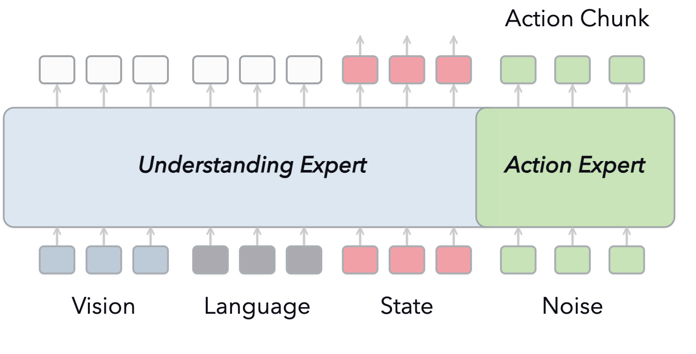
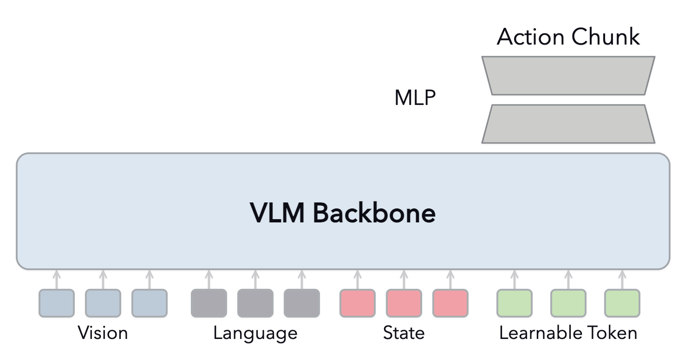
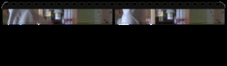
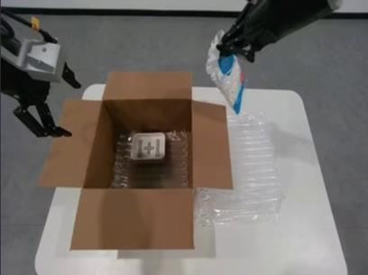

# 研究VLM表征对VLA初始化的影响

[← 返回 2026-05-27 列表](index.md){ .back-link }

### Rethinking VLM Representation for VLA Initialization

  ⭐ 10.0
  VLA
  2605.25802

*Weifeng Lin, Siyuan Huang, Hao Li, Tingwei Chen 等 8 位*

<figure markdown>
  
  <figcaption>Figure 1: Overview of our study design. We evaluate the resulting initializations across multiple base VLMs, action heads, and simulated benchmarks.</figcaption>
</figure>

!!! tip "💡 Trick — 关键技术 insight"
    通过控制实验设计，系统分析VLM表征的三个维度：具身VQA监督能力、参数更新策略、机器人数据预训练。发现保留预训练表征是关键，LoRA比全微调更可靠，分阶段LoRA训练效果最佳。

## 摘要

本文研究VLA初始化中预训练VLM表征的作用，通过控制实验分析三个维度：具身VQA监督、参数更新策略、机器人数据预训练。实验表明，原始VLM表征对动作性能至关重要，但具身VQA适应并非总是有益，其收益取决于下游瓶颈且不同能力域增益不可加。LoRA初始化比全微调更可靠，机器人数据预训练进一步提升性能，最佳方案是分阶段LoRA训练。结论是VLM到VLA的适应应注入动作相关的具身和轨迹信号，同时保留有用的预训练表征。

**Tags**: `vla` `vlm` `representation-learning` `lora` `robot-learning`

## 📝 我的评价

值得精读，系统分析了VLA初始化的关键因素，实验设计严谨，对实际应用有指导意义。与现有工作相比，更关注表征本身而非模型架构。

## 📷 论文中其他图

---

[📄 arXiv 摘要页](http://arxiv.org/abs/2605.25802v1) &nbsp;·&nbsp; [📑 PDF 全文](https://arxiv.org/pdf/2605.25802v1)
