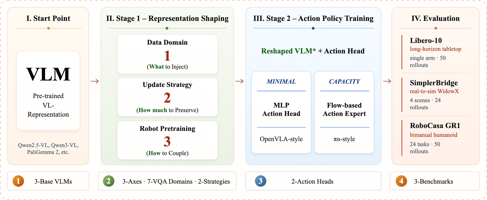

<a class="back-btn" href="../">← 返回 2026-05-27</a>

# 研究VLM表示对VLA初始化的影响

### Rethinking VLM Representation for VLA Initialization

⭐ 9.0
VLA
2605.25802

📄 <a href="http://arxiv.org/abs/2605.25802v1">arXiv 摘要页</a> &nbsp;·&nbsp; 📑 <a href="https://arxiv.org/pdf/2605.25802v1">PDF 全文</a>

*Weifeng Lin, Siyuan Huang, Hao Li, Tingwei Chen 等 8 位*

<figure markdown>
  
  <figcaption>Figure 1: Overview of our study design. We evaluate the resulting initializations across multiple base VLMs, action heads, and simulated benchmarks.</figcaption>
</figure>

## 💡 关键 Tricks

- ⭐ 核心 — **将VLA初始化分解为三个可控维度：能力级具身VQA监督、参数更新策略、机器人数据预训练，系统分析各因素作用。**
- 发现原始预训练VLM表示是动作性能的关键来源，过度重塑会削弱初始化效果。
- 具身VQA适应并非均匀有效，其收益取决于下游瓶颈，不同能力域的增益不可简单叠加。
- LoRA比全微调提供更可靠的初始化，表明保留预训练表示的重要性。
- 机器人数据预训练进一步提升初始化效果，最佳变体通过分阶段LoRA训练获得。
- 提出有效VLM到VLA适应应注入动作相关的具身和机器人轨迹信号，同时保留预训练表示。

## 📝 摘要

=== "中文"

    视觉-语言-动作（VLA）模型广泛采用预训练的视觉-语言模型（VLM）作为策略主干，但目前尚不清楚何种预训练VLM表示对VLA初始化有用。本文沿三个维度将VLA初始化作为可控表示设计问题进行研究：能力级具身VQA监督、参数更新策略和机器人数据预训练。实验表明，原始预训练VLM表示是动作性能的关键来源。然而，具身VQA适应并不带来均匀收益：其益处取决于下游瓶颈，且不同能力域的增益并非简单叠加。对于更新策略，LoRA比全微调提供更可靠的初始化，表明过度重塑预训练表示会削弱VLA初始化。机器人数据预训练进一步改善VLA初始化，最强变体通过分阶段LoRA训练获得。这些发现表明，有效的VLM到VLA适应应注入与动作相关的具身和机器人轨迹信号，同时保留对动作学习仍有用的预训练VLM表示。

=== "English"

    Vision-Language-Action (VLA) models widely adopt pretrained Vision-Language Models (VLMs) as policy backbones, yet it remains unclear what kind of pretrained VLM representation is useful as a VLA initialization. In this paper, we study VLA initialization as a controlled representation-design problem along three axes: capability-level embodied VQA supervision, parameter-update strategy, and robot-data pretraining. Our experiments show that the original pretrained VLM representation is a key source of action performance. However, embodied VQA adaptation does not yield uniform gains: its benefit depends on downstream bottlenecks, and gains from different capability domains are not simply additive. For update strategy, LoRA provides a more reliable initialization than Full Finetune, indicating that overly reshaping the pretrained representation can weaken VLA initialization. Robot-data pretraining further improves VLA initialization, with the strongest variant obtained by staged LoRA-based training. Together, these findings suggest that effective VLM-to-VLA adaptation should inject action-relevant embodied and robot-trajectory signals while preserving the pretrained VLM representation that remains useful for action learning.

## 🔗 与已有工作的关系

与直接使用预训练VLM作为VLA主干的方法相比，本文系统分析了不同VLM表示和适应策略的影响，揭示了保留原始表示的重要性。与全微调方法相比，LoRA策略更有效地保持预训练特征。

## 📌 我的评价

本文通过系统实验揭示了VLM表示对VLA初始化的关键作用，为VLA模型设计提供了实用指导，值得精读。

---

**Tags**: `vla` `vlm` `representation-learning` `initialization` `robotics`
