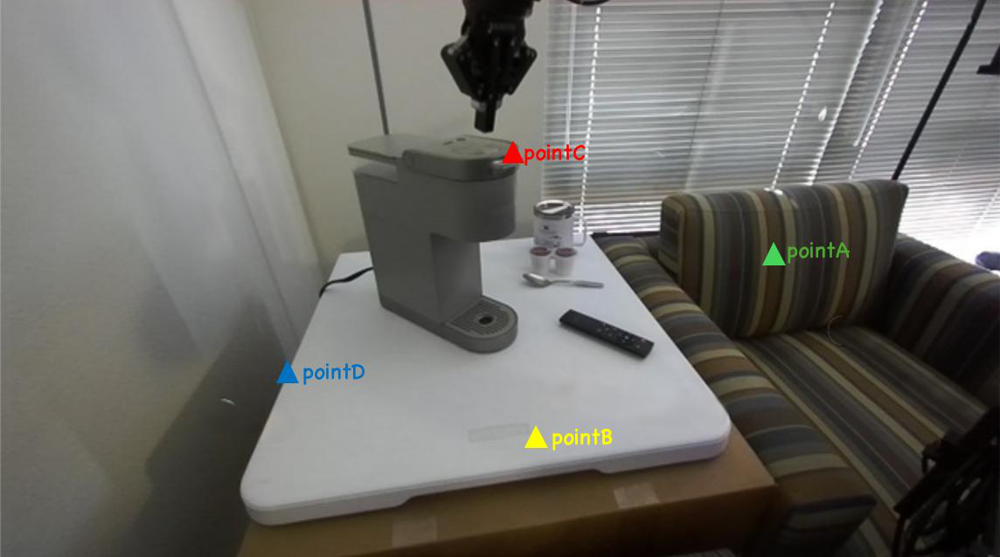
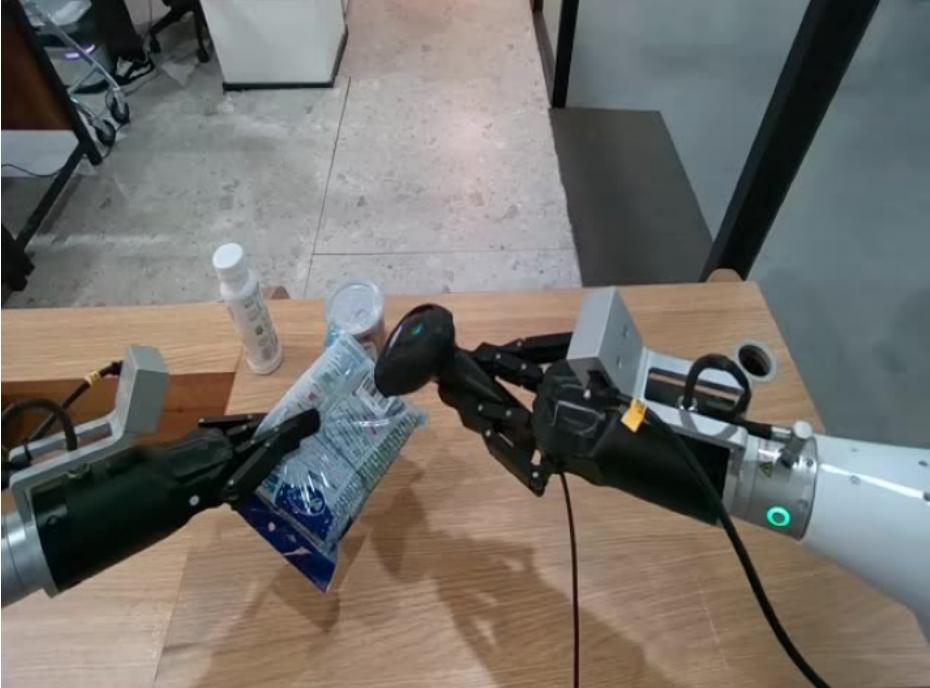
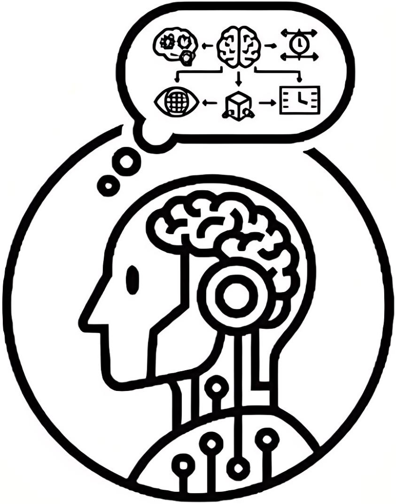
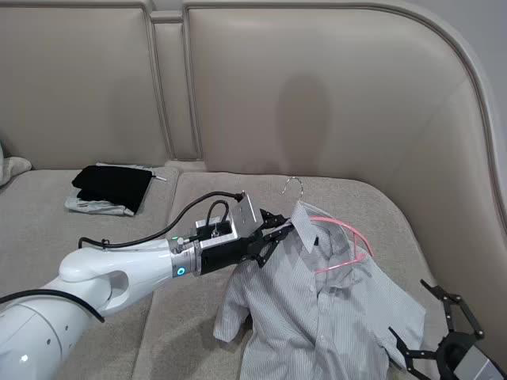

# 提出大规模EQA数据集与统一评估框架

[← 返回 2026-05-27 列表](index.md){ .back-link }

### Extending Embodied Question Answering from Perception to Decision

  ⭐ 9.0
  VLA
  2605.25813

*Xicheng Gong, Qiwei Li, Peiran Xu, Yadong Mu*

<figure markdown>
  
  <figcaption>Figure 1. Overview of EQA-Decision. Prior embodied QA datasets and benchmarks mainly target perception-oriented tasks, where models focus on describing what is visible. EQA-Decision extends this scope with decision-centric tasks that requir</figcaption>
</figure>

!!! tip "💡 Trick — 关键技术 insight"
    将EQA拆解为静态场景构建、空间理解、任务动态推理和即时决策四个互补维度，并构建超四百万QA对的大规模数据集；同时提出RoboDecision基线模型，统一评估感知、推理和动作级决策。

## 摘要

现有EQA数据集和基准碎片化，缺乏统一的大规模评估框架。本文提出EQA-Decision，一个大规模具身问答数据集，系统覆盖四个互补的具身推理维度：静态场景构建、空间理解、任务动态推理和即时决策，包含超过四百万个问答对及分层标注。同时开发了RoboDecision基线模型，与EQA-Decision基准对齐，提供统一框架联合评估感知、推理和动作级决策。实验表明，EQA-Decision能有效基准测试和增强VLM在空间与交互推理方面的能力，为推进具身智能研究奠定基础。

**Tags**: `embodied-qa` `dataset` `benchmark` `vlm` `decision-making`

## 📝 我的评价

值得精读。贡献在于构建了大规模、多维度、统一的EQA数据集和评估框架，弥补了现有碎片化不足。与已有工作相比，更强调决策层面，且数据集规模大、维度全，对具身智能研究有重要推动作用。

## 📷 论文中其他图

---

[📄 arXiv 摘要页](http://arxiv.org/abs/2605.25813v1) &nbsp;·&nbsp; [📑 PDF 全文](https://arxiv.org/pdf/2605.25813v1)
