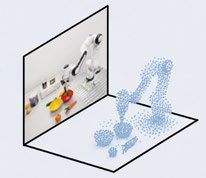
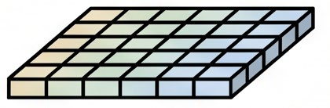

# 通过SE(3)轨迹预测对齐观测与动作空间

[← 返回 2026-05-27 列表](index.md){ .back-link }

### OASIS: Observation-Action Space Alignment via SE(3) Trajectory Prediction for Robotic Manipulation

  ⭐ 10.0
  VLA
  2605.25829

*Xinzhe Chen, Sihua Ren, Liqi Huang, Haowen Sun 等 8 位*

<figure markdown>
  
  <figcaption>Figure 2: Architecture of OASIS. The 3D-aware feature encoder merges image, language, and metric-depth features into a 3D-aware representation. The SE(3) trajectory predictor aligns the intermediate representation with the action space via </figcaption>
</figure>

!!! tip "💡 Trick — 关键技术 insight"
    核心在于将中间表示从观测空间对齐到动作空间，具体通过预测SE(3)末端执行器轨迹实现。该轨迹预测器使用位姿监督的隐藏状态，使动作解码器生成的动作为刚体运动，从而隐式恢复动作空间的几何结构。

## 摘要

现有VLA和WAM模型通过辅助空间特征或未来视觉状态预测丰富中间表示，但这些表示仍停留在观测空间，未共享动作空间的刚体几何，导致动作解码器需隐式恢复该几何。本文提出OASIS，一种通过SE(3)末端执行器轨迹预测对齐中间表示与动作空间的视觉运动策略。OASIS结合3D感知特征编码器（融合视觉-语言和度量深度特征）与SE(3)轨迹预测器（生成相机帧末端执行器轨迹）。基于预测器的位姿监督隐藏状态，动作解码器生成与刚体运动一致的动作块。在仿真和真实实验中，OASIS在成功率和分布外泛化上优于VLA和WAM基线。

**Tags**: `visuomotor-policy` `se3-trajectory-prediction` `action-space-alignment` `robotic-manipulation` `vla`

## 📝 我的评价

值得精读。贡献在于提出一种显式对齐观测与动作空间的方法，通过SE(3)轨迹预测引入刚体几何先验，与现有隐式方法有本质区别。实验充分，泛化性能突出。

## 📷 论文中其他图

---

[📄 arXiv 摘要页](http://arxiv.org/abs/2605.25829v1) &nbsp;·&nbsp; [📑 PDF 全文](https://arxiv.org/pdf/2605.25829v1)
