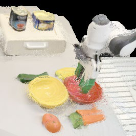

<a class="back-btn" href="../">← 返回 2026-05-27</a>

# 通过SE(3)轨迹预测对齐观测-动作空间的机器人操作策略

### OASIS: Observation-Action Space Alignment via SE(3) Trajectory Prediction for Robotic Manipulation

👀
⭐ 9.0
VLA
2605.25829

📄 <a href="http://arxiv.org/abs/2605.25829v1">arXiv 摘要页</a> &nbsp;·&nbsp; 📑 <a href="https://arxiv.org/pdf/2605.25829v1">PDF 全文</a>

*Xinzhe Chen, Sihua Ren, Liqi Huang, Haowen Sun 等 8 位*

<figure markdown>
  
  <figcaption>Figure 2: Architecture of OASIS. The 3D-aware feature encoder merges image, language, and metric-depth features into a 3D-aware representation. The SE(3) trajectory predictor aligns the intermediate representation with the action space via </figcaption>
</figure>

## 💡 关键 Tricks

- ⭐ 核心 — **提出SE(3)末端执行器轨迹预测器，在中间表示中显式建模刚体几何，使动作解码器能直接利用姿态监督的隐状态生成动作块，避免隐式恢复几何结构。**
- 设计3D感知特征编码器，融合视觉-语言特征与度量深度特征，为轨迹预测提供几何感知的观测表示。
- 在仿真和真实实验中，OASIS在成功率和分布外泛化上优于VLA和WAM基线，验证了动作空间对齐的有效性。

## 📝 摘要

=== "中文"

    最近的视觉-语言-动作（VLA）模型和世界动作模型（WAM）通过用辅助空间特征或未来视觉状态预测来丰富中间表示，从而推进了机器人操作。然而，这些表示在很大程度上仍停留在观测空间内，不共享动作空间的刚体几何，迫使动作解码器隐式恢复该几何。我们提出OASIS，一种通过SE(3)末端执行器轨迹预测将中间表示与动作空间对齐的视觉运动策略。OASIS结合了一个融合视觉-语言和度量深度特征的3D感知特征编码器，以及一个生成相机帧末端执行器轨迹的SE(3)轨迹预测器。以预测器的姿态监督隐状态为条件，动作解码器生成与刚体运动一致的动作块。在仿真和真实世界实验中，OASIS在成功率和分布外泛化方面优于VLA和WAM基线。我们的项目页面可在https://npuhandsome.github.io/OASIS_web获取。

=== "English"

    Recent vision-language-action (VLA) models and world action models (WAMs) advance robotic manipulation by enriching intermediate representations with auxiliary spatial features or future visual-state prediction. However, these representations largely remain within the observation space and do not share the rigid-body geometry of the action space, forcing the action decoder to implicitly recover this geometry. We propose OASIS, a visuomotor policy that aligns the intermediate representation with the action space via $SE(3)$ end-effector trajectory prediction. OASIS couples a 3D-aware feature encoder that fuses vision-language and metric-depth features with an $SE(3)$ trajectory predictor that produces a camera-frame end-effector trajectory. Conditioned on the predictor's pose-supervised hidden states, the action decoder generates action chunks consistent with rigid-body motion. Across simulation and real-world experiments, OASIS outperforms VLA and WAM baselines in success rate and out-of-distribution generalization. Our project page is available at https://npuhandsome.github.io/OASIS_web.

## 🔗 与已有工作的关系

与现有VLA模型（如OpenVLA）和世界动作模型（如DreamerV3）相比，OASIS的关键区别在于中间表示不再局限于观测空间，而是通过显式的SE(3)轨迹预测与动作空间对齐。传统方法依赖动作解码器隐式恢复刚体几何，而OASIS通过姿态监督的隐状态直接提供几何先验，减少了表示鸿沟。

👀 锐评

SE(3)轨迹预测作为中间监督的设计思路清晰，实验在仿真和真实场景均验证了有效性，分布外泛化提升尤其有说服力。但摘要未提及与纯3D感知方法（如VGGT）的对比，且SE(3)预测器对相机标定误差的鲁棒性存疑——若深度噪声较大，对齐可能反而引入偏差。

---

**Tags**: `vla` `world-model` `se3` `robotic-manipulation` `action-space-alignment`
