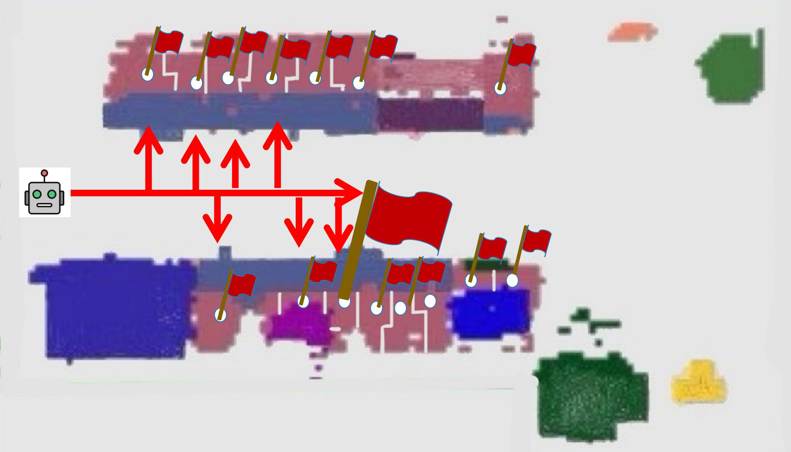
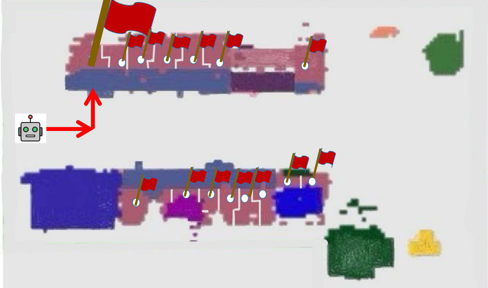
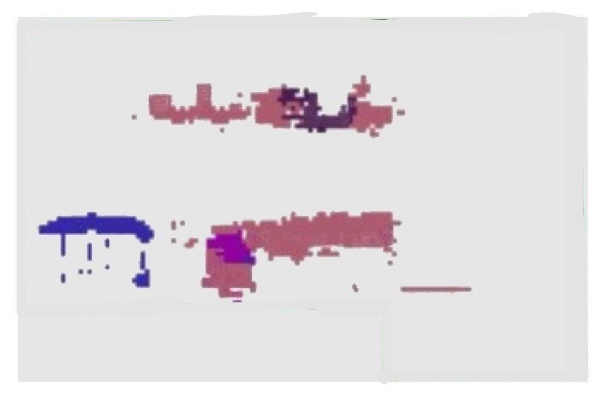
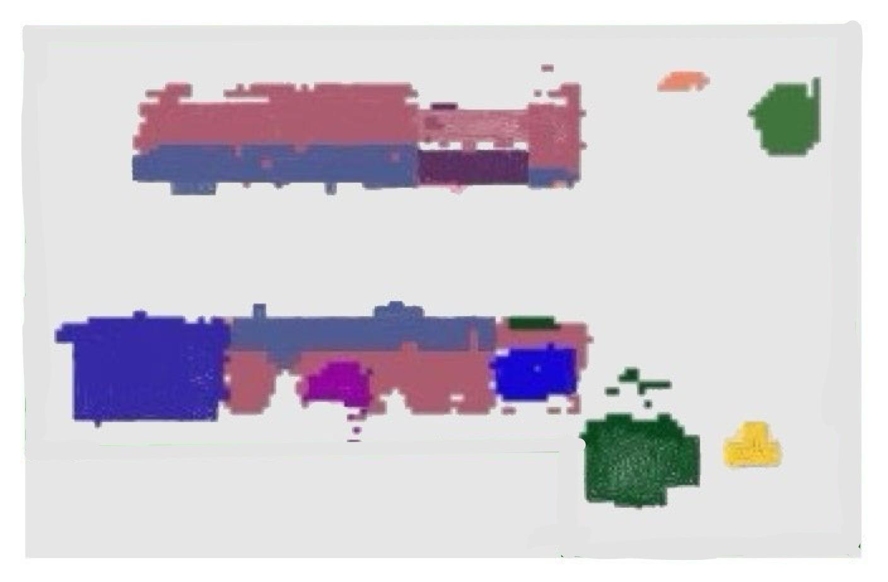
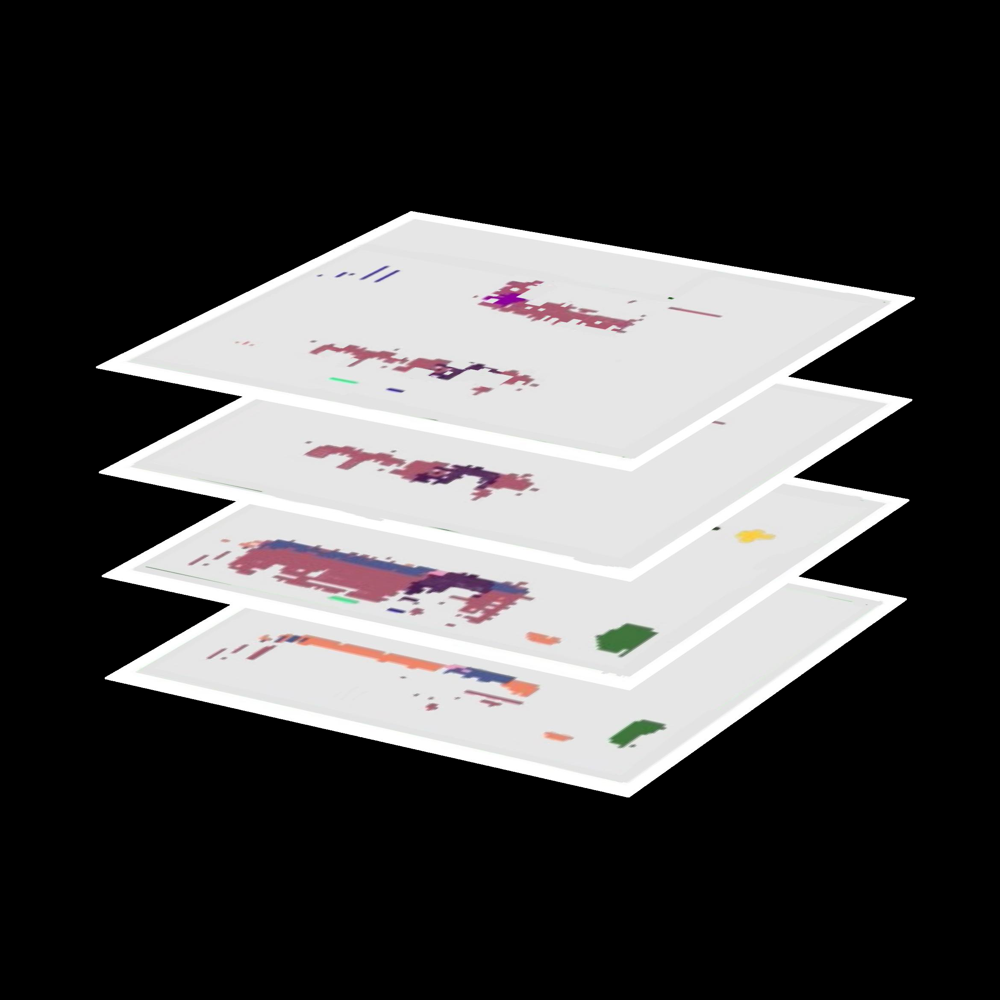

# 多层级重规划框架提升具身指令跟随性能

[← 返回 2026-05-27 列表](index.md){ .back-link }

### RePlan-Bot: Multi-Level Replanning for Embodied Instruction Following

  ⭐ 9.0
  navigation
  2605.25851

*Xicheng Gong, Guozheng Sun, Peiran Xu, Yadong Mu*

<figure markdown>
  
  <figcaption>Figure 2. The detailed pipeline of RePlan-Bot. At the high level, upon receiving natural-language commands, the Modular Planner generates an initial plan. The LLM-Auditor then refines this plan to make it more rational. During task executio</figcaption>
</figure>

!!! tip "💡 Trick — 关键技术 insight"
    1. 高层LLM审计器根据环境反馈动态调整子目标；2. 常识引导的搜索机制结合多层实例地图实现结构化物体定位；3. 轻量级ViT校正器提前修正高风险低级动作。三者协同实现持续重规划。

## 摘要

针对具身指令跟随中长程规划与不可逆状态变化导致的低成功率问题，提出RePlan-Bot。该方法集成高层LLM审计器动态调整子目标、常识引导搜索机制进行结构化物体定位、以及轻量级ViT校正器预防低级动作错误。在ALFRED基准上达到SOTA，在未见环境中也表现优异。

**Tags**: `embodied-instruction-following` `replanning` `llm` `vit` `alfred`

## 📝 我的评价

值得精读，多层级重规划思路新颖，结合LLM与视觉校正器，在ALFRED上SOTA，对长程任务有参考价值。

## 📷 论文中其他图

---

[📄 arXiv 摘要页](http://arxiv.org/abs/2605.25851v1) &nbsp;·&nbsp; [📑 PDF 全文](https://arxiv.org/pdf/2605.25851v1)
