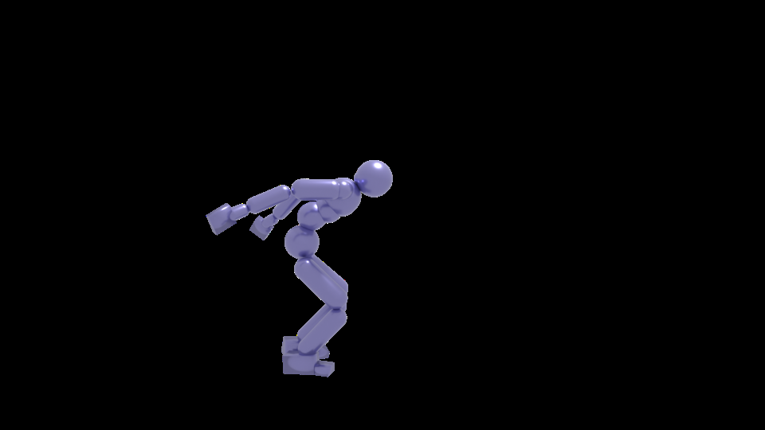

# 多尺度意图扩散实现文本驱动物理人形控制

[← 返回 2026-05-27 列表](index.md){ .back-link }

### MIND: Multi-Scale Intent Diffusion for Text-Driven Physics-Based Humanoid Control

  ⭐ 9.0
  locomotion
  2605.26006

*Bin Li, Ruichi Zhang, Han Liang, Jingyan Zhang 等 7 位*

<figure markdown>
  
  <figcaption>Fig. 2. Framework overview. Given text commands and humanoid states, MIND models humanoid intent at multiple temporal scales under a within diffusion framework. Specifically, the Holistic Intent Predictor (HIP) cap- tures global behavioral </figcaption>
</figure>

!!! tip "💡 Trick — 关键技术 insight"
    提出多尺度意图扩散机制，利用全局意图预测器捕捉整体行为动态，局部意图预测器提供细粒度信号，以行为意图作为语义桥梁弥合文本与动作的模态差距。将人形状态编码到潜在空间以增强语义意图建模。

## 摘要

现有文本驱动物理人形控制方法存在领域偏移或模态差距问题。本文提出MIND，一种端到端扩散框架，通过多尺度意图扩散机制，以行为意图作为语义桥梁，实现文本到动作的生成。全局意图预测器指导整体行为，局部意图预测器细化局部行为，并利用潜在状态编码提升语义对齐。实验表明MIND在行为连贯性、物理合理性和语义对齐上优于现有方法。

**Tags**: `diffusion` `humanoid-control` `text-driven` `behavioral-intent` `physics-based`

## 📝 我的评价

值得精读。核心创新在于多尺度意图扩散的设计，有效解决了文本与动作的语义鸿沟，实验充分。与现有两阶段和端到端方法相比，提供了新的思路。

## 📷 论文中其他图

---

[📄 arXiv 摘要页](http://arxiv.org/abs/2605.26006v1) &nbsp;·&nbsp; [📑 PDF 全文](https://arxiv.org/pdf/2605.26006v1)
