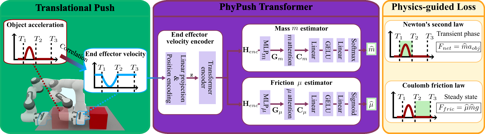

<a class="back-btn" href="../">← 返回 2026-05-27</a>

# 单次推动无传感器物理属性估计

### PhyPush: One Push is All You Need for Sensorless Physical Property Estimation with Physics-Guided Transformers

👀
⭐ 9.0
manipulation
2605.26284

📄 <a href="http://arxiv.org/abs/2605.26284v1">arXiv 摘要页</a> &nbsp;·&nbsp; 📑 <a href="https://arxiv.org/pdf/2605.26284v1">PDF 全文</a>

*Koyo Fujii, Luis Figueredo, Praminda Caleb-Solly, Ivan Boschi 等 7 位*

<figure markdown>
  
  <figcaption>Fig. 2: PhyPush system pipeline: The core intuition behind our PhyPush is that an object with distinct properties exhibits unique behavioral responses to the same push action. Therefore, our framework estimates these properties by observing</figcaption>
</figure>

## 💡 关键 Tricks

- ⭐ 核心 — **物理引导损失函数：将牛顿第二定律和库仑摩擦模型嵌入损失函数，约束网络输出符合物理规律，提升泛化性。**
- 仅用末端执行器速度：从单次推动的动力学数据中提取速度，无需力/力矩传感器或触觉阵列。
- Transformer架构：利用自注意力机制处理时序速度数据，隐式建模接触动力学。

## 📝 摘要

=== "中文"

    准确估计物体质量和摩擦系数是实现可靠自适应机器人操作的基础。尽管交互感知为推断这些属性提供了强大机制，但现有方法大多依赖力/力矩传感器、触觉阵列或多相机运动捕捉系统等专用硬件，限制了可扩展性和部署。本文提出PhyPush，一种物理引导的Transformer框架，仅利用单次推动中从运动学推导的末端执行器速度来估计物体的质量和摩擦系数，所需数据通常可从标准机械臂获得。该模型通过物理引导损失函数融入牛顿第二定律和库仑摩擦模型的约束，提高了物理一致性和对未见物体及表面的泛化能力。在多种仿真和真实世界设置中，PhyPush在具有挑战性的域外条件下始终实现更准确的质量和摩擦估计。在仿真中，与具有完整力信息特权的基线相比，误差降低超过10%；在真实实验中，其性能优于纯数据驱动损失的方法。总体而言，结果表明物理引导学习能够仅依靠单次推动和易获取的运动学数据实现低成本、传感器高效的物理属性估计。

=== "English"

    Accurately estimating object mass and friction is fundamental to achieving reliable and adaptive robotic manipulation. Although interactive perception provides a powerful mechanism for inferring such properties, most existing approaches depend on specialized hardware such as force/torque sensors, tactile arrays, or multi-camera motion-capture systems, limiting scalability and deployment. This paper presents PhyPush, a physics-guided Transformer framework that estimates an object's mass and friction coefficient using only kinematically derived end-effector velocity from a single push. This typically requires data available on standard robotic arms. The model incorporates constraints from Newton's second law and the Coulomb friction model through a physics-guided loss, improving physical consistency and generalization to unseen objects and surfaces. Across diverse simulation and real-world setups, PhyPush consistently achieves more accurate mass and friction estimation in challenging out-of-domain conditions. In simulation, it reduces error by over 10% compared with a baseline that has privileged access to full force information, while in real-world experiments, it outperforms a data-driven loss approach. Overall, the results demonstrate that physics-guided learning can enable low-cost, sensor-efficient estimation of physical properties, relying solely on a single push and readily available kinematic data.

## 🔗 与已有工作的关系

与依赖力传感器或触觉阵列的传统交互感知方法不同，PhyPush仅使用运动学数据，降低了硬件需求。与纯数据驱动方法相比，物理引导损失增强了泛化性。该方法可视为将物理模型嵌入Transformer的尝试，类似于某些物理信息神经网络（PINN）在机器人学中的应用。

👀 锐评

核心贡献在于用物理损失替代传感器，但单次推动的假设在真实场景中可能因接触不稳定而失效。仿真中与有特权信息的基线对比不够公平，因为基线可能过拟合。真实实验仅与数据驱动基线对比，缺少与有传感器方法的直接比较。

---

**Tags**: `physical-property-estimation` `physics-guided-learning` `transformer` `robotic-manipulation` `sensorless`
