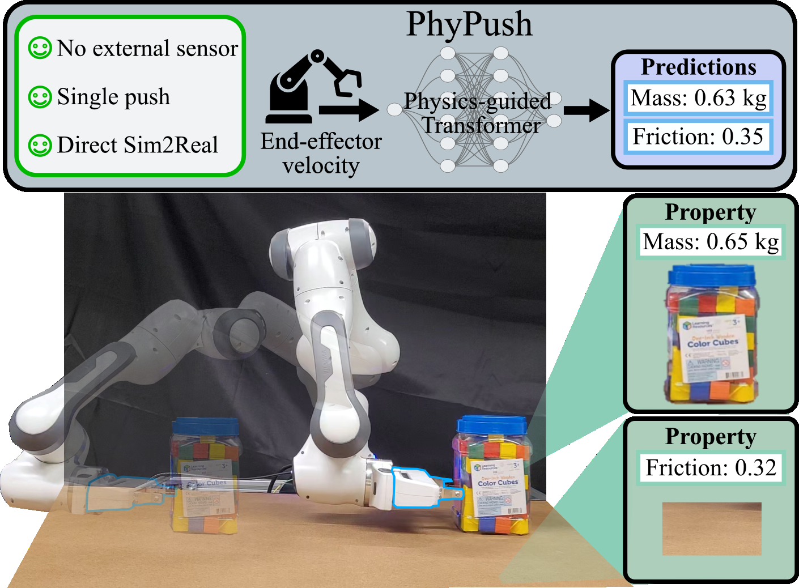
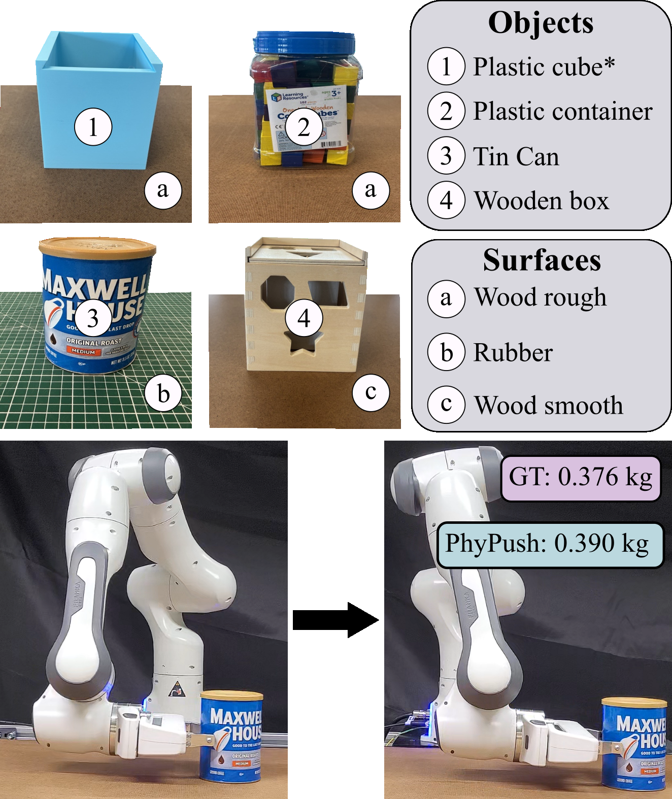

# 单次推动估计物体质量与摩擦系数

[← 返回 2026-05-27 列表](index.md){ .back-link }

### PhyPush: One Push is All You Need for Sensorless Physical Property Estimation with Physics-Guided Transformers

  ⭐ 9.0
  manipulation
  2605.26284

*Koyo Fujii, Luis Figueredo, Praminda Caleb-Solly, Ivan Boschi 等 7 位*

<figure markdown>
  
  <figcaption>Fig. 2: PhyPush system pipeline: The core intuition behind our PhyPush is that an object with distinct properties exhibits unique behavioral responses to the same push action. Therefore, our framework estimates these properties by observing</figcaption>
</figure>

!!! tip "💡 Trick — 关键技术 insight"
    利用牛顿第二定律和库仑摩擦模型构建物理引导损失函数，约束Transformer模型输出，使其符合物理规律，从而仅用运动学数据（末端速度）即可准确估计质量与摩擦系数，无需力/力矩传感器。

## 摘要

本文提出PhyPush框架，使用物理引导的Transformer模型，仅通过单次推动的末端执行器速度（运动学数据）估计物体质量和摩擦系数。模型引入牛顿第二定律和库仑摩擦模型作为物理损失，增强物理一致性和泛化能力。在仿真和真实实验中，PhyPush在域外条件下误差降低超过10%，优于使用完整力信息的基线方法。结果表明，物理引导学习可实现低成本、传感器高效的物理属性估计。

**Tags**: `physics-guided-learning` `mass-estimation` `friction-estimation` `transformer` `interactive-perception`

## 📝 我的评价

值得精读，贡献在于提出一种无需力传感器的物理属性估计方法，利用物理损失引导学习，实验充分。与现有依赖力/力矩传感器的方法相比，显著降低了硬件需求，具有实际部署潜力。

## 📷 论文中其他图

---

[📄 arXiv 摘要页](http://arxiv.org/abs/2605.26284v1) &nbsp;·&nbsp; [📑 PDF 全文](https://arxiv.org/pdf/2605.26284v1)
