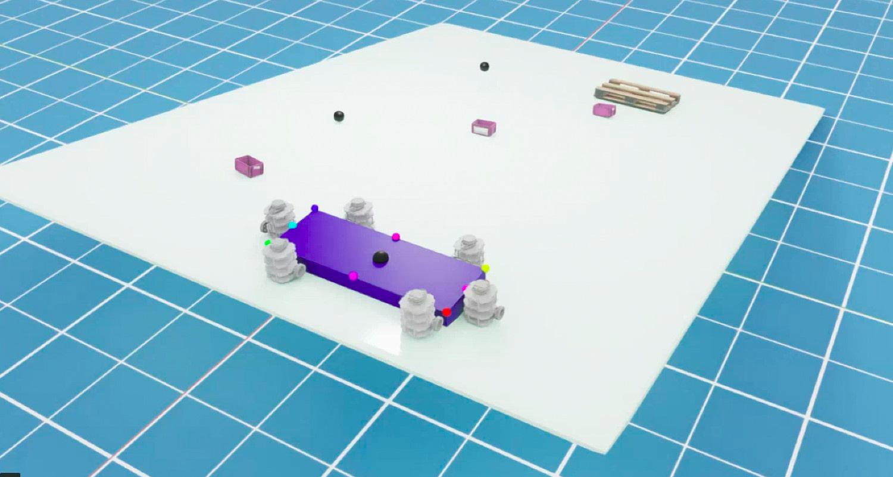

<a class="back-btn" href="../">← 返回 2026-05-27</a>

# 去中心化角色分配与比例控制的多机器人协同搬运

### Multi-Robot Box Transport over Different Surfaces with Decentralized Role-based Proportional Control

👀
⭐ 9.0
manipulation
2605.26430

📄 <a href="http://arxiv.org/abs/2605.26430v1">arXiv 摘要页</a> &nbsp;·&nbsp; 📑 <a href="https://arxiv.org/pdf/2605.26430v1">PDF 全文</a>

*Aditya Bhatt, Himavarshini Yarragangu, Urvish Shah, Venkata Sai Yaswanth Mohan Thota 等 5 位*

<figure markdown>
  
  <figcaption>Fig. 1: Collaborative Box transport using a team of turtlebots in NVIDIA IsaacSim. The goal is to transport the box (down- hill) to the goal-location through the waypoints (shown as spheres), on a plane at 5◦incline. The goal location is th</figcaption>
</figure>

## 💡 关键 Tricks

- ⭐ 核心 — **提出R2P2框架，根据操作模式（旋转vs平移）为机器人分配角色（推、支撑、阻止），并基于规则或比例控制速度，实现去中心化协同。**
- 异步去中心化架构，无需全局通信或同步，避免单点故障，适用于不同地形（平坦、上坡、下坡）和摩擦系数。
- 在NVIDIA IsaacSim中构建六机器人仿真环境，验证方法在不同表面和箱体质量下的泛化性，并与虚拟领航-跟随方法对比。
- 在四台TurtleBot上完成实物实验，成功搬运1.2kg箱子，证明方法在真实硬件上的可行性。

## 📝 摘要

=== "中文"

    通过推动实现多机器人协同搬运物体在建筑、仓库和灾后清理等场景中有广泛应用。然而，在不同倾斜度和摩擦系数的表面上实现协同搬运带来了独特挑战。为解决这些问题，本文提出了一种异步去中心化任务与运动规划方法，用于在平坦、上坡和下坡地形上搬运不同质量的矩形箱子。这种去中心化方法减少了通信、同步和共识需求，并缓解了单点故障问题。我们的方法称为R2P2（Roles with Rules and Proportional-control Primitive），根据操作模式（箱子旋转vs平移）为机器人分配角色（如推、支撑、阻止），然后基于角色采用规则控制或比例速度控制。每个机器人在执行角色和控制时假设能观测自身和箱子的位置与朝向。R2P2在基于NVIDIA IsaacSim构建的六机器人仿真环境中进行评估，展示了在不同表面摩擦/倾斜和箱子质量场景下的泛化能力，并且成功率优于标准的虚拟领航-跟随方法。R2P2还通过实物实验成功验证，在四台TurtleBot上执行，任务为搬运一个1.2kg的箱子。

=== "English"

    Collaborative transport of objects via pushing by multiple robots has many applications, ranging from construction and warehouse environments to post disaster debris clean-up. Achieving collaborative transport over surfaces with different inclination and friction properties however poses unique challenges. To address these challenges, this paper presents an asynchronous decentralized task and motion planning approach for transporting rectangular boxes of varying mass over flat, uphill and downhill terrain. Such a decentralized approach alleviates communication, synchronization and consensus needs and mitigates single point of failure issues. Our approach, called R2P2 or Roles with Rules and Proportional-control Primitive, assigns roles (e.g., push, support and prevent) to robots based on rules cognizant of the mode of manipulation needed (box rotation vs translation); this is followed by either rule-based control or proportional control of robot velocity based on the roles. Each robot is assumed to observe the location and heading of self and the box in executing the role and controls. R2P2 is evaluated with a six-robot team deployed in a simulator built using NVIDIA IsaacSim -- demonstrating generalizability across different surface friction/inclination and box mass scenarios, and better success rate compared to a standard virtual-leader-follower method. R2P2 is also successfully validated with a physical experiment, where it is executed onboard four turtlebots tasked with moving a 1.2 kg box.

## 🔗 与已有工作的关系

与传统的虚拟领航-跟随方法相比，R2P2采用去中心化角色分配和比例控制，无需全局通信或领导者，更适合动态环境。与集中式规划方法相比，R2P2避免了单点故障，且对通信要求低。该方法借鉴了基于角色的协同思想，但通过规则和比例控制实现了更灵活的操作模式切换。

👀 锐评

方法设计合理，去中心化角色分配和比例控制思路清晰，仿真和实物实验验证了可行性。但实物实验仅用四台机器人搬运1.2kg箱子，规模较小，且未展示更复杂场景（如多障碍物、动态环境）下的表现。此外，与虚拟领航-跟随方法的对比仅在仿真中进行，实物对比缺失。

---

**Tags**: `multi-robot` `decentralized` `role-assignment` `proportional-control` `transport`
