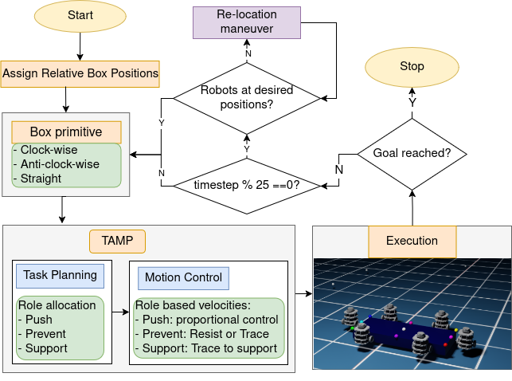
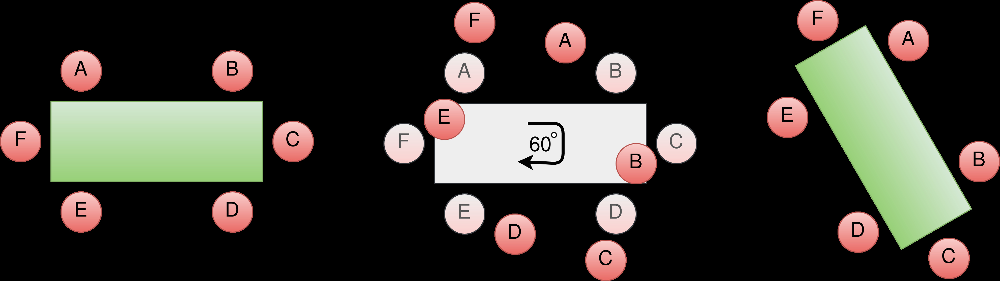
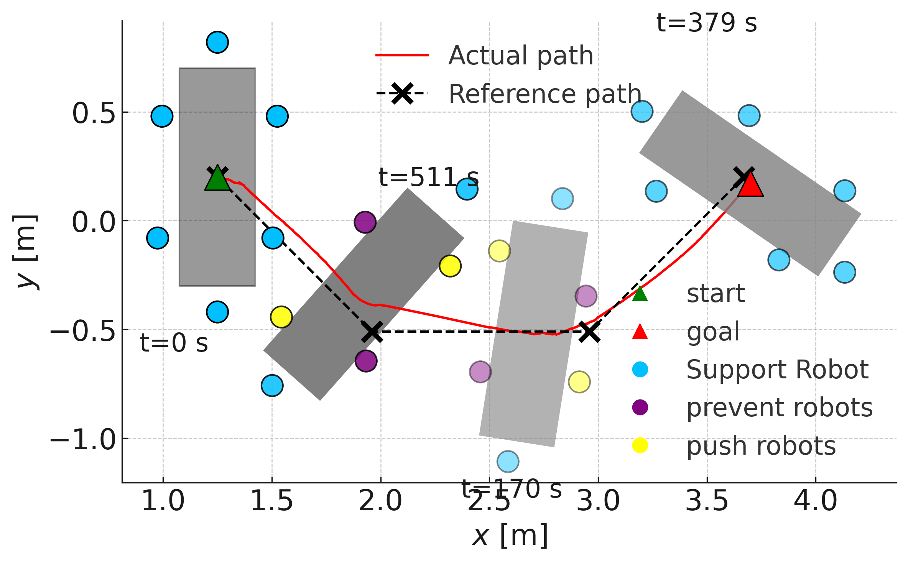
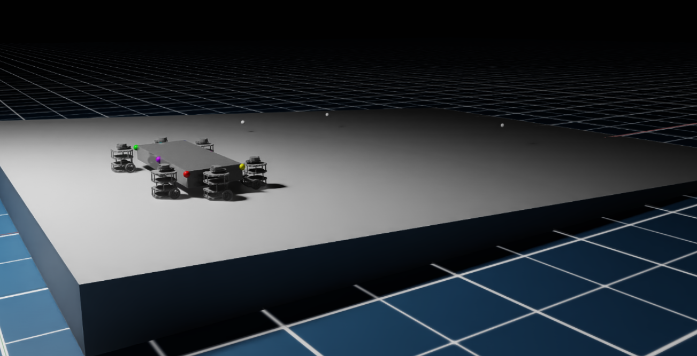
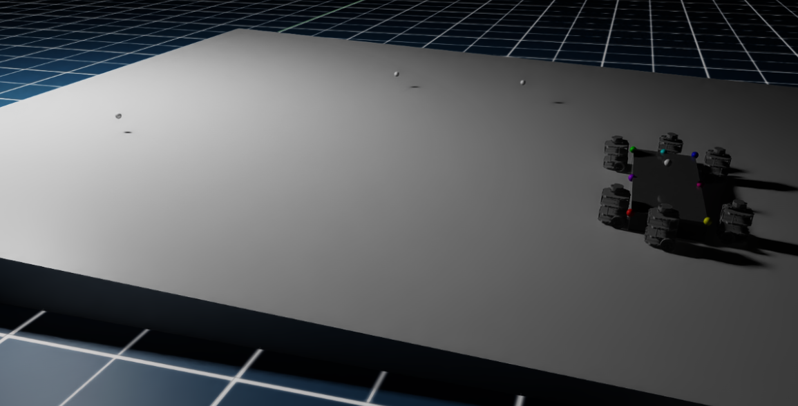

# 多机器人协作推箱子的分散式角色比例控制

[← 返回 2026-05-27 列表](index.md){ .back-link }

### Multi-Robot Box Transport over Different Surfaces with Decentralized Role-based Proportional Control

  ⭐ 9.0
  manipulation
  2605.26430

*Aditya Bhatt, Himavarshini Yarragangu, Urvish Shah, Venkata Sai Yaswanth Mohan Thota 等 5 位*

<figure markdown>
  
  <figcaption>Fig. 1: Collaborative Box transport using a team of turtlebots in NVIDIA IsaacSim. The goal is to transport the box (down- hill) to the goal-location through the waypoints (shown as spheres), on a plane at 5◦incline. The goal location is th</figcaption>
</figure>

!!! tip "💡 Trick — 关键技术 insight"
    提出R2P2方法，通过规则分配角色（推、支撑、防止）并融合比例控制，实现异步分散式规划；利用角色感知的规则切换平移与旋转模式，无需全局通信，提升鲁棒性。

## 摘要

本文针对多机器人在不同倾斜度和摩擦系数的表面上协作运输矩形箱子的问题，提出了一种异步分散式任务与运动规划方法R2P2。该方法基于规则分配机器人角色（推、支撑、防止），并依据操作模式（平移或旋转）进行角色控制，结合规则控制与比例控制。在NVIDIA IsaacSim仿真中，六机器人团队在不同表面和箱子质量下验证了泛化性，成功率优于虚拟领航-跟随方法。物理实验用四台TurtleBot成功运输1.2kg箱子。

**Tags**: `multi-robot` `decentralized` `role-based` `proportional-control` `transport`

## 📝 我的评价

值得精读。贡献在于提出一种轻量级分散式协作框架，避免通信依赖，适用于非结构化环境。与虚拟领航方法对比有优势，但物理实验规模较小。

## 📷 论文中其他图

---

[📄 arXiv 摘要页](http://arxiv.org/abs/2605.26430v1) &nbsp;·&nbsp; [📑 PDF 全文](https://arxiv.org/pdf/2605.26430v1)
