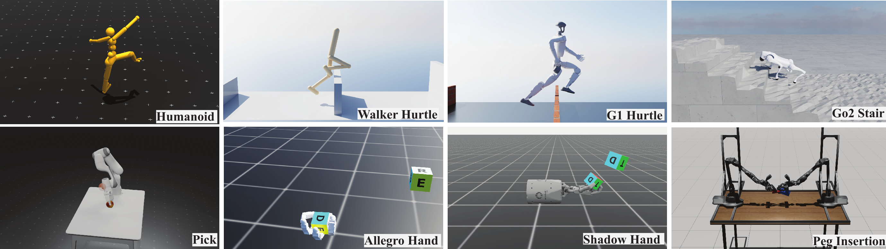

<a class="back-btn" href="../">← 返回 2026-05-27</a>

# 随机解耦策略梯度的轻量视觉RL方法

### Efficient On-policy Visual-RL via Stochastic Decoupled Policy Gradient

👀
⭐ 9.0
policy-learning
2605.26478

📄 <a href="http://arxiv.org/abs/2605.26478v1">arXiv 摘要页</a> &nbsp;·&nbsp; 📑 <a href="https://arxiv.org/pdf/2605.26478v1">PDF 全文</a>

*Haoxiang You, Yilang Liu, Davis Zong, Qian Wang 等 8 位*

<figure markdown>
  
  <figcaption>Figure 2: Preview of tasks: including both manipulation and locomotion, egocentric and third- person view, single and multiple cameras, RGB and depth image. Our method learns all tasks end-to-end on a single NVIDIA RTX 4080 GPU within a few</figcaption>
</figure>

## 💡 关键 Tricks

- ⭐ 核心 — **通过轨迹滚动的随机扰动估计策略梯度，避免传统策略梯度的高方差和计算开销**
- 仅需少量批渲染环境，大幅降低计算和内存开销
- 在视觉MuJoCo基准上实现更快的训练速度和更高的奖励
- 引入逼真的视觉机器人基准套件，涵盖灵巧操作和挑战性运动
- 展示从仿真到真实硬件的有效迁移

## 📝 摘要

=== "中文"

    我们提出了随机解耦策略梯度（SDPG），一种轻量级的视觉强化学习方法，能够在单个NVIDIA RTX 4080 GPU上在几小时内端到端训练多样化的视觉运动控制策略。SDPG通过轨迹滚动的随机扰动来估计策略梯度，所需批渲染环境数量减少几个数量级，从而大幅降低计算和内存开销。在视觉MuJoCo基准上，SDPG在训练时间、内存使用和奖励方面持续优于基线方法。最后，为了支持未来研究，我们引入了一套逼真的视觉机器人基准，涵盖灵巧操作、挑战性运动，并在物理硬件上展示了有效的仿真到真实迁移。

=== "English"

    We present the stochastic decoupled policy gradient (SDPG), a lightweight visual reinforcement learning (RL) method that trains diverse visuomotor control policies end-to-end within a few hours on a single NVIDIA RTX 4080 GPU. SDPG estimates policy gradients via random perturbations of trajectory rollouts, requiring orders of magnitude fewer batch-rendered environments and substantially reducing compute and memory overhead. On visual MuJoCo benchmarks, SDPG consistently outperforms baseline methods in training time, memory usage, and rewards. Finally, to support future research, we introduce a suite of realistic visual robotics benchmarks spanning dexterous manipulation, challenging locomotion, and demonstrate effective sim-to-real transfer on physical hardware.

## 🔗 与已有工作的关系

与传统的策略梯度方法（如REINFORCE、PPO）相比，SDPG通过随机扰动估计梯度，避免了高方差和大量环境交互。与基于模型的RL或世界模型方法（如Dreamer）相比，SDPG更轻量，无需学习动力学模型。与视觉模仿学习方法（如BC）相比，SDPG不需要专家数据。

👀 锐评

SDPG的核心思想——通过随机扰动估计梯度——并非全新，但将其成功应用于视觉RL并实现高效训练是一个不错的工程贡献。实验仅在MuJoCo视觉基准上进行，缺乏对更复杂3D环境（如Habitat、Isaac Sim）的验证，泛化性存疑。仿真到真实的迁移仅提及但未提供详细结果，需看全文确认。

---

**Tags**: `visual-rl` `policy-gradient` `sample-efficiency` `sim-to-real` `dexterous-manipulation`
