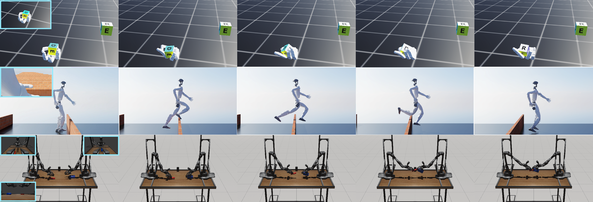
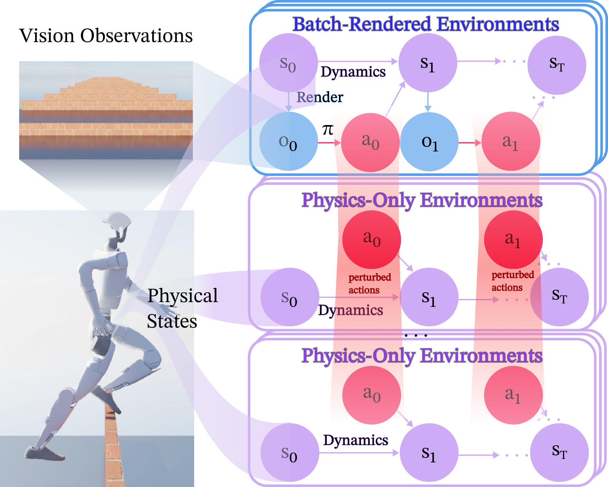
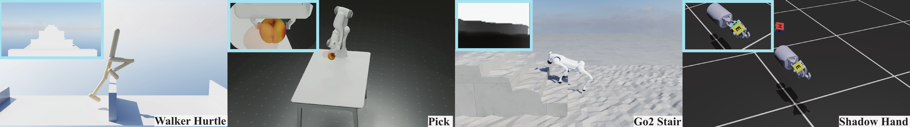
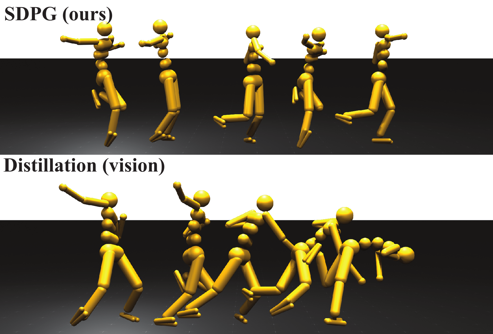
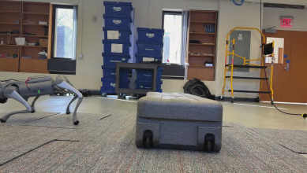

# 随机解耦策略梯度实现高效视觉强化学习

[← 返回 2026-05-27 列表](index.md){ .back-link }

### Efficient On-policy Visual-RL via Stochastic Decoupled Policy Gradient

  ⭐ 9.0
  policy-learning
  2605.26478

*Haoxiang You, Yilang Liu, Davis Zong, Qian Wang 等 8 位*

<figure markdown>
  
  <figcaption>Figure 2: Preview of tasks: including both manipulation and locomotion, egocentric and third- person view, single and multiple cameras, RGB and depth image. Our method learns all tasks end-to-end on a single NVIDIA RTX 4080 GPU within a few</figcaption>
</figure>

!!! tip "💡 Trick — 关键技术 insight"
    通过轨迹滚动的随机扰动估计策略梯度，大幅减少批量渲染环境数量，降低计算和内存开销；解耦策略梯度估计与价值函数更新，提升样本效率。

## 摘要

本文提出随机解耦策略梯度（SDPG），一种轻量级视觉强化学习方法，可在单个NVIDIA RTX 4080 GPU上几小时内端到端训练多样化的视觉运动控制策略。SDPG通过轨迹滚动的随机扰动估计策略梯度，所需批量渲染环境数量减少几个数量级，显著降低计算和内存开销。在视觉MuJoCo基准测试中，SDPG在训练时间、内存使用和奖励方面持续优于基线方法。此外，为支持未来研究，作者引入了一套逼真的视觉机器人基准测试，涵盖灵巧操作、具有挑战性的运动，并在物理硬件上展示了有效的sim-to-real迁移。

**Tags**: `visual-rl` `policy-gradient` `sim-to-real` `dexterous-manipulation` `locomotion`

## 📝 我的评价

值得精读，贡献度较高。SDPG通过随机扰动估计梯度，显著降低了视觉RL的计算成本，并展示了sim-to-real迁移能力。与现有方法相比，SDPG在效率和性能上均有优势，但需验证其在更复杂任务上的泛化性。

## 📷 论文中其他图

---

[📄 arXiv 摘要页](http://arxiv.org/abs/2605.26478v1) &nbsp;·&nbsp; [📑 PDF 全文](https://arxiv.org/pdf/2605.26478v1)
