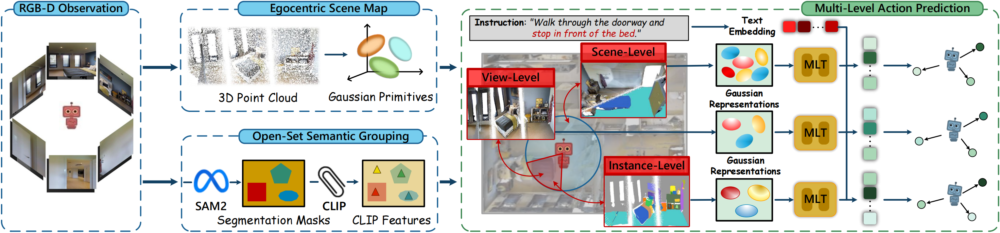

<a class="back-btn" href="../">← 返回 2026-05-27</a>

# 提出3D高斯地图实现开放集语义分组的视觉语言导航

### 3D Gaussian Map with Open-Set Semantic Grouping for Vision-Language Navigation

⭐ 9.0
navigation
2605.26500

📄 <a href="http://arxiv.org/abs/2605.26500v1">arXiv 摘要页</a> &nbsp;·&nbsp; 📑 <a href="https://arxiv.org/pdf/2605.26500v1">PDF 全文</a>

*Jianzhe Gao, Rui Liu, Wenguan Wang*

<figure markdown>
  
  <figcaption>Figure 2. Overview of our method. At each node, our agent leverages egocentric RGB-D observations to generate pseudo-lidar point clouds, which are then used to initialize an Egocentric Scene Map (§3.1). Simultaneously, the observations are </figcaption>
</figure>

## 💡 关键 Tricks

- ⭐ 核心 — **核心：Open-Set Semantic Grouping，将3D高斯基于开放世界中的物体实例或类别进行分组，统一几何与语义，提升泛化能力。**
- Egocentric Scene Map在线构建，从稀疏伪激光雷达点云初始化3D高斯，提供几何先验。
- Multi-Level Action Prediction策略，结合多粒度空间-语义线索辅助决策。
- 使用可微分的3D高斯表示环境，支持端到端优化。
- 在R2R、R4R、REVERIE三个基准上验证有效性。

## 📝 摘要

=== "中文"

    视觉语言导航要求智能体根据自然语言指令在复杂3D环境中导航，需要深入理解场景。现有方法为智能体配备各种场景表示以增强空间感知，但往往忽略了VLN场景中复杂的3D几何和丰富的语义，限制了在多样化和未见环境中的泛化能力。为解决这些问题，本文提出一种3D高斯地图，将环境表示为一组可微分的3D高斯，并据此开发了VLN导航策略。具体地，通过从稀疏伪激光雷达点云初始化3D高斯在线构建自我中心场景地图，为场景理解提供信息丰富的几何先验。每个高斯基元通过开放集语义分组操作进一步丰富，该操作基于3D高斯在开放世界中属于物体实例或类别成员的属性进行分组，形成统一的3D高斯地图。基于此地图，设计了多级动作预测策略，结合多粒度的空间-语义线索辅助智能体决策。在三个公开基准（R2R、R4R和REVERIE）上的大量实验验证了方法的有效性。

=== "English"

    Vision-language navigation (VLN) requires an agent to traverse complex 3D environments based on natural language instructions, necessitating a thorough scene understanding. While existing works equip agents with various scene representations to enhance spatial awareness, they often neglect the complex 3D geometry and rich semantics in VLN scenarios, limiting the ability to generalize across diverse and unseen environments. To address these challenges, this work proposes a 3D Gaussian Map that represents the environment as a set of differentiable 3D Gaussians and accordingly develops a navigation strategy for VLN. Specifically, Egocentric Scene Map is constructed online by initializing 3D Gaussians from sparse pseudo-lidar point clouds, providing informative geometric priors for scene understanding. Each Gaussian primitive is further enriched through Open-Set Semantic Grouping operation, which groups 3D Gaussians based on their membership in object instances or stuff categories within the open world, resulting in a unified 3D Gaussian Map. Building on this map, Multi-Level Action Prediction strategy, which combines spatial-semantic cues at multiple granularities, is designed to assist agents in decision-making. Extensive experiments conducted on three public benchmarks (i.e., R2R, R4R, and REVERIE) validate the effectiveness of our method.

## 🔗 与已有工作的关系

与现有使用点云或网格表示的方法不同，本文采用可微分的3D高斯作为场景表示，并通过开放集语义分组统一几何与语义。相比传统基于预定义类别的方法，开放集分组允许模型在未见环境中泛化。

## 📌 我的评价

方法新颖，将3D高斯溅射与开放集语义结合用于VLN，实验充分。值得精读，尤其对场景表示和开放集泛化感兴趣的读者。

---

**Tags**: `vision-language-navigation` `3d-gaussian-splatting` `open-set-semantic-grouping` `scene-representation`
