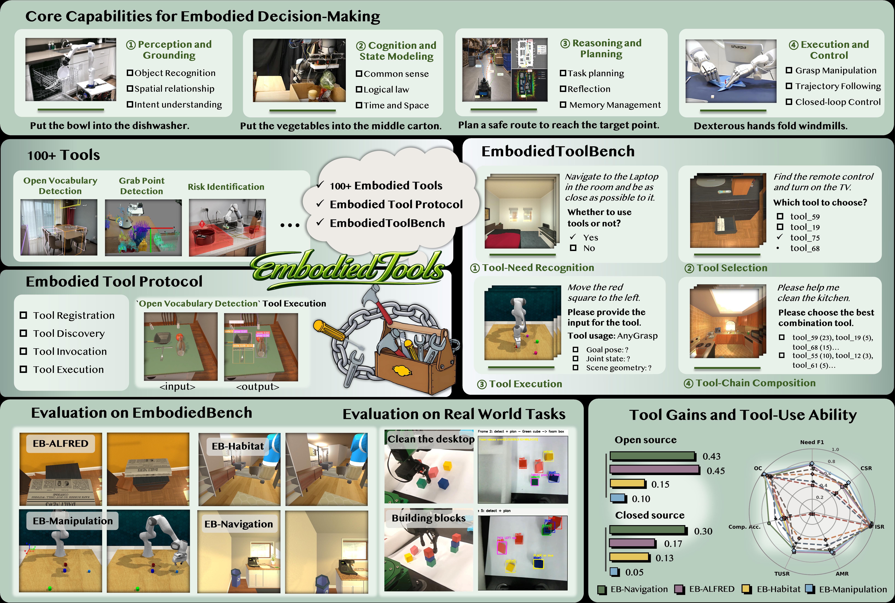
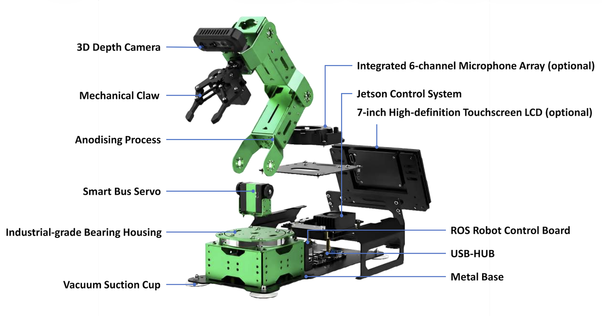
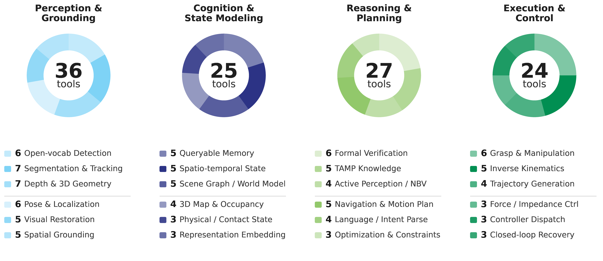
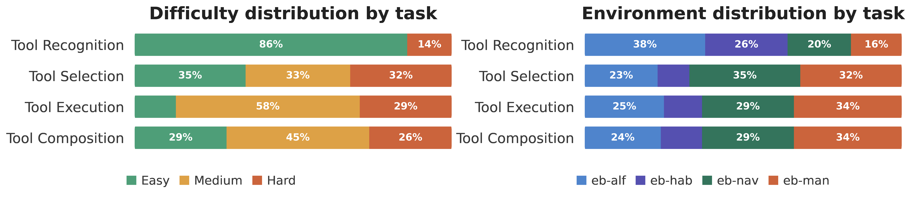

# 提出工具外化方法解耦具身能力

[← 返回 2026-05-27 列表](index.md){ .back-link }

### Enabling Extensible Embodied Capabilities with Tools

  ⭐ 9.0
  perception
  2605.26637

*Xueyang Zhou, Zijia Wang, Qianjiang Li, Yibo Hu 等 10 位*

<figure markdown>
  
  <figcaption>Figure 1. Overview of the EmbodiedTool.</figcaption>
</figure>

!!! tip "💡 Trick — 关键技术 insight"
    将感知、认知、推理、执行等异构能力解耦为独立工具，通过标准化协议ETP动态调用，避免单一模型难以模块化学习的问题。构建100+工具库和评估基准，揭示工具对认知/感知能力提升显著，但对执行能力提升有限。

## 摘要

现有具身智能方法将感知、推理、规划和控制统一在单一参数化策略中，但能力层次化且异构，难以可靠学习。本文提出能力外化方法，将异构能力解耦为独立工具，在推理时动态调用。为此，设计了具身工具协议ETP，标准化工具注册、发现、调用和执行，并构建了100+验证工具。基于此，构建EmbodiedToolBench评估工具增强效果。实验表明，能力外化持续提升具身性能（EB-ALFRED平均提升31%，EB-Navigation提升36%），但对执行类能力提升有限。此外，模型在何时、选择哪个、如何调用工具方面仍存在挑战。

**Tags**: `embodied-ai` `tool-augmentation` `modularity` `benchmark` `protocol`

## 📝 我的评价

值得精读，贡献在于提出工具外化框架和标准化协议，系统评估了工具增强的边界。与已有工作相比，更强调能力解耦和动态调用，而非端到端学习。实验设计全面，揭示了工具使用的关键挑战。

## 📷 论文中其他图

---

[📄 arXiv 摘要页](http://arxiv.org/abs/2605.26637v1) &nbsp;·&nbsp; [📑 PDF 全文](https://arxiv.org/pdf/2605.26637v1)
