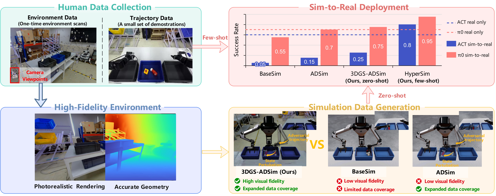
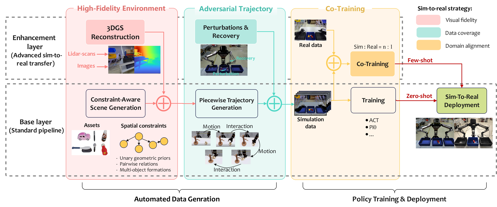
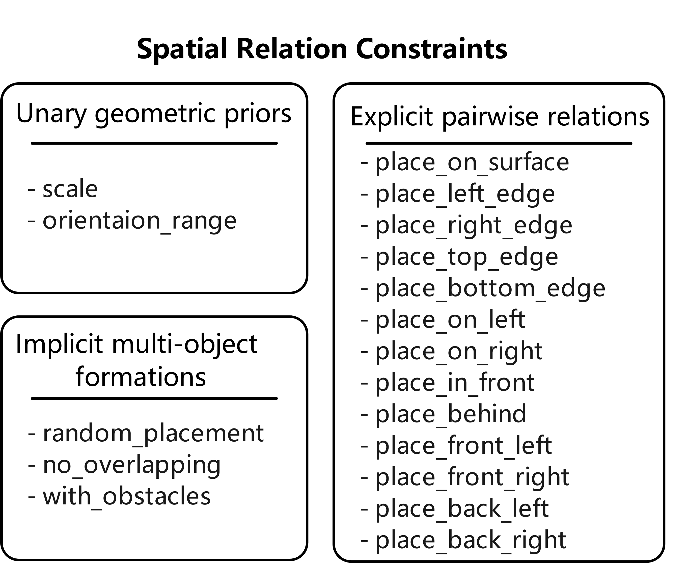
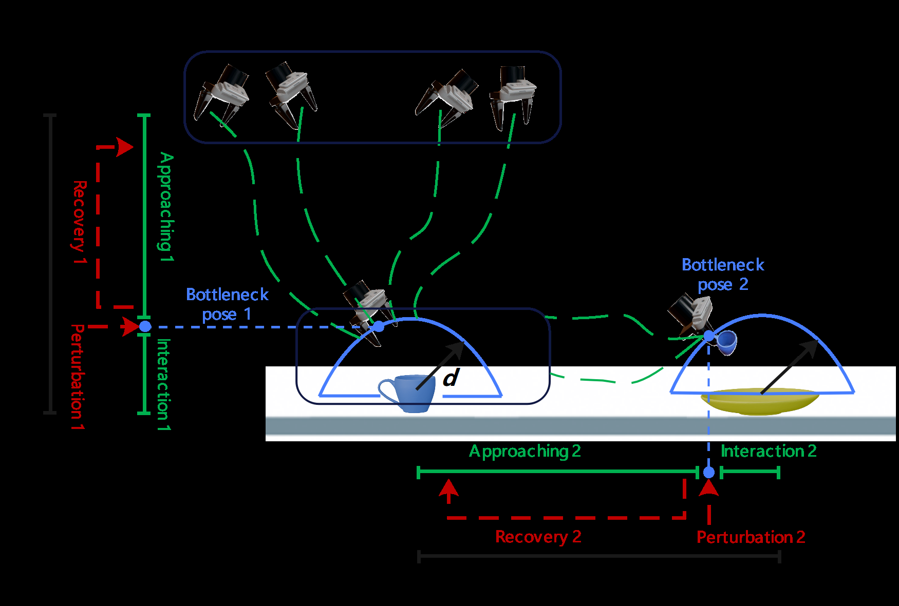
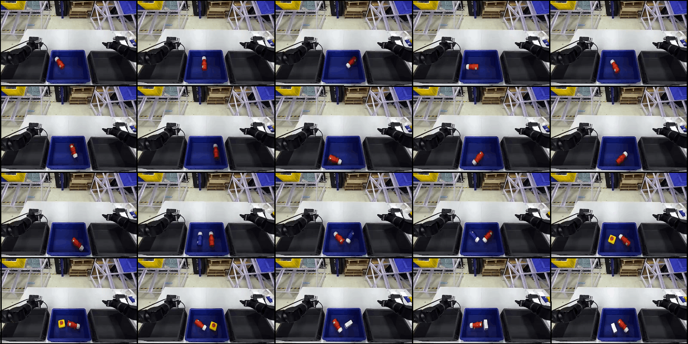
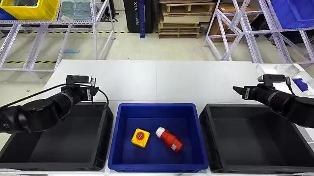

# 提出全流程仿真到真实框架，提升机器人操作策略迁移鲁棒性

[← 返回 2026-05-27 列表](index.md){ .back-link }

### HyperSim: A Holistic Sim-To-Real Framework For Robust Robotic Manipulation

  ⭐ 10.0
  sim2real
  2605.26638

*Junyi Dong, Haotian Luo, Ziwei Xu, Shengwei Bian 等 14 位*

<figure markdown>
  
  <figcaption>Fig. 1. Requiring minimal human-collected data (a one-time environment scan and a few dozen demonstrations), our method reconstructs photorealistic and geometrically accurate environments to generate adversarial trajectories for policy trai</figcaption>
</figure>

!!! tip "💡 Trick — 关键技术 insight"
    核心在于三个模块协同：高保真环境合成（视觉域对齐）、对抗轨迹生成（数据覆盖扩展）、仿真与真实联合训练（域不变表征）。对抗轨迹通过引入物理扰动和失败案例，迫使策略学习鲁棒行为，显著提升动态不确定性下的成功率。

## 摘要

本文提出HyperSim框架，涵盖合成数据生成、策略训练到真实部署的全流程。通过高保真环境合成、对抗轨迹生成和仿真-真实联合训练三个核心模块，系统性地缩小仿真到真实的域差距。在400次真实任务执行中，ACT和π₀策略分别达到80%和95%的仿真到真实成功率，且对抗轨迹训练的策略在物理扰动下完成率提升35%。

**Tags**: `sim-to-real` `robotic-manipulation` `domain-randomization` `adversarial-trajectory` `co-training`

## 📝 我的评价

值得精读。贡献在于提出系统性的sim-to-real框架，实验规模大（400次真实执行），且对抗轨迹生成方法具有通用性。与现有工作相比，更强调数据生成和训练流程的整体设计，而非单一技术改进。

## 📷 论文中其他图

---

[📄 arXiv 摘要页](http://arxiv.org/abs/2605.26638v1) &nbsp;·&nbsp; [📑 PDF 全文](https://arxiv.org/pdf/2605.26638v1)
