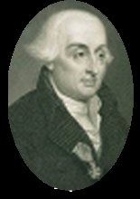

# 结合李雅普诺夫理论与拉格朗日力学的数据驱动机器人跟踪控制

[← 返回 2026-05-27 列表](index.md){ .back-link }

### L-Learning : A Lyapunov-Based Approach Leveraging Lagrangian Mechanics for Efficient and Stable Robot Tracking

  ⭐ 9.0
  locomotion
  2605.26648

*Quan Quan, Hao Li*

<figure markdown>
  
  <figcaption>Fig. 1: Comparison of Learning-based Control Flow: (a) Traditional learning algorithm vs. (b) L-Learning.</figcaption>
</figure>

!!! tip "💡 Trick — 关键技术 insight"
    从数据中显式学习系统的能量函数，并利用拉格朗日力学结构保证闭环稳定性，同时通过李雅普诺夫理论优化控制性能，实现样本高效且稳定的轨迹跟踪。

## 摘要

本文提出L-Learning，一种新颖的数据驱动控制框架，将李雅普诺夫稳定性理论与拉格朗日力学相结合，以增强机器人轨迹跟踪性能。传统控制方法在动态和不确定环境中性能下降，而数据驱动方法虽更具适应性，但常受限于高样本复杂度和缺乏严格稳定性保证。L-Learning通过从数据中显式学习系统能量函数，在优化性能的同时内在保证闭环稳定性。该框架具有优越的控制精度、理论稳定性保证和高样本效率，为实际机器人应用提供了有前景的解决方案。

**Tags**: `lyapunov` `lagrangian-mechanics` `data-driven-control` `trajectory-tracking` `stability`

## 📝 我的评价

值得精读，贡献在于将物理先验（拉格朗日力学）与稳定性理论（李雅普诺夫）结合到数据驱动控制中，解决了样本效率和稳定性保证的权衡问题。与现有基于模型或纯数据驱动方法相比，具有理论优势。

## 📷 论文中其他图

---

[📄 arXiv 摘要页](http://arxiv.org/abs/2605.26648v1) &nbsp;·&nbsp; [📑 PDF 全文](https://arxiv.org/pdf/2605.26648v1)
