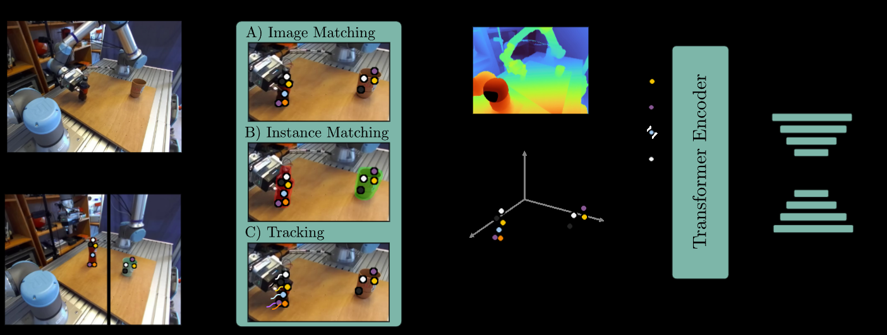
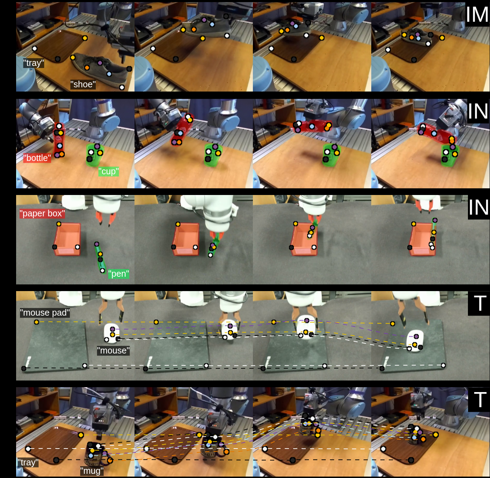
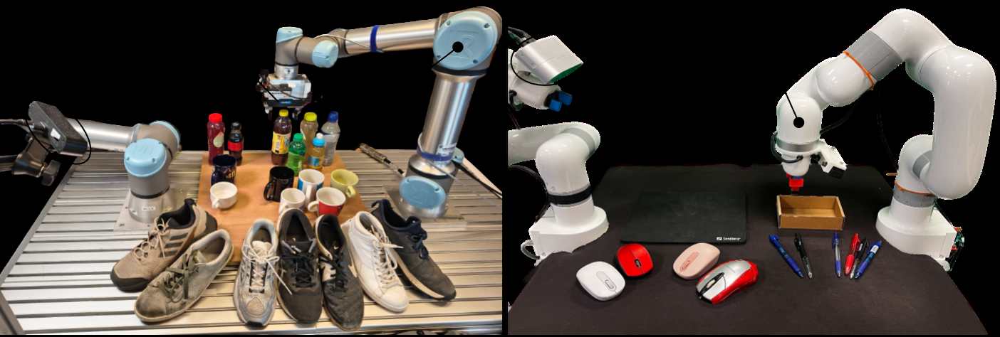
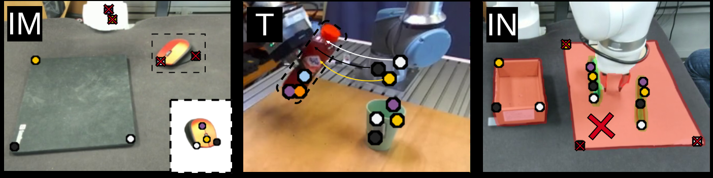
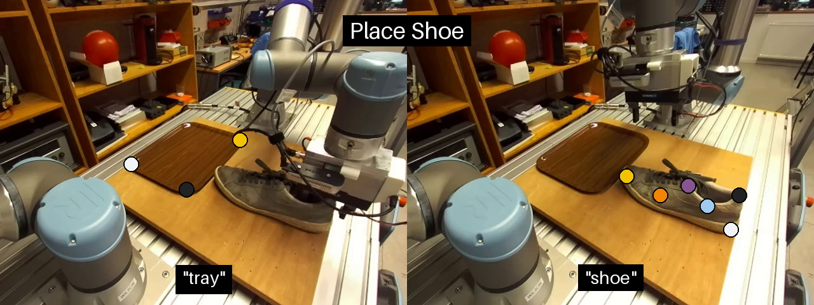
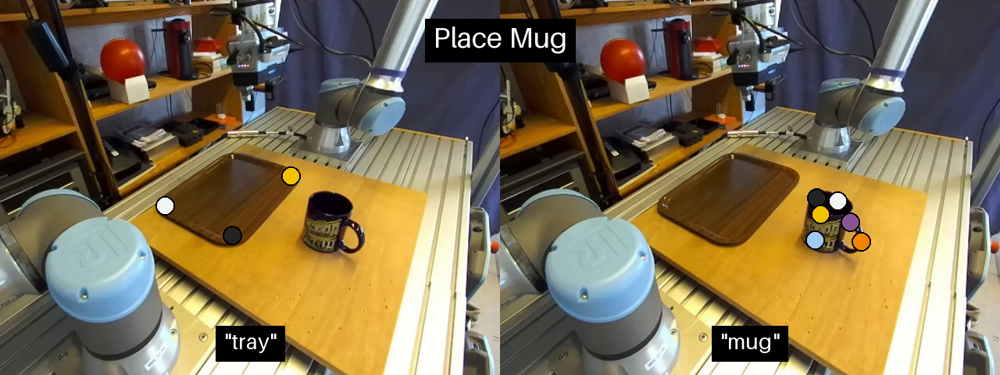

# 关键点模仿学习的泛化能力、设计选择与局限

[← 返回 2026-05-27 列表](index.md){ .back-link }

### On the Generalization Capabilities, Design Choices and Limitations of Keypoint Imitation Learning

  ⭐ 9.0
  manipulation
  2605.26649

*Thomas Lips, Marco Moletta, Michael C. Welle, Danica Kragic 等 5 位*

<figure markdown>
  
  <figcaption>Fig. 2. Overview of our three-stage keypoint imitation learning pipeline. 1) Keypoint references are manually annotated on a reference image for each object category. 2) Keypoints are extracted from each observation with visual foundation m</figcaption>
</figure>

!!! tip "💡 Trick — 关键技术 insight"
    结合先前关键点模仿学习（KIL）方法，系统研究设计选择（如关键点数量、提取方式等）对性能的影响。利用视觉基础模型实现单次关键点提取，并通过2000+真实世界 rollout 评估泛化能力，发现 KIL 在数据效率上优于 RGB 基线，但未超越 S2-diffusion，且继承基础模型的局限。

## 摘要

本文研究基于RGB的模仿学习在泛化到未见物体或场景时的局限性，探索使用视觉基础模型提取关键点作为中间表示。通过整合先前KIL方法并系统研究设计选择，在五个任务上进行了2000+真实世界 rollout 评估。KIL总体成功率达75%，显著优于RGB基线（47%），与S2-diffusion（73%）相当。文章还探讨了关键点提取基础模型的局限，并将KIL扩展到多物体实例任务。结论确认KIL是数据高效的机器人学习方法，但未超越其他表示，且继承基础模型的局限。

**Tags**: `imitation-learning` `keypoint-representation` `foundation-models` `robotic-manipulation` `generalization`

## 📝 我的评价

值得精读，提供了KIL的实用设计指南和泛化能力评估，实验规模大（2000+ rollout），但未超越S2-diffusion，且依赖基础模型。贡献在于系统比较和局限分析，对实际应用有指导意义。

## 📷 论文中其他图

---

[📄 arXiv 摘要页](http://arxiv.org/abs/2605.26649v1) &nbsp;·&nbsp; [📑 PDF 全文](https://arxiv.org/pdf/2605.26649v1)
