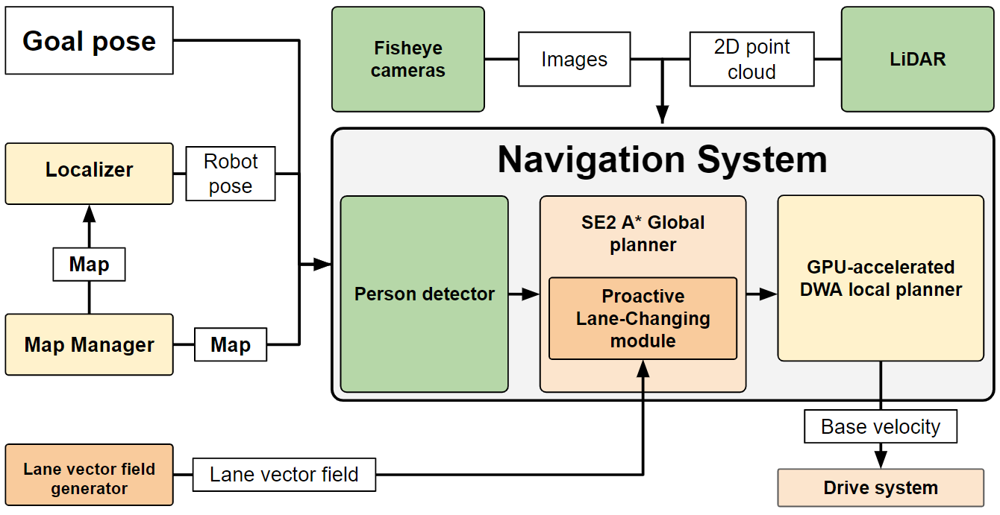
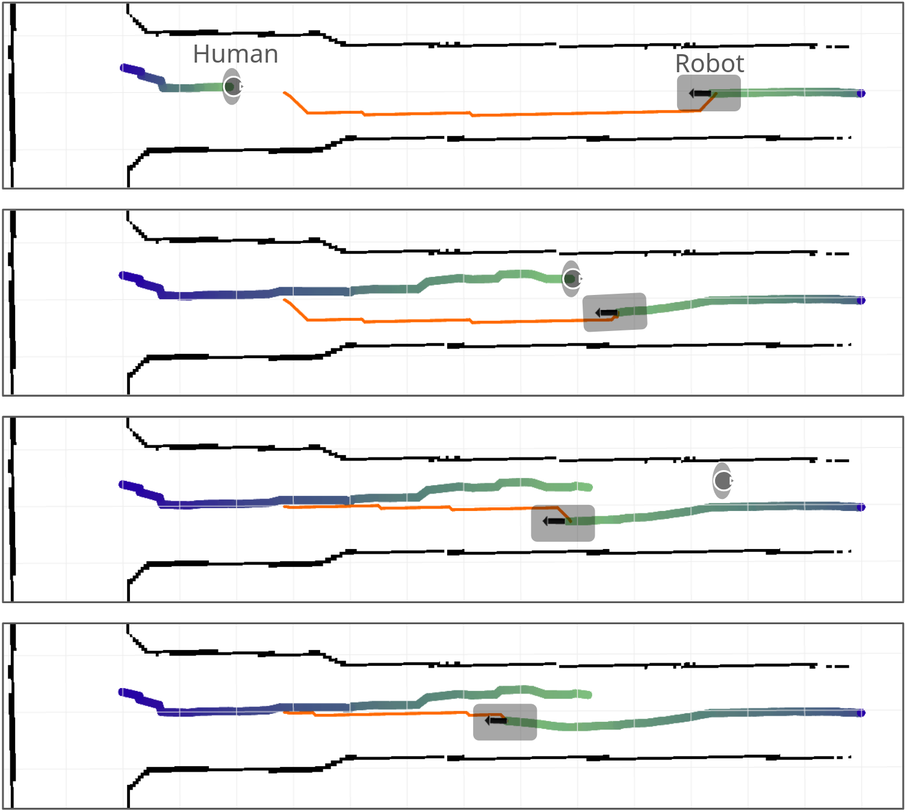
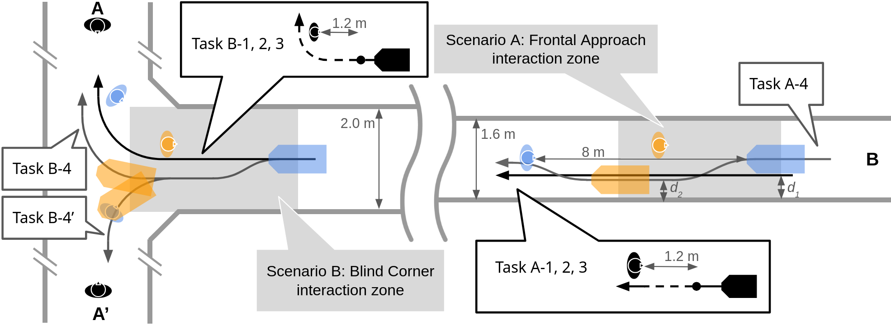
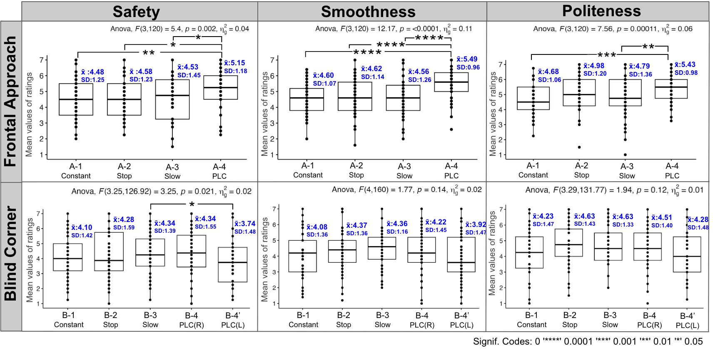
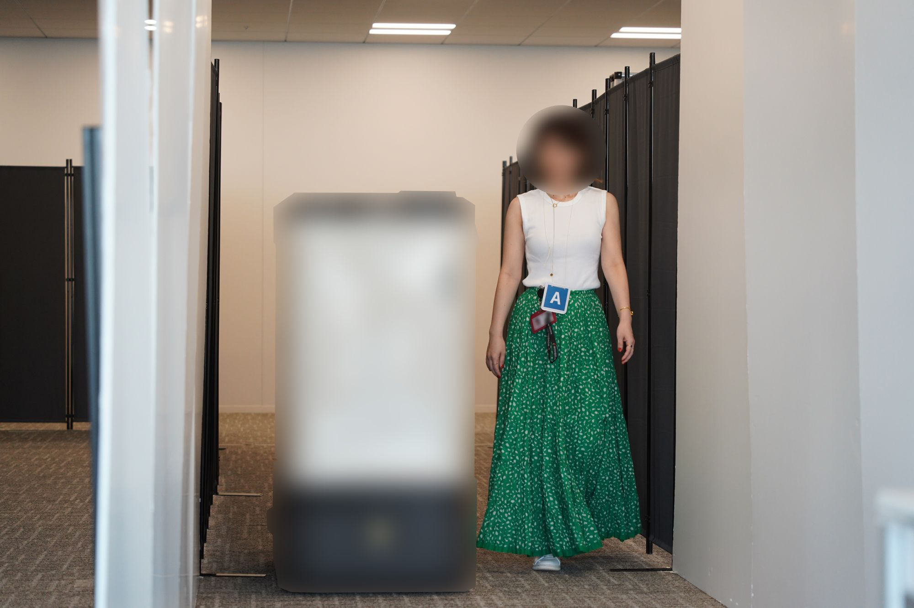

# 提出主动变道模式，延长反应距离至8米改善社交导航

[← 返回 2026-05-27 列表](index.md){ .back-link }

### Look Further: Socially-Compliant Navigation System in Residential Buildings

  ⭐ 9.0
  navigation
  2605.26710

*Akira Shiba, Marina Obata, Nathan Kau, Zoltan Beck 等 7 位*

<figure markdown>
  
  <figcaption>Fig. 1: Smart Logistics Robot dimensions and HRI sensors</figcaption>
</figure>

!!! tip "💡 Trick — 关键技术 insight"
    核心在于将机器人对行人的反应距离从传统社交导航的几米扩展到8米以上，并设计主动变道（PLC）模式：在走廊中提前从中心横向移动到一侧，而非在近距离减速或停止。这种远距离预判行为显著提升了人对机器人运动的安全感、流畅性和礼貌感，而传统方法仅在近距离处理冲突。

## 摘要

本文研究住宅楼内移动配送机器人的社交导航问题。传统方法在几米内处理人机交互，但本文证明将反应距离扩展到8米以上能改善人类对机器人运动的感知。提出主动变道（PLC）模式：机器人在走廊中距行人8米时从中心横向移动到一侧。用户研究（42人）显示，在直走廊场景中，PLC在安全性、流畅性和礼貌性上显著优于减速、停止和近距离避障等传统模式；但在交叉口盲角场景中，各方法无显著差异，参与者偏好多样。

**Tags**: `social-navigation` `mobile-robot` `human-robot-interaction` `proactive-behavior` `delivery-robot`

## 📝 我的评价

值得精读，贡献在于提出远距离预判行为（PLC）并验证其有效性，挑战了传统社交导航的近距离假设。与已有工作相比，强调提前规划而非即时反应，但实验仅限走廊场景，泛化性需进一步验证。

## 📷 论文中其他图

---

[📄 arXiv 摘要页](http://arxiv.org/abs/2605.26710v1) &nbsp;·&nbsp; [📑 PDF 全文](https://arxiv.org/pdf/2605.26710v1)
