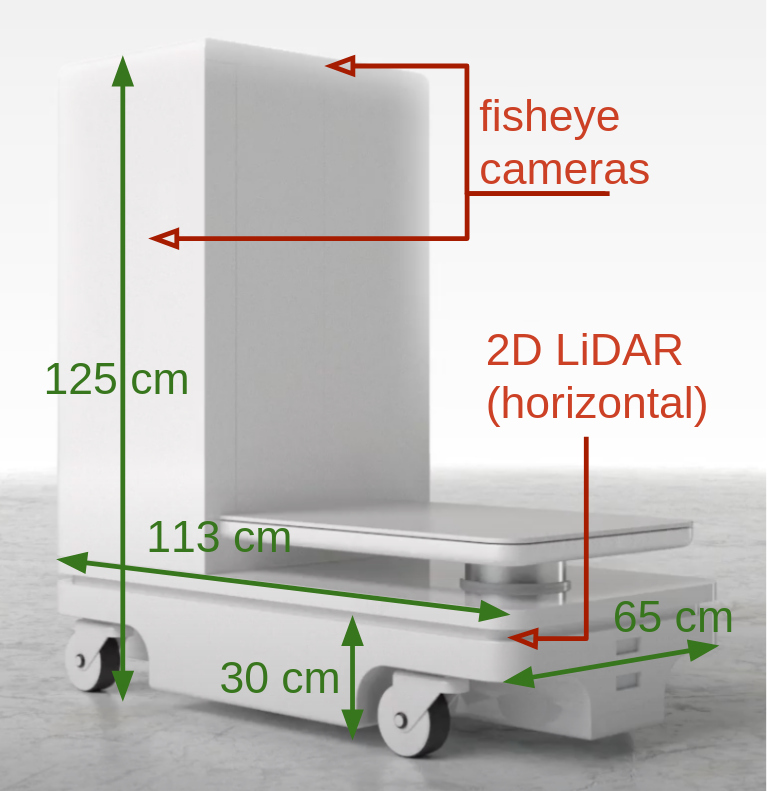

<a class="back-btn" href="../">← 返回 2026-05-27</a>

# 提出主动变道导航系统，在8米外提前避让行人

### Look Further: Socially-Compliant Navigation System in Residential Buildings

⭐ 9.0
navigation
HRI 2025
2605.26710

📄 <a href="http://arxiv.org/abs/2605.26710v1">arXiv 摘要页</a> &nbsp;·&nbsp; 📑 <a href="https://arxiv.org/pdf/2605.26710v1">PDF 全文</a>

*Akira Shiba, Marina Obata, Nathan Kau, Zoltan Beck 等 7 位*

<figure markdown>
  
  <figcaption>Fig. 1: Smart Logistics Robot dimensions and HRI sensors</figcaption>
</figure>

## 💡 关键 Tricks

- ⭐ 核心 — **核心：Proactive Lane-Changing (PLC) 运动模式——机器人在8米外从走廊中心横向移动到一侧，提前避让行人，而非在近距离减速或停止。这种远距离主动变道避免了侵入个人空间，提升了人类对机器人运动的安全感、流畅度和礼貌感。**
- 将反应距离从传统社交导航的几米扩展到8米以上，利用走廊环境的可预测性（行人沿直线运动）提前规划。
- 在直走廊场景中，PLC 显著优于传统减速、停止和近距离避让模式；但在盲角交叉口场景中，由于行人突然出现，远距离反应无法有效实施，各方法无显著差异。
- 用户研究采用三个服务目标（安全、流畅、礼貌）进行主观评价，共42名参与者，对比了PLC与文献中典型运动模式。
- 系统设计针对室内住宅走廊环境，利用结构化环境（直走廊、交叉口）简化感知与规划。

## 📝 摘要

=== "中文"

    移动机器人对行人的反应距离强烈影响人机交互的多种品质。本文聚焦于住宅室内走廊环境中移动配送机器人平台的导航。社交导航方法通常专注于避免令人不适的人机交互，例如机器人侵入个人空间。由于个人空间已被证明仅几米范围，社交导航方法通常专注于解决这些短距离交互。然而，本工作表明，通过将反应距离扩展到8米以上（远超典型交互距离），可以改善人类对机器人运动的感知。我们引入了主动变道（PLC）运动模式及利用该模式在更远距离对行人做出反应的导航系统。该模式包括机器人在走廊中从中心横向移动到一侧，在距离迎面行人8米处完成变道。我们进行了一项包含42名参与者的用户研究，基于三个服务目标（安全、流畅、礼貌）评估他们对配送机器人的印象。在直走廊场景（正面接近）中，与文献中典型运动模式（减速、停止、近距离避碰）相比，PLC在三个目标上均显著改善。相反，在交叉口（盲角）场景中，所有方法均无显著差异，参与者对机器人运动模式的偏好多样。

=== "English"

    The distance at which a mobile robot reacts to a person strongly impacts various qualities of the human-robot interaction. In this paper, we focus on the navigation of a mobile delivery robot platform in a residential indoor hallway environment. Social navigation methods typically focus on avoiding uncomfortable human-robot interactions, such as when a robot encroaches on someone's personal space. Since personal space has been shown to be in the range of just a few meters, social navigation methods typically focus on deconflicting and resolving these short-range interactions. In this work, however, we demonstrate that by extending the reaction distance to over eight meters, far beyond the typical interaction distance, we can improve the human's perception of the robot's motion. We introduce the Proactive Lane-Changing (PLC) motion pattern and a navigation system that leverages it to react to people at an increased distance. This pattern consists of changing the robot's lateral position as it navigates down the hallway from the center to the side at an eight-meter distance from an oncoming person.   We conducted a user study with 42 participants to assess their impressions of the delivery robot based on three service objectives: safety, smoothness, and politeness. In the straight hallway scenario (Frontal Approach), results showed significant improvement in each of these three objectives compared to typical motion patterns found in the literature: slowing down, stopping, and reactive collision avoidance in the proximity of a person. In contrast, in the intersection (Blind Corner) scenarios, none of the approaches performed significantly better than any other, with participants having a diverse range of preferences among robot motion patterns.

## 🔗 与已有工作的关系

与传统的社交导航方法（如减速、停止或近距离避碰）不同，本文提出在远距离（8米）主动变道，提前避免侵入个人空间，而非在近距离被动反应。该方法利用了走廊环境的可预测性，而传统方法通常针对更通用的环境。

## 📌 我的评价

该论文针对住宅走廊这一特定场景，提出了简单有效的远距离主动变道策略，并通过用户研究验证了其优势。思路新颖，实验设计合理，值得精读。

---

**Tags**: `social-navigation` `human-robot-interaction` `mobile-robot` `proactive-lane-changing` `user-study`
