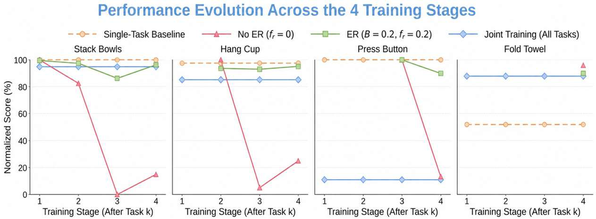
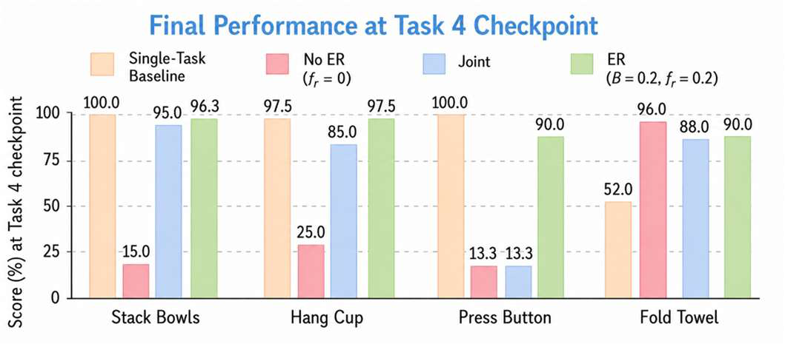
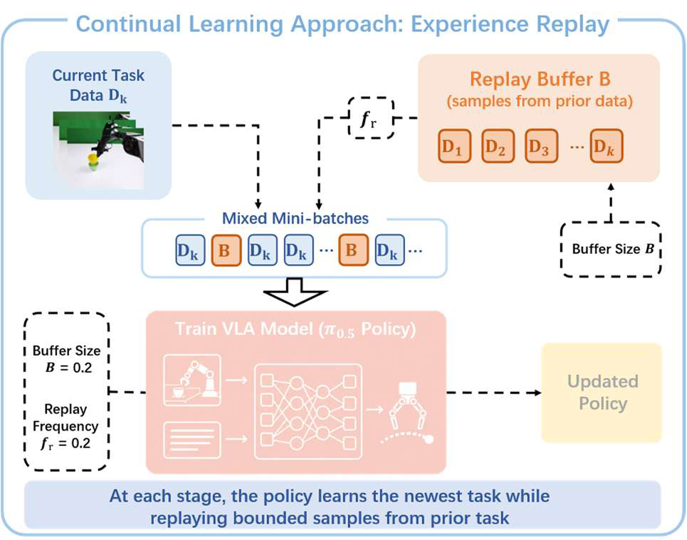
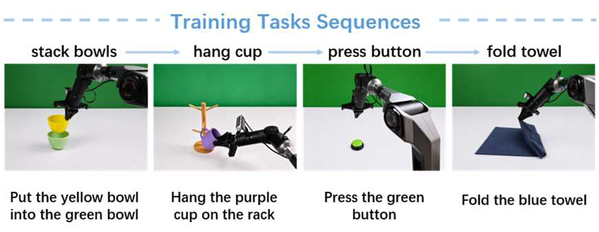
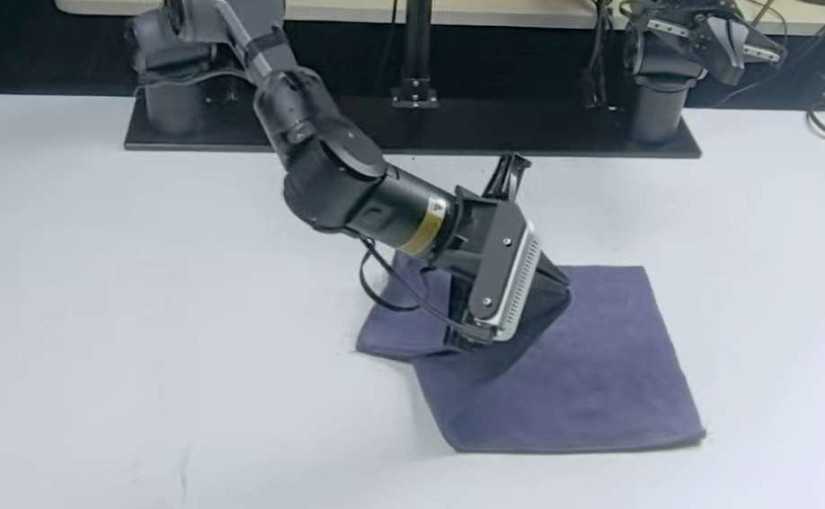
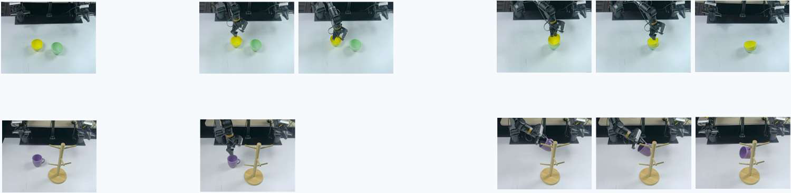

# 真实世界VLA模型持续学习与灾难性遗忘研究

[← 返回 2026-05-27 列表](index.md){ .back-link }

### Can VLA Models Learn from Real-World Data Continually without Forgetting?

  ⭐ 9.0
  VLA
  2605.26820

*Jiarun Zhu, Yijun Hong, Xiaoquan Sun, Zetian Xu 等 8 位*

<figure markdown>
  
  <figcaption>Figure 1: Overview of our investigation into real-world continual VLA learning. We collect a real-world sequential manipulation dataset of four heterogeneous tasks and study whether VLA models can adapt to them sequentially without forgetti</figcaption>
</figure>

!!! tip "💡 Trick — 关键技术 insight"
    构建了包含四种连续操作任务的真实世界持续学习数据集，系统评估了经验回放方法，揭示了实现成功的关键因素（如回放缓冲区大小、采样策略等）。

## 摘要

本文研究了视觉-语言-动作（VLA）模型在真实世界中持续学习的能力。作者构建了一个包含四种连续操作任务（刚体抓取、接触式按压、可变形物体折叠）的真实世界数据集，发现VLA模型在持续学习异构真实世界演示时会出现严重的灾难性遗忘。通过系统评估经验回放方法，揭示了影响其成功的关键实现因素。该工作首次对真实世界VLA持续学习进行实证研究，为部署长期机器人策略提供了实用指导。

**Tags**: `continual-learning` `vla` `catastrophic-forgetting` `experience-replay` `real-world`

## 📝 我的评价

值得精读。该工作填补了VLA模型在真实世界持续学习研究的空白，提供了宝贵的实验数据和经验回放实践指导，对机器人终身学习有重要贡献。

## 📷 论文中其他图

---

[📄 arXiv 摘要页](http://arxiv.org/abs/2605.26820v1) &nbsp;·&nbsp; [📑 PDF 全文](https://arxiv.org/pdf/2605.26820v1)
