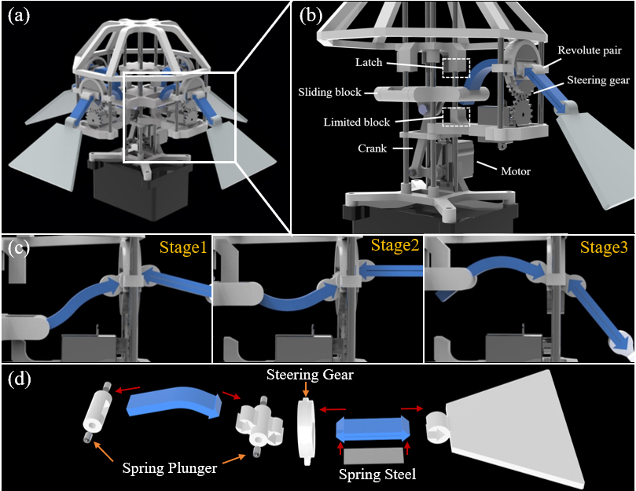

<a class="back-btn" href="../">← 返回 2026-05-27</a>

# 仿生水下软体机器人，采用闩锁介导的双稳态机构

### A Bioinspired Underwater Robot with a Latch-Mediated Soft Bistable Mechanism

👀
⭐ 8.0
locomotion
2605.26936

📄 <a href="http://arxiv.org/abs/2605.26936v1">arXiv 摘要页</a> &nbsp;·&nbsp; 📑 <a href="https://arxiv.org/pdf/2605.26936v1">PDF 全文</a>

*Chongze Bi, Wenjie Wu, Zonghao Zuo, Li Wen*

<figure markdown>
  
  <figcaption>Figure 2.  Mechanism and Structural Design. a) Overview of our robot. b)  Mechanism design of the bistable actuator. c) Behavior of the bistable  structure and fins at different stages. d) Assembly of main structures of the  bistable actuat</figcaption>
</figure>

## 💡 关键 Tricks

- ⭐ 核心 — **设计软体双稳态致动器，集成闩锁机制，实现单电机非对称能量输入与释放，模仿螳螂虾的LaMSA系统。**
- 结合鳍状结构，将双稳态快速释放转化为水下推进与机动。
- 通过调节鳍角实现多种运动模式（垂直上升、斜向前进、侧向平移）。

## 📝 摘要

=== "中文"

    水下机器人在近几十年取得了显著进展，然而，微型水下机器人的发展仍受限于传统能源的低能量密度。自然界提供了巧妙的解决方案——像螳螂虾和跳蚤这样的生物利用闩锁介导的弹簧驱动（LaMSA）系统，通过解耦能量存储与释放实现快速运动。尽管对LaMSA已有广泛研究，但在简单紧凑的结构中复现这种快速、非对称驱动仍然具有挑战性。本文介绍了一种仿生软体双稳态致动器，集成了闩锁机构，能够使用单个电机实现非对称能量输入与释放。结合鳍状结构，该设计实现了高效的水下推进与机动性。实验结果表明，该机器人实现了稳定的周期性拍动、精确转向，最大推力为0.528 N，冲量为0.147 Ns，垂直位移为30 mm。通过调节鳍角，机器人实现了多种运动，包括垂直上升、斜向前进和侧向平移。本研究为紧凑型水下机器人的运动控制提供了一种新颖、节能的方法，为先进仿生设计铺平了道路，潜在应用包括探索、环境监测和检查。

=== "English"

    Underwater robotics has advanced significantly over recent decades. however, the development of miniaturized underwater robots remains limited by low energy densities of traditional power sources. Nature offers compelling solutions-organisms like mantis shrimps and fleas utilize latch-mediated spring actuation (LaMSA) systems that achieve rapid movements through a decoupled energy storage and release mechanism. Despite extensive studies of LaMSA, replicating such rapid, asymmetric actuation within simple, compact structures remains challenging. In this work, we introduce a bioinspired, soft bistable actuator with an integrated latch mechanism that enables asymmetric energy input and release using a single motor. Coupled with fin structures, this design facilitates efficient underwater propulsion and maneuverability. Experimental results demonstrate stable periodic flapping, precise steering, and a maximum thrust of 0.528 N, impulse of 0.147 Ns, and vertical displacement of 30 mm. By modulating fin angles, the robot achieves versatile motions, including vertical ascent, diagonal forward movement, and lateral translation. This study presents a novel, energy-efficient approach for controlling motion in compact underwater robots, paving the way for advanced biomimetic designs with potential applications in exploration, environmental monitoring, and inspection.

## 🔗 与已有工作的关系

与传统的电机驱动或压电驱动水下机器人不同，本工作借鉴了生物LaMSA机制，通过闩锁-双稳态结构实现能量快速释放，类似于一些软体机器人中的跳跃或抓取机构。与现有软体水下机器人相比，该方法在紧凑性、能量效率和运动多样性方面具有优势。

👀 锐评

生物启发设计巧妙，LaMSA机制在软体水下机器人中的应用有新颖性。但实验仅展示了基本运动能力，缺乏与现有微型水下机器人的定量性能对比（如速度、效率）。此外，论文未提及控制精度、负载能力或长时间运行稳定性，这些对实际应用至关重要。

---

**Tags**: `bioinspired` `underwater-robot` `soft-robot` `bistable-actuator` `latch-mechanism`
