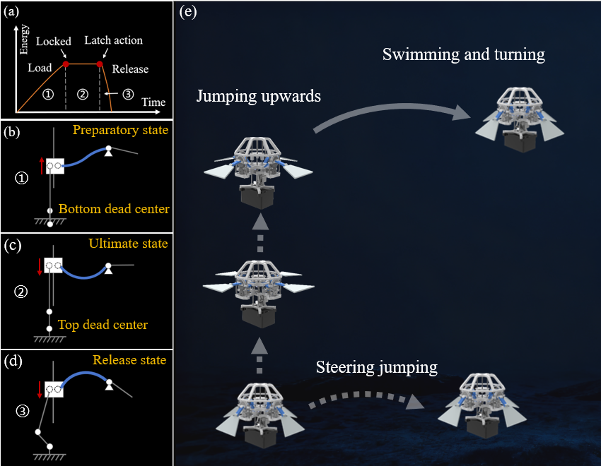
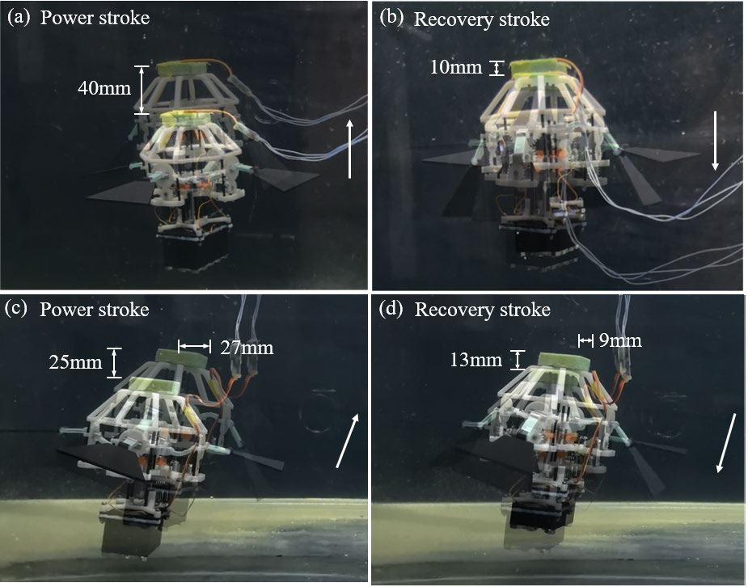
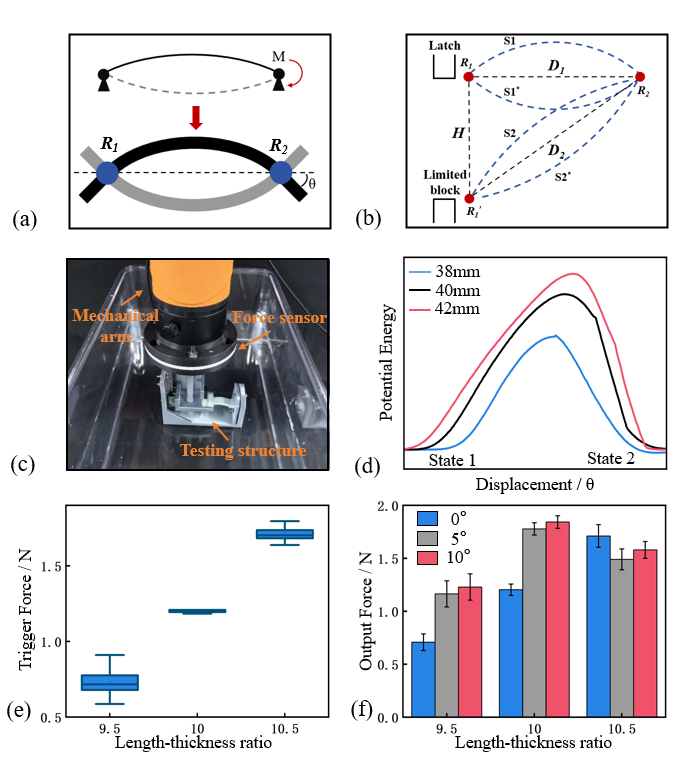
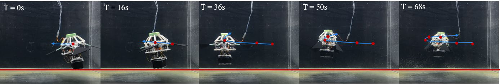
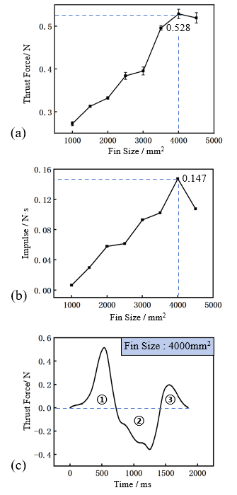

# 仿生软体双稳态水下机器人，利用闩锁机制实现高效推进

[← 返回 2026-05-27 列表](index.md){ .back-link }

### A Bioinspired Underwater Robot with a Latch-Mediated Soft Bistable Mechanism

  ⭐ 9.0
  locomotion
  2605.26936

*Chongze Bi, Wenjie Wu, Zonghao Zuo, Li Wen*

<figure markdown>
  
  <figcaption>Figure 2.  Mechanism and Structural Design. a) Overview of our robot. b)  Mechanism design of the bistable actuator. c) Behavior of the bistable  structure and fins at different stages. d) Assembly of main structures of the  bistable actuat</figcaption>
</figure>

!!! tip "💡 Trick — 关键技术 insight"
    核心在于将闩锁介导的弹簧驱动（LaMSA）与软体双稳态结构结合，通过单个电机实现非对称能量输入与释放，从而在紧凑结构中产生快速、非对称的驱动。这种设计解耦了能量存储与释放，使得机器人能够利用鳍状结构实现高效水下推进和机动。

## 摘要

水下机器人领域面临小型化动力源能量密度低的挑战。自然界中螳螂虾等生物通过闩锁介导的弹簧驱动（LaMSA）实现快速运动。本文提出一种仿生软体双稳态驱动器，集成了闩锁机制，利用单个电机实现非对称能量输入与释放。结合鳍状结构，该设计实现了高效水下推进与机动。实验表明，机器人能稳定周期性拍动、精确转向，最大推力0.528 N，冲量0.147 Ns，垂直位移30 mm。通过调节鳍角，可实现垂直上升、斜向前进和侧向平移等多种运动。该研究为紧凑型水下机器人提供了一种新颖的节能运动控制方法。

**Tags**: `bioinspired` `soft-robot` `underwater-robot` `bistable-actuator` `latch-mechanism`

## 📝 我的评价

值得精读。该工作巧妙地将LaMSA原理与软体双稳态结构结合，解决了小型水下机器人快速驱动与紧凑结构的矛盾。实验数据充分，展示了多种运动模式，对仿生水下机器人设计有重要参考价值。

## 📷 论文中其他图

---

[📄 arXiv 摘要页](http://arxiv.org/abs/2605.26936v1) &nbsp;·&nbsp; [📑 PDF 全文](https://arxiv.org/pdf/2605.26936v1)
