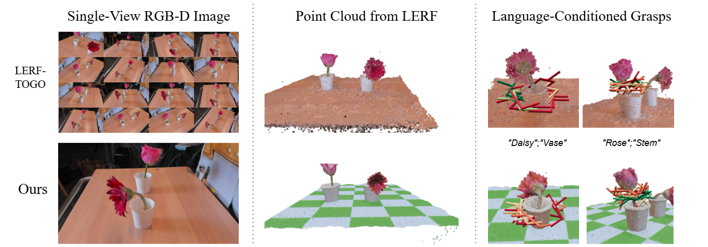
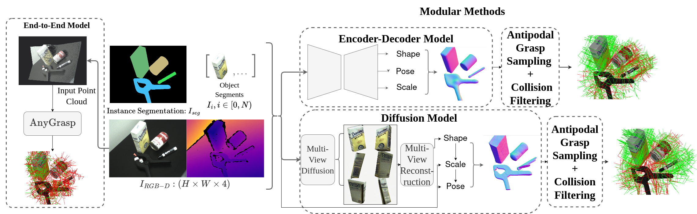
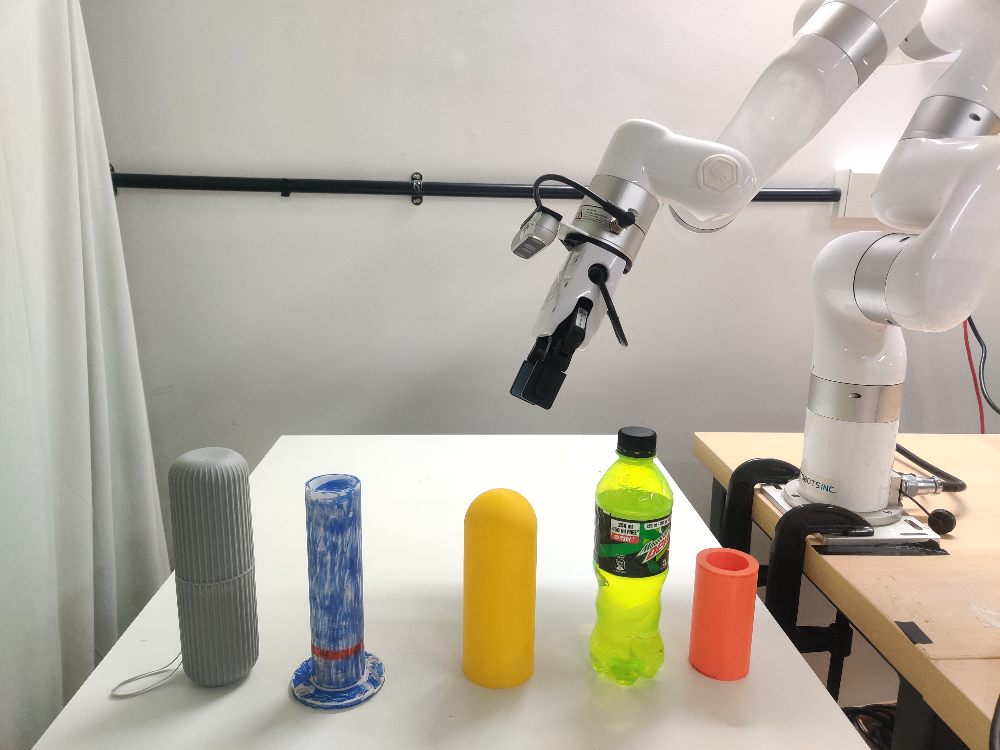
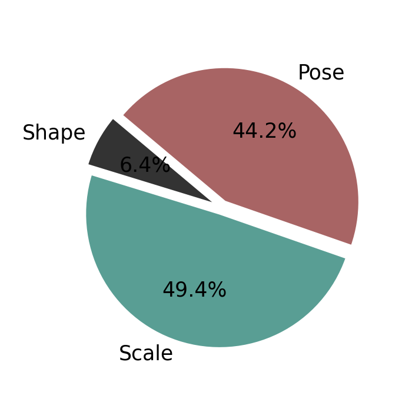
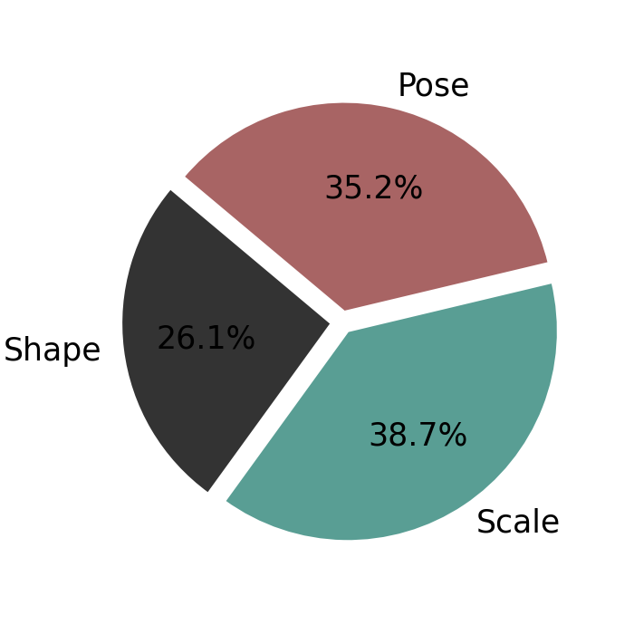

# 模块化方法优于端到端抓取合成方法

[← 返回 2026-05-27 列表](index.md){ .back-link }

### Object Pose and Shape Estimation for Grasping: Does it Work?

  ⭐ 9.0
  grasping
  2605.26944

*Pavan Karke, Kushal Shah, Gaurav Singh, Md Faizal Karim 等 6 位*

<figure markdown>
  
  <figcaption>Fig. 1. (a) We implement and analyze four methods for grasp synthesis (only three shown): a state-of-the-art, End-to-End Method (AnyGrasp [1]), and three Modular Methods (SAM3D-Grasp, CRISP-Grasp and SC-Grasp), which first estimate the obje</figcaption>
</figure>

!!! tip "💡 Trick — 关键技术 insight"
    通过对比实验，发现先进行物体姿态和形状估计再使用对极采样生成抓取的模块化方法，在单视图RGB-D输入下，性能优于端到端抓取合成方法。关键在于姿态和形状估计的准确性，尽管在杂乱场景中性能会下降。此外，结合视觉语言模型可实现语言条件抓取。

## 摘要

本文研究了物体姿态和形状估计方法在抓取任务中的成熟度。通过对比端到端抓取合成方法和三种模块化方法（先估计姿态和形状，再使用对极采样生成抓取），发现模块化方法在所有实验中均优于端到端方法，尤其对小物体有效。模块化方法的有效性依赖于姿态和形状估计的准确性，在杂乱场景中会部分退化。文章还分析了三种模块化方法的失败模式和运行时间，并展示了结合视觉语言模型实现语言条件抓取的能力，性能与基线相当。

**Tags**: `grasping` `pose-estimation` `shape-estimation` `modular-methods` `end-to-end`

## 📝 我的评价

值得精读，贡献在于系统比较了模块化与端到端方法，揭示了姿态和形状估计在抓取中的关键作用，并展示了与视觉语言模型结合的可能性。与已有工作相比，提供了更全面的实验分析和实际应用指导。

## 📷 论文中其他图

---

[📄 arXiv 摘要页](http://arxiv.org/abs/2605.26944v1) &nbsp;·&nbsp; [📑 PDF 全文](https://arxiv.org/pdf/2605.26944v1)
