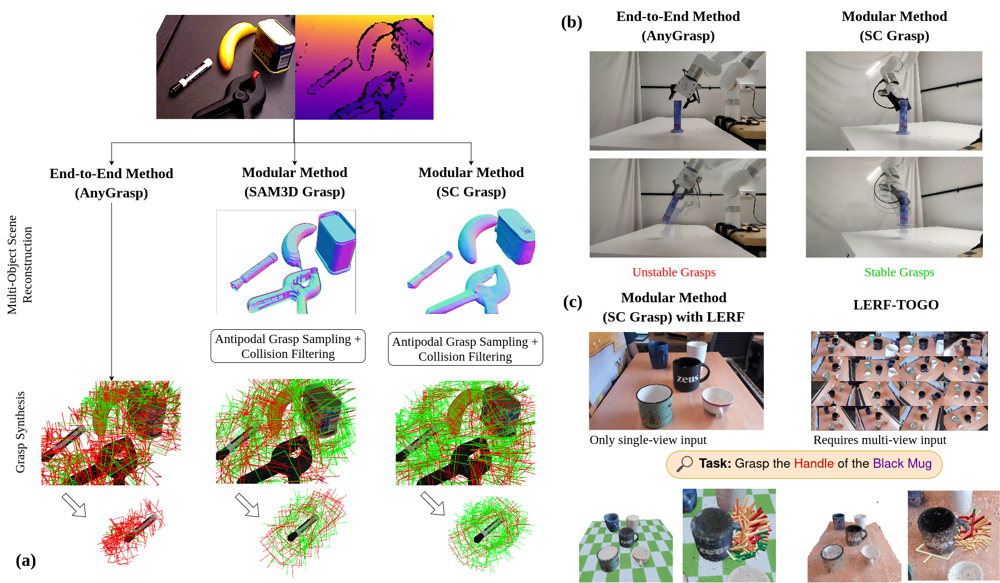

<a class="back-btn" href="../">← 返回 2026-05-27</a>

# 模块化方法在抓取任务中优于端到端方法

### Object Pose and Shape Estimation for Grasping: Does it Work?

⭐ 9.0
grasping
2605.26944

📄 <a href="http://arxiv.org/abs/2605.26944v1">arXiv 摘要页</a> &nbsp;·&nbsp; 📑 <a href="https://arxiv.org/pdf/2605.26944v1">PDF 全文</a>

*Pavan Karke, Kushal Shah, Gaurav Singh, Md Faizal Karim 等 6 位*

<figure markdown>
  
  <figcaption>Fig. 1. (a) We implement and analyze four methods for grasp synthesis (only three shown): a state-of-the-art, End-to-End Method (AnyGrasp [1]), and three Modular Methods (SAM3D-Grasp, CRISP-Grasp and SC-Grasp), which first estimate the obje</figcaption>
</figure>

## 💡 关键 Tricks

- ⭐ 核心 — **将抓取任务分解为姿态形状估计+抓取采样两个模块，利用现有成熟模型（如SAM3D、InstantMesh）进行估计，再通过反平行采样生成抓取，避免了端到端方法对大量数据的需求和泛化问题。**
- 使用单视图RGB-D图像作为输入，结合编码器-解码器或扩散模型进行姿态形状估计，实现了类别无关的开放集泛化。
- 在模块化方法中，先估计场景中所有物体的姿态和形状，再统一进行抓取采样，提高了对小型物体的抓取成功率。
- 通过分析失败模式，发现模块化方法的性能受限于姿态形状估计的精度，尤其在杂乱场景中会退化。
- 将视觉语言模型（如CLIP）与姿态形状估计结合，实现语言条件抓取，仅需单视图RGB-D输入即可达到与LERF-TOGO相当的性能。
- 对比了编码器-解码器（如SAM3D）和扩散模型（如InstantMesh）两种估计方式，发现两者在运行时间和精度上各有优劣。

## 📝 摘要

=== "中文"

    物体姿态和形状估计问题近年来取得了关键进展。编码器-解码器模型（如SAM3D、LRM、CRISP）和扩散模型（如InstantMesh、Zero123、SceneComplete）展示了类别无关的形状编码能力和开放集泛化性。在这项工作中，我们提出一个问题：物体姿态和形状估计方法是否足够成熟，以至于当与反平行抓取采样结合时，能够优于端到端的抓取合成方法？我们通过将研究范围限定在平行夹爪、7自由度抓取和单视图RGB(-D)图像输入，详细探讨了这个问题。我们实现并比较了一种最先进的端到端抓取合成方法和三种模块化方法，这些方法首先估计场景中所有物体的姿态和形状，然后使用反平行采样生成抓取。我们观察到，在所有实验中，模块化方法都优于端到端方法。模块化方法能够合成大量抓取，即使对于小型物体也是如此，而端到端方法则失败。模块化方法的有效性取决于姿态和形状估计的准确性，并且在杂乱场景中会部分退化——这是现有姿态和形状估计方法的局限性。我们还分析了三种模块化方法的失败模式和运行时间，这些方法使用两种不同的物体姿态和形状估计方式：一种基于编码器-解码器模型，另一种基于扩散模型。最后，我们证明了单视图物体姿态和形状估计方法可以与视觉语言模型结合，仅从单视图RGB-D图像输入生成语言条件抓取。我们注意到其性能与最先进的LERF-TOGO基线相当。

=== "English"

    The problem of object pose and shape estimation has seen key advancements lately. Encoder-decoder (e.g., SAM3D, LRM, CRISP) and diffusion-based models (e.g., InstantMesh, Zero123, SceneComplete) have shown category-agnostic shape encoding capacity and open-set generalizability. In this work, we ask the question: Are the object pose and shape estimation methods mature enough, such that when used with antipodal grasp sampling, can outperform the end-to-end grasp synthesis methods? We explore this question in detail by scoping our study to parallel jaw grippers, 7-DoF grasps, and single-view RGB(-D) image as input. We implement and compare a state-of-the-art, end-to-end grasp synthesis method and three modular methods, which first estimate the object pose and shape for all objects in the scene, and generate grasps using antipodal sampling. We observe that the modular methods outperform the end-to-end method in all our experiments. The modular methods are able to synthesize plenty of grasps, even for small objects, where the end-to-end methods fail. The effectiveness of the modular methods is contingent on the accuracy of the pose and shape estimation, and suffers partial degradation in cluttered scenes - a limitation of the existing pose and shape estimation methods. We also analyze the failure modes and run-times for the three modular methods, which use two different ways of object pose and shape estimation: one based on an encoder-decoder model, while another a diffusion model. Finally, we demonstrate that the single-view object pose and shape estimation methods can be augmented with vision-language models to yield language-conditioned grasps from just single-view RGB-D image as input. We notice comparable performance to the state-of-the-art LERF-TOGO baseline.

## 🔗 与已有工作的关系

与直接端到端抓取合成方法相比，模块化方法通过显式估计物体姿态和形状，利用成熟的反平行采样策略，在小型物体和开放集场景中表现更好。传统端到端方法通常需要大量训练数据且泛化性有限，而模块化方法则受益于预训练的姿态形状估计模型。

## 📌 我的评价

该论文系统性地比较了模块化与端到端抓取方法，实验设计严谨，结论明确，对实际应用有指导意义。值得精读，尤其是对抓取系统设计感兴趣的研究者。

---

**Tags**: `grasping` `pose estimation` `shape estimation` `modular` `diffusion`
