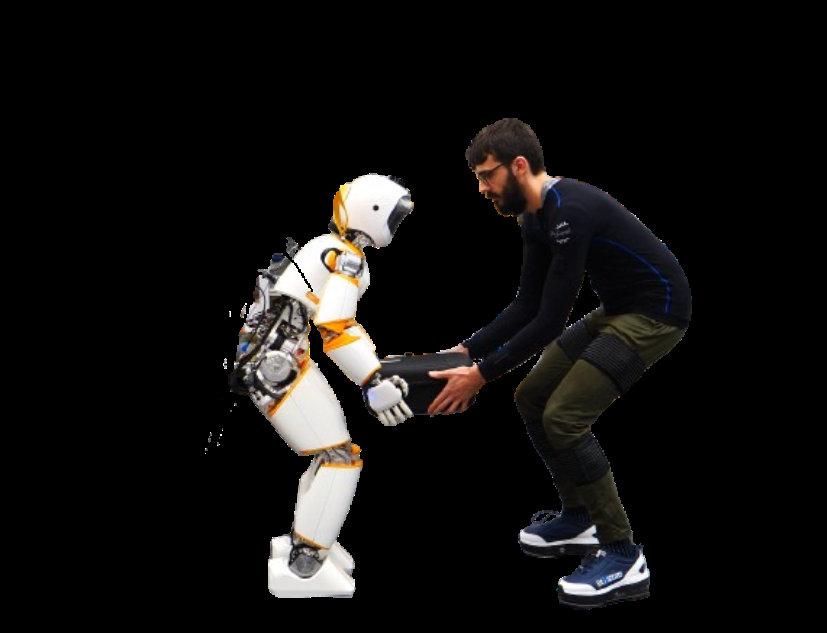
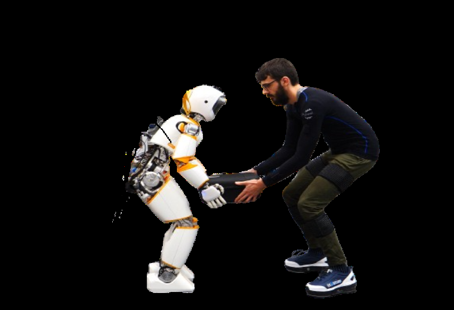
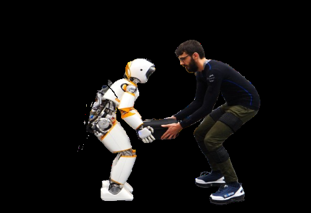
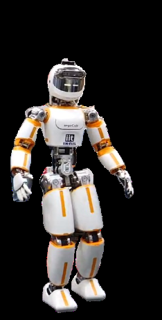
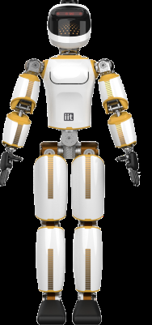
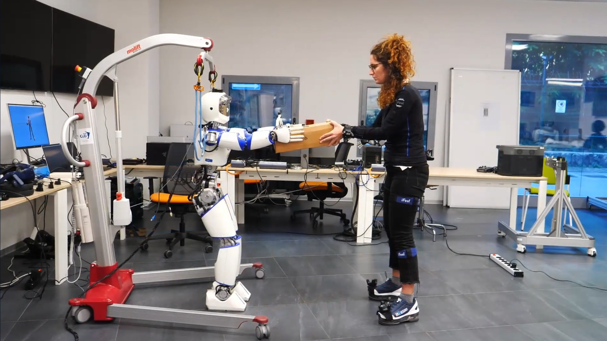

# 提出共享具身智能架构，优化人形机器人硬件与控制以协作

[← 返回 2026-05-27 列表](index.md){ .back-link }

### Towards Shared Embodied Intelligence in Humanoid Robots through Optimization Development and Testing of the Human Aware ergoCub Robot

  ⭐ 9.0
  locomotion
  2605.26991

*Carlotta Sartore, Mohamed Elobaid, Lorenzo Rapetti, Giulio Romualdi 等 16 位*

<figure markdown>
  
  <figcaption>Fig. 2: The shared embodied intelligence architecture instances to optimize robot hardware and physical intelli- gence leveraging human-robot interaction models that are parametrized with respect to robot hardware parameters. Within this ar</figcaption>
</figure>

!!! tip "💡 Trick — 关键技术 insight"
    将人体工效学指标作为优化目标，通过建模人机交互与硬件配置的函数关系，将人体模型嵌入机器人物理智能中，实现硬件与控制的双重优化。

## 摘要

本文提出一种整合共享智能与具身认知的架构，旨在使机器人能够安全有效地与人类进行物理协作。该架构通过优化机器人硬件和物理智能参数（如人体工效学指标），将人体模型嵌入机器人控制中，实现共享具身智能。具体实现为人形机器人ergoCub，其形态和控制针对协作任务优化。实验表明该方法在工业和辅助机器人领域有应用潜力。

**Tags**: `humanoid-robot` `shared-intelligence` `embodied-cognition` `human-robot-collaboration` `ergonomics`

## 📝 我的评价

值得精读，贡献在于提出将人体工效学融入机器人设计的新框架，与以往仅关注任务效率的方法不同，强调人类中心设计。

## 📷 论文中其他图

---

[📄 arXiv 摘要页](http://arxiv.org/abs/2605.26991v1) &nbsp;·&nbsp; [📑 PDF 全文](https://arxiv.org/pdf/2605.26991v1)
