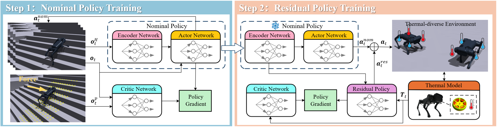
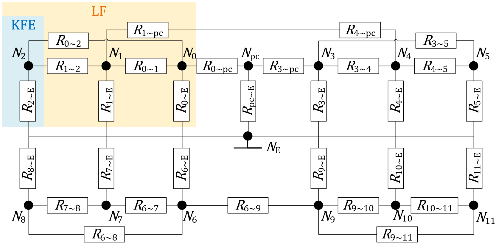
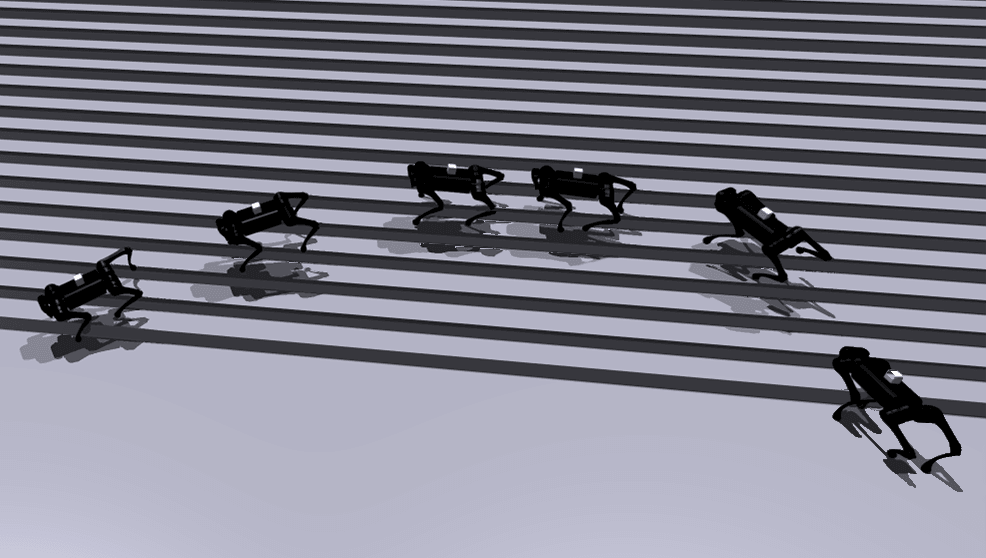
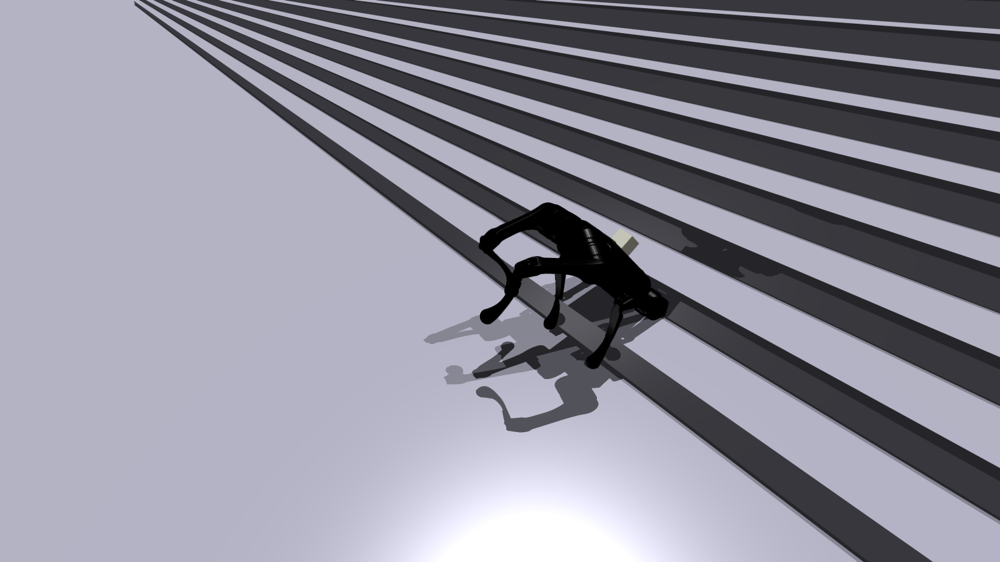
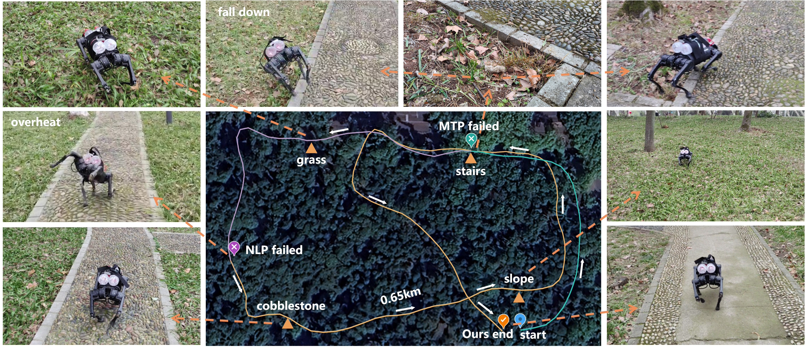

# 残差策略平衡电机热安全与四足运动性能

[← 返回 2026-05-27 列表](index.md){ .back-link }

### Learning to Balance Motor Thermal Safety and Quadrupedal Locomotion Performance with Residual Policy

  ⭐ 9.0
  locomotion
  2605.27046

*Yuhang Wan, Weixian Lin, Letian Qian, Yiqi Zou 等 8 位*

<figure markdown>
  
  <figcaption>Fig. 1: Overview of the two-stage training framework: (1) pre-train a nominal policy as the baseline for locomotion; (2) integrate a whole-body thermal model of the quadruped robot into our pipeline and train a residual policy to modulate t</figcaption>
</figure>

!!! tip "💡 Trick — 关键技术 insight"
    将全身热模型集成到强化学习管线中实时更新电机温度，并采用两阶段训练框架：先预训练标称运动策略，再叠加残差策略根据热状态修正动作，实现低温高性能与高温防过热。

## 摘要

电机热管理在电驱动机器人（尤其是足式机器人）中常被忽视，但电机过热是限制长时间运动的关键因素。本文将四足机器人的全身热模型集成到强化学习管线中更新电机温度，并提出两阶段训练框架：先预训练标称策略作为运动基线，再训练残差策略根据热状态提供修正动作，确保低温下高性能并防止高温过热。仿真结果表明该策略有效平衡了热安全与运动性能。在Unitree A1四足机器人上的真实实验进一步验证：在3kg负载下，机器人能在多种地形上稳定运动超过13分钟，而单独标称策略约5分钟即导致电机过热。

**Tags**: `reinforcement-learning` `thermal-management` `quadrupedal-locomotion` `residual-policy` `sim2real`

## 📝 我的评价

值得精读，贡献在于将热管理引入四足运动RL，两阶段残差策略设计简洁有效，实验充分（仿真+实物），对长时运动有实际意义。

## 📷 论文中其他图

---

[📄 arXiv 摘要页](http://arxiv.org/abs/2605.27046v1) &nbsp;·&nbsp; [📑 PDF 全文](https://arxiv.org/pdf/2605.27046v1)
