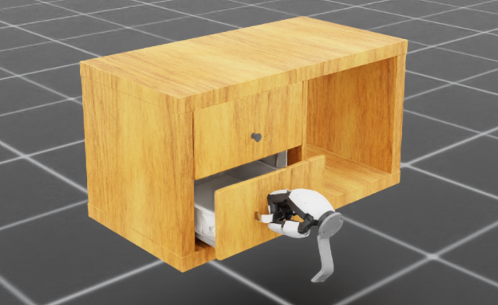
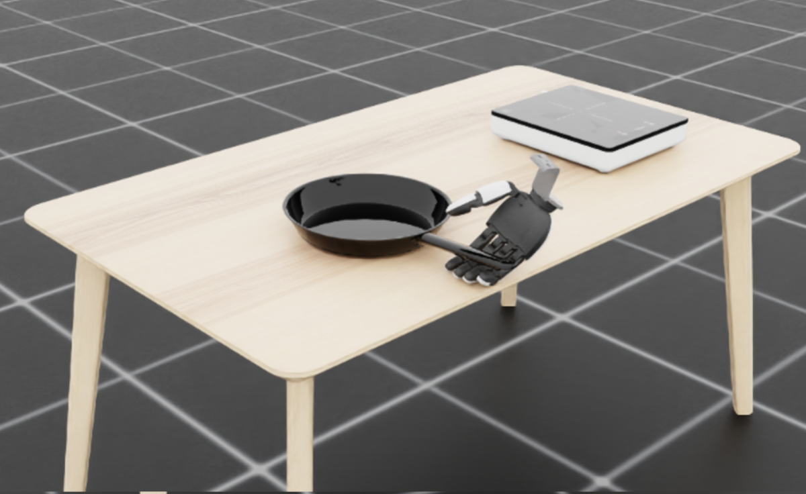
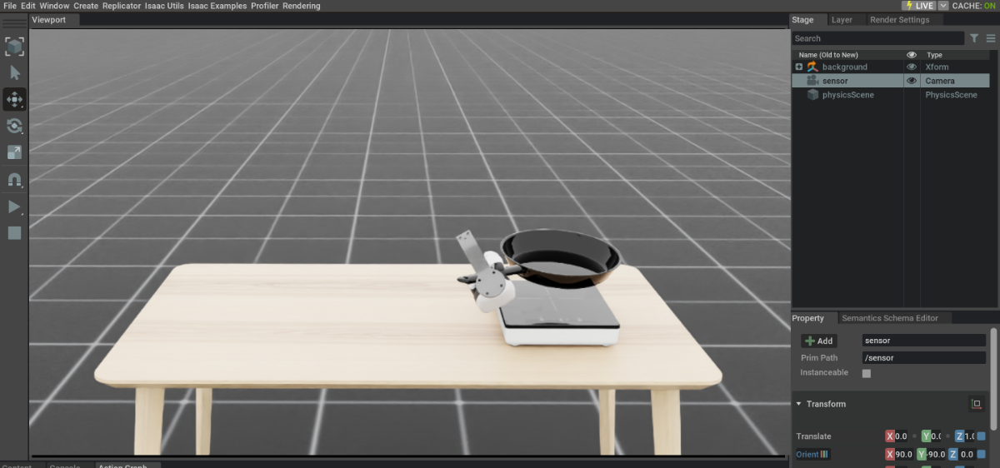
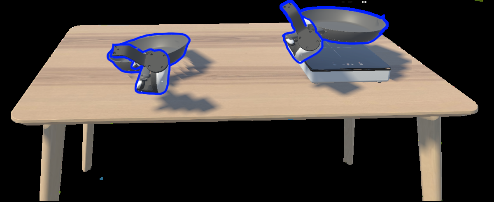
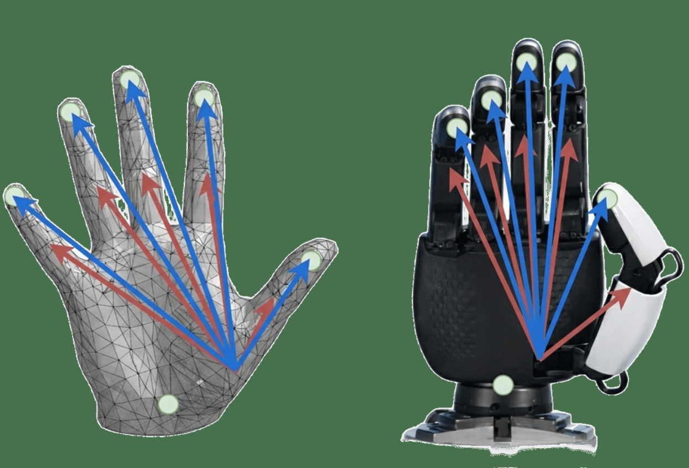

# VR数据收集与不确定性引导的在线纠正

[← 返回 2026-05-27 列表](index.md){ .back-link }

### VR-DAgger: Immersive VR for Dexterous Data Collection and Uncertainty-Guided On-Policy Correction

  ⭐ 9.0
  teleoperation
  2605.27114

*René Zurbrügg, Tifanny Portela, Arjun Bhardwaj, Aravind Elanjimattathil Vijayan 等 6 位*

<figure markdown>
  
  <figcaption>Fig. 2: VR-DAGGER system overview. A client-server architecture decouples interactive VR teleoperation from simulation and learning. The server runs Isaac Lab, policy inference, and MC dropout uncertainty estimation; the Meta Quest client s</figcaption>
</figure>

!!! tip "💡 Trick — 关键技术 insight"
    结合VR沉浸式遥操作高效收集灵巧操作数据，并利用不确定性估计引导专家仅对高不确定性状态进行在线纠正，减少冗余专家干预。

## 摘要

本文提出VR-DAgger框架，利用VR沉浸式遥操作高效收集灵巧操作演示数据，并引入不确定性估计来引导专家仅在模型预测高不确定性的状态下进行在线纠正，从而减少专家在冗余低价值纠正上的时间消耗。实验表明，该方法在灵巧操作任务上显著提升了数据收集效率和策略性能。

**Tags**: `vr` `dexterous-manipulation` `dagger` `uncertainty-estimation` `imitation-learning`

## 📝 我的评价

值得精读，贡献在于将VR与不确定性引导的DAgger结合，解决了灵巧操作数据收集和分布偏移问题，实验充分，方法实用。

## 📷 论文中其他图

---

[📄 arXiv 摘要页](http://arxiv.org/abs/2605.27114v1) &nbsp;·&nbsp; [📑 PDF 全文](https://arxiv.org/pdf/2605.27114v1)
