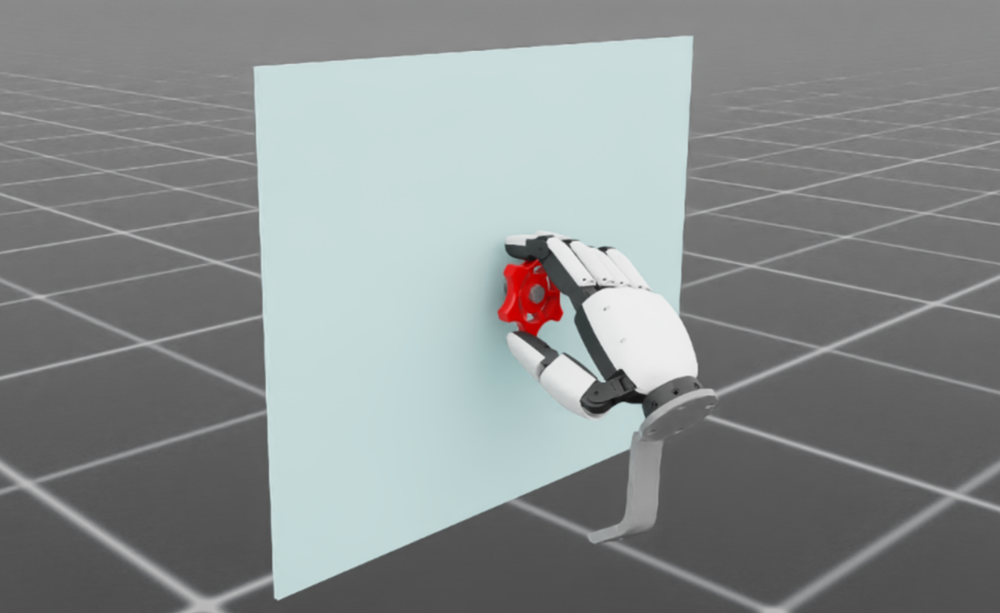

<a class="back-btn" href="../">← 返回 2026-05-27</a>

# VR采集+不确定性引导的在线策略修正框架

### VR-DAgger: Immersive VR for Dexterous Data Collection and Uncertainty-Guided On-Policy Correction

⭐ 9.0
teleoperation
2605.27114

📄 <a href="http://arxiv.org/abs/2605.27114v1">arXiv 摘要页</a> &nbsp;·&nbsp; 📑 <a href="https://arxiv.org/pdf/2605.27114v1">PDF 全文</a>

*René Zurbrügg, Tifanny Portela, Arjun Bhardwaj, Aravind Elanjimattathil Vijayan 等 6 位*

<figure markdown>
  
  <figcaption>Fig. 2: VR-DAGGER system overview. A client-server architecture decouples interactive VR teleoperation from simulation and learning. The server runs Isaac Lab, policy inference, and MC dropout uncertainty estimation; the Meta Quest client s</figcaption>
</figure>

## 💡 关键 Tricks

- ⭐ 核心 — **核心：不确定性引导的在线策略修正（DAgger变体）：利用模型不确定性（如dropout MC采样）自动识别高错误风险状态，仅在这些状态下请求专家纠正，减少冗余交互。**
- 沉浸式VR数据采集：使用VR头显和手套提供高自由度、低成本的灵巧操作演示数据，支持复杂任务。
- 结合离线演示与在线修正：先用VR采集大量离线数据预训练策略，再通过不确定性引导的在线交互高效修正分布偏移。
- 不确定性量化方法：采用MC Dropout或集成模型估计预测方差，作为请求专家纠正的阈值。
- 避免冗余纠正：传统DAgger随机或固定频率请求专家，本方法聚焦于模型不确定的困难样本，提升专家时间利用率。
- 灵巧操作任务验证：在需要精细控制的物体重排、组装等任务上验证，相比基线方法显著减少专家交互次数并提高成功率。

## 📝 摘要

=== "中文"

    从演示中学习对机器人操作有效，但收集足够的任务特定数据仍是主要瓶颈。在分布偏移下，小误差会累积，性能下降，专家时间往往花在冗余、低价值的修正上，而非少数关键失败案例。本文提出VR-DAgger，一个结合沉浸式VR数据采集与不确定性引导在线策略修正的框架。首先通过VR系统高效收集灵巧操作演示数据，然后利用模型不确定性自动识别高错误风险状态，仅在这些状态下请求专家在线纠正。在多个灵巧操作任务上的实验表明，该方法显著减少了专家交互次数，同时提升了策略在分布偏移下的鲁棒性和最终成功率。

=== "English"

    Learning from demonstrations is effective for robotic manipulation, but collecting sufficient task-specific data remains a major bottleneck. Under distribution shift, small errors compound, performance degrades, and expert time is often spent on redundant, low-value corrections instead of the few critical failure cases.

## 🔗 与已有工作的关系

与传统模仿学习（如行为克隆）相比，本方法通过在线修正处理分布偏移，但避免了DAgger中随机或固定频率请求专家导致的冗余。与仅依赖离线演示的方法相比，本方法利用不确定性引导的交互更高效地纠正关键错误。

## 📌 我的评价

该工作将VR采集与不确定性引导的DAgger结合，解决了数据效率和专家时间利用问题，思路清晰且实验充分，值得精读。

---

**Tags**: `imitation learning` `dexterous manipulation` `virtual reality` `uncertainty estimation` `daggervariant`
