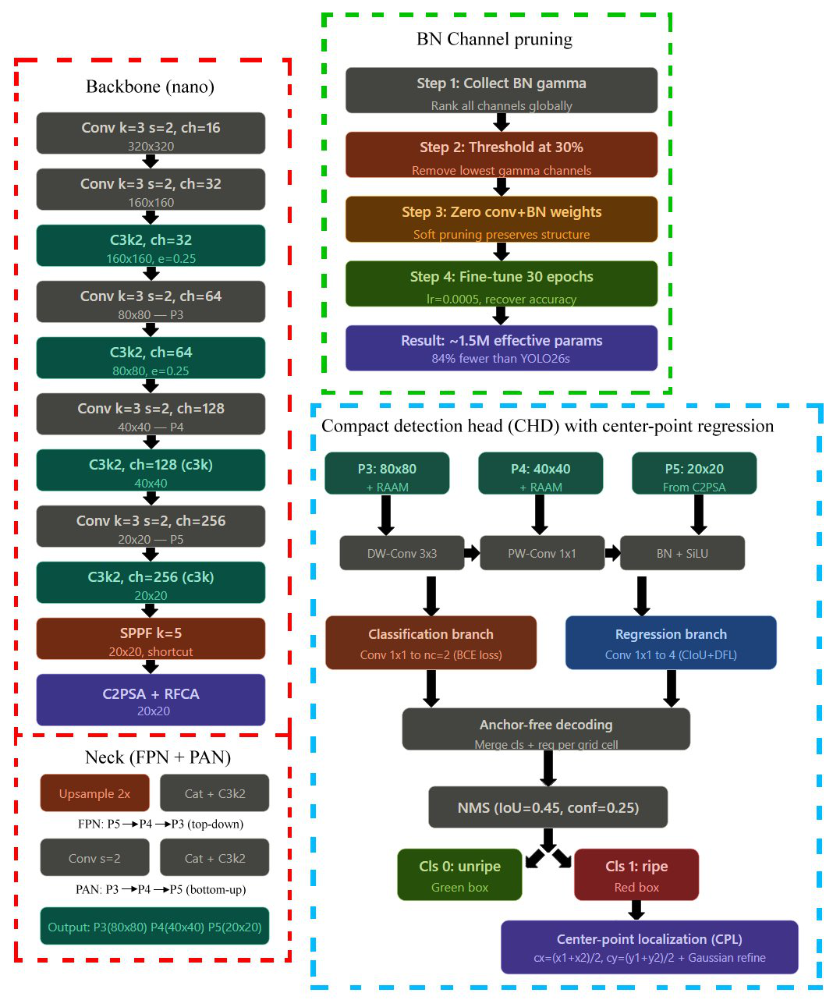
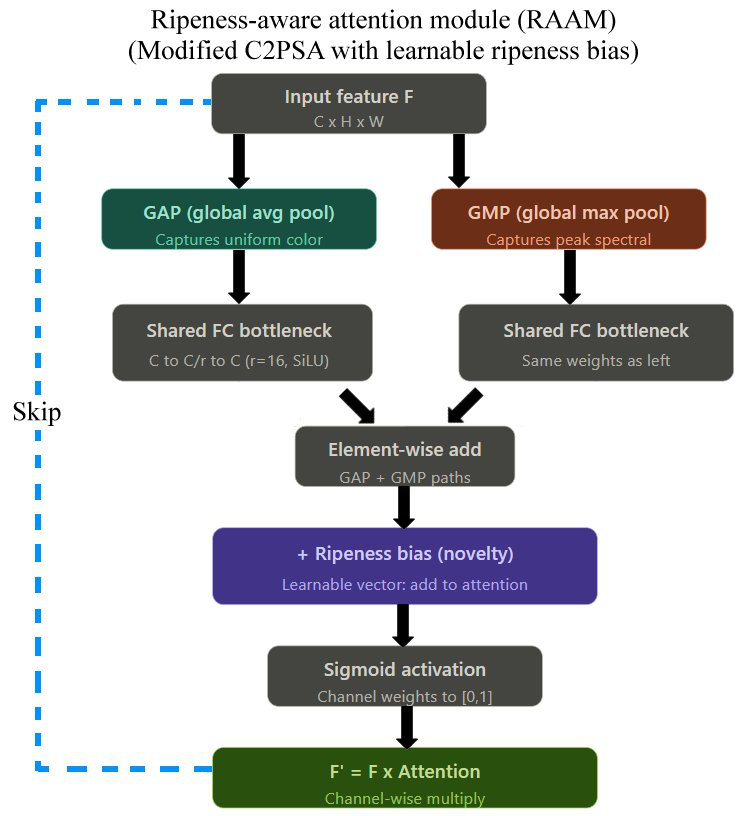
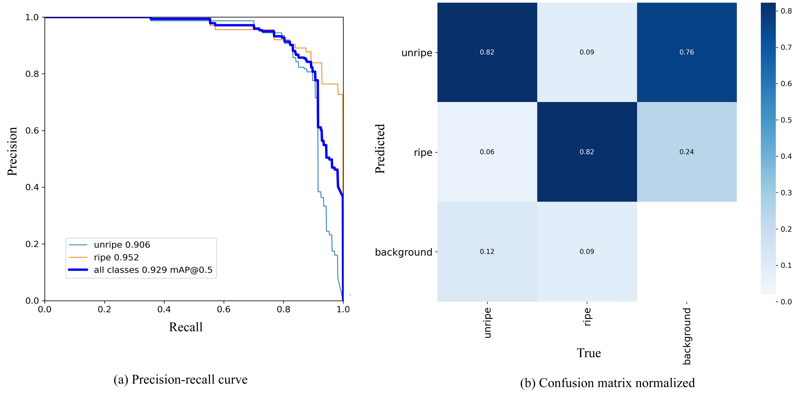
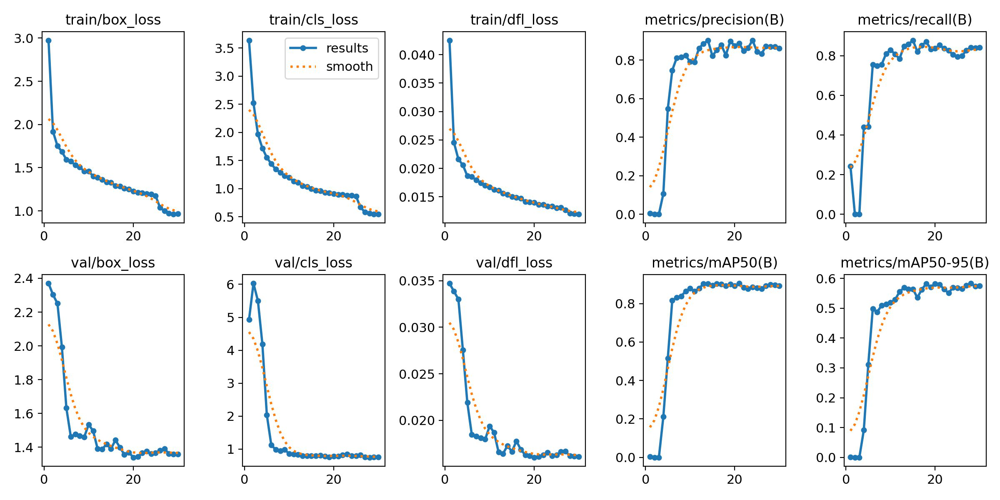
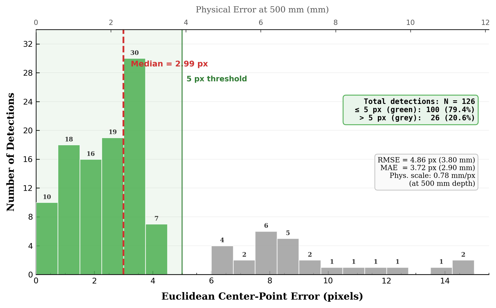

# 轻量级番茄成熟检测与采摘点定位网络

[← 返回 2026-05-27 列表](index.md){ .back-link }

### YOLO26-RipeLoc Lite: A lightweight architecture for tomato ripeness detection and picking point localization in greenhouse robotic harvesting

  ⭐ 9.0
  perception
  2605.27129

*Rajmeet Singh, Manveen Kaur, Shahpour Alirezaee, Irfan Hussain*

<figure markdown>
  
  <figcaption>Figure 2: Overall architecture of YOLO26-RipeLoc Lite. The model consists of a modified YOLO26 nano backbone (left, red dashed), a BN-based channel pruning pipeline (top-right, green dashed), and a detection head with center-point localizat</figcaption>
</figure>

!!! tip "💡 Trick — 关键技术 insight"
    1) 轻量特征金字塔(LFPN)采用深度可分离卷积实现高效多尺度融合；2) 成熟感知注意力模块(RAAM)通过双池化和可学习成熟偏置向量增强颜色纹理区分；3) 紧凑检测头(CDH)共享卷积并集成中心点回归分支，直接输出抓取点。

## 摘要

针对温室番茄机器人采摘，提出YOLO26-RipeLoc Lite轻量网络，同时完成成熟检测、分类和中心点定位。引入LFPN、RAAM和CDH三个改进模块。在1500张图像数据集上，mAP@0.5达92.9%，参数仅2.38M，经30%剪枝后约1.8M。消融实验表明温室HSV增强提升最大(+2.02 pp)，三阶段渐进解冻获得最佳定位质量。与YOLOv8n/s等对比，精度高2.9 pp且参数少7.0%。

**Tags**: `yolo` `object-detection` `agricultural-robotics` `lightweight-network` `ripeness-detection`

## 📝 我的评价

值得精读。贡献在于针对温室番茄采摘场景设计了轻量级且集成定位的检测网络，在精度和效率上优于主流YOLO变体。与已有工作相比，创新点明确且实验充分，对农业机器人应用有实际参考价值。

## 📷 论文中其他图

---

[📄 arXiv 摘要页](http://arxiv.org/abs/2605.27129v1) &nbsp;·&nbsp; [📑 PDF 全文](https://arxiv.org/pdf/2605.27129v1)
