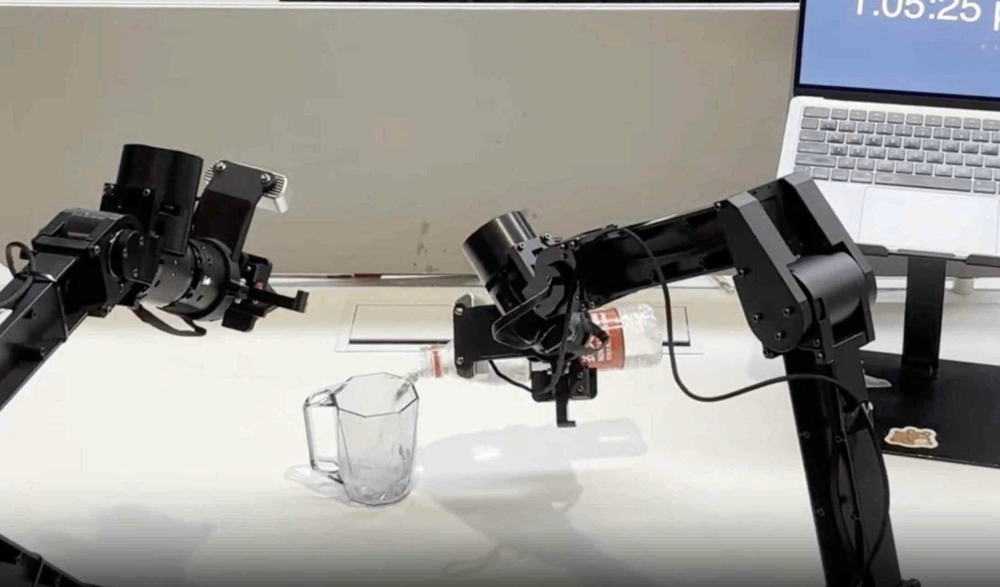
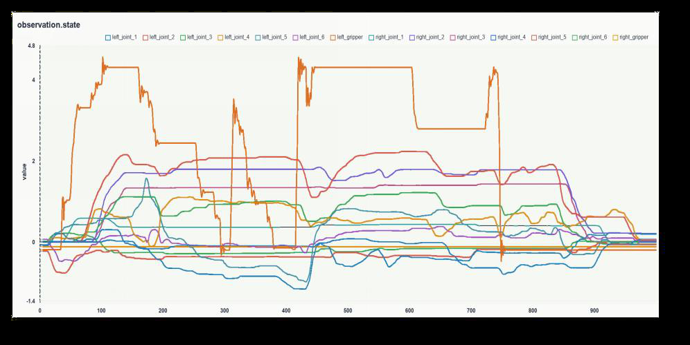
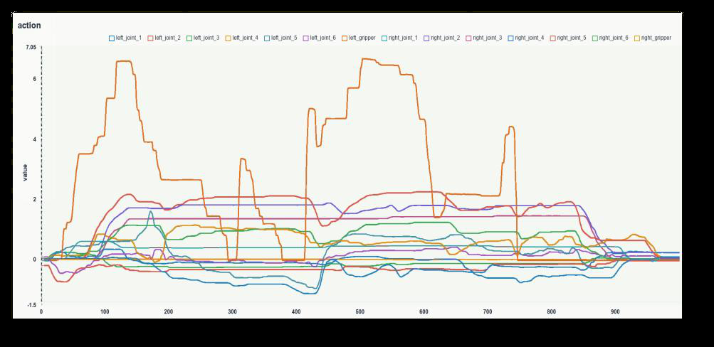
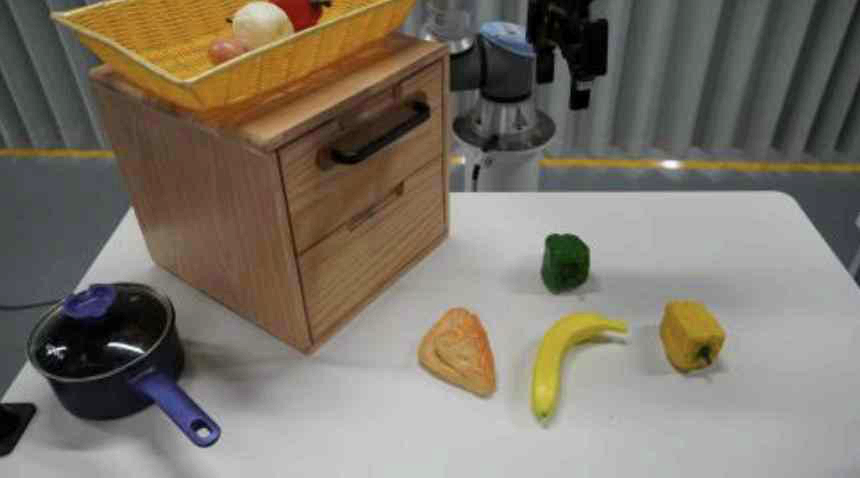
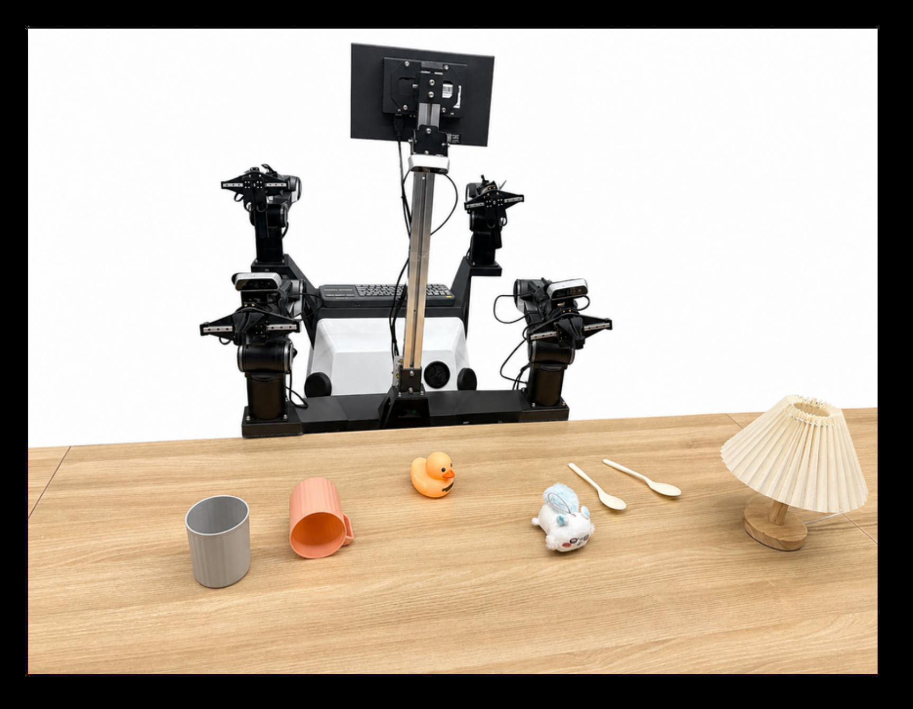
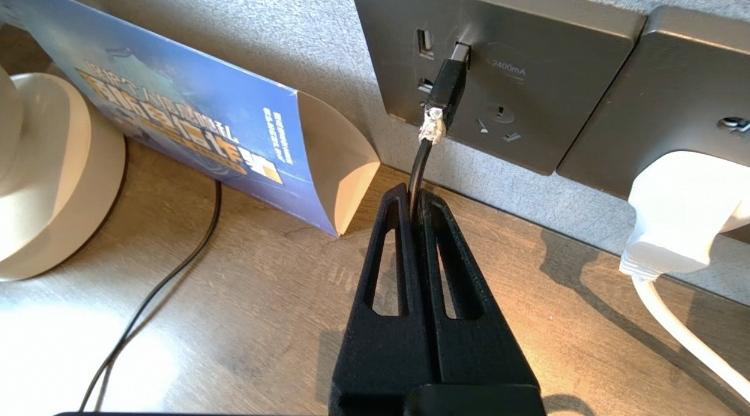

# 细粒度指令对齐的可操控VLA策略

[← 返回 2026-05-27 列表](index.md){ .back-link }

### FineVLA: Fine-Grained Instruction Alignment for Steerable Vision-Language-Action Policies

  ⭐ 10.0
  VLA
  2605.27284

*Xintong Hu, Xuhong Huang, Jinyu Zhang, Yutong Yao 等 14 位*

<figure markdown>
  
  <figcaption>Figure 1: Overview of FineVLA. FineVLA builds a closed loop for action-instruction alignment, connecting fine-grained data construction, robotic video understanding, scalable annotation, and steerable VLA policy learning. Left: FineVLA-Tool</figcaption>
</figure>

!!! tip "💡 Trick — 关键技术 insight"
    核心在于构建细粒度指令数据集FineVLA-Data，并设计可控混合训练策略（FG:Raw比例1:2到1:1），使模型同时学习目标级和细粒度指令，实现可操控性。细粒度监督不牺牲目标级成功率，且与原始指令互补。

## 摘要

现有VLA模型通常只能跟随粗粒度目标级指令，缺乏执行细节（如手臂、方向、接触区域）的指导。本文提出FineVLA框架，包括：数据构建工具统一10个开源数据集，生成47,159条细粒度轨迹；一个包含500视频、10,816原子事实和1,030 VQA问题的基准；一个机器人专用VLM标注器；以及一个可控混合训练策略。实验发现：细粒度监督不降低目标级成功率（提升1.4-8.1%），最佳混合比例FG:Raw=1:2到1:1，在仿真和真实任务中均优于纯原始指令，尤其在姿态、颜色和接近方向等细粒度因素上提升显著。

**Tags**: `vla` `fine-grained` `instruction-following` `robot-manipulation` `data-augmentation`

## 📝 我的评价

值得精读。贡献在于系统性地解决了细粒度指令对齐问题，并提供了开源数据集和基准。与现有VLA工作相比，强调了可操控性，实验设计严谨。

## 📷 论文中其他图

---

[📄 arXiv 摘要页](http://arxiv.org/abs/2605.27284v1) &nbsp;·&nbsp; [📑 PDF 全文](https://arxiv.org/pdf/2605.27284v1)
