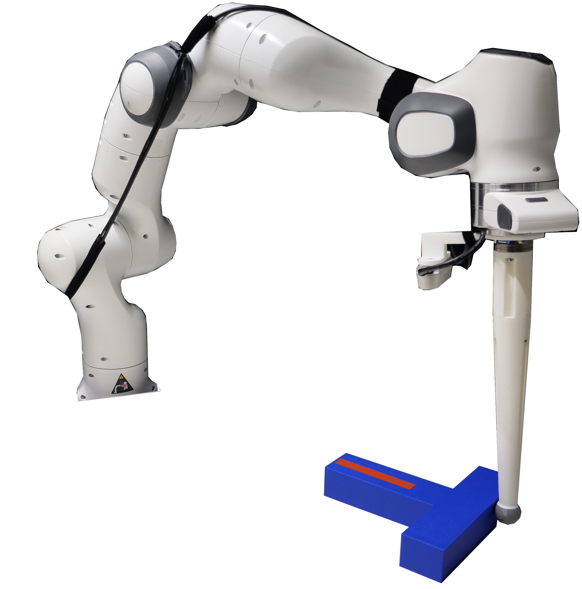

<a class="back-btn" href="../">← 返回 2026-05-27</a>

# 用零空间投影解决多目标反应控制的冲突问题

### Riding the Shifting Potential: When Reactive Control Suffices for Multi-Goal Behavior

👀
⭐ 8.0
navigation
2605.27314

📄 <a href="http://arxiv.org/abs/2605.27314v1">arXiv 摘要页</a> &nbsp;·&nbsp; 📑 <a href="https://arxiv.org/pdf/2605.27314v1">PDF 全文</a>

*Vito Mengers, Oliver Brock*

<figure markdown>
  
  <figcaption>Fig. 2. By coupling state estimators through active interconnections, we construct a model that solves the pushT task through reactive gradient-based control (green box). When interconnected with additional estimators into a larger model (o</figcaption>
</figure>

## 💡 关键 Tricks

- ⭐ 核心 — **将冲突目标优先级编码为图世界模型中的零空间投影，高优先级梯度投影到低优先级梯度的零空间，避免局部极小。**
- 优先级根据当前状态连续确定，而非固定，使控制适应动态交互。
- 在非凸障碍导航和非凸物体平面推动任务中，无需演示或重训练，直接迁移到真实机器人。

## 📝 摘要

=== "中文"

    反应控制通常被认为不足以处理多目标任务，因为冲突目标会导致局部极小。我们认为这一局限性并非固有，而是源于静态编码未能反映目标当前如何交互。我们利用基于图的世界模型中编码的交互结构，通过扩展零空间投影来解决冲突：在冲突产生的地方，将低优先级梯度投影到高优先级梯度的零空间中，优先级由当前状态连续确定。我们在两个目标冲突为核心问题的领域进行了演示：非凸障碍导航（静态势场根本失败）和非凸物体平面推动，我们的方法在一百个配置中实现了100%的成功率，而最速下降基线为0%，扩散策略约为55%，无需演示或重训练。相同的公式直接迁移到真实机器人，额外感知和运动学约束通过相同机制得到适应。

=== "English"

    Reactive control is often considered insufficient for multi-objective tasks because conflicting objectives give rise to local minima. We argue this limitation is not inherent but arises from static encodings that fail to reflect how objectives currently interact. We exploit the interaction structure encoded in a graph-based world model by extending it with nullspace projections: conflicts are resolved where they arise by projecting lower-priority gradients into the nullspace of higher-priority ones, with priorities determined continuously from the current state. We demonstrate this in two domains where conflicts between objectives are central: navigation around non-convex obstacles, where static potential fields fundamentally fail, and planar pushing of non-convex objects, where our method achieves $100\%$ success across one-hundred configurations versus $0\%$ for the steepest-descent baseline and ${\sim}55\%$ for diffusion policy, without demonstrations or retraining. The same formulation transfers directly to a real robot with additional perceptual and kinematic constraints, accommodating them through the same mechanism.

## 🔗 与已有工作的关系

与传统反应控制（如势场法）相比，本文通过动态优先级和零空间投影解决了局部极小问题。与扩散策略等基于演示的方法相比，本文无需训练数据即可达到更高成功率。与基于优化的规划方法相比，本文保持反应控制的低计算成本。

👀 锐评

方法简洁优雅，在非凸障碍和平面推动任务上效果显著，零空间投影的思路在机器人控制中并不新鲜，但结合图世界模型动态优先级的设计有实际价值。然而，实验仅涉及两个简单领域，且未与更多基线（如MPC、强化学习）对比，泛化性存疑。另外，真实机器人实验细节不足，未提及是否处理了感知噪声等实际问题。

---

**Tags**: `reactive-control` `nullspace-projection` `multi-objective` `world-model` `robot-manipulation`
