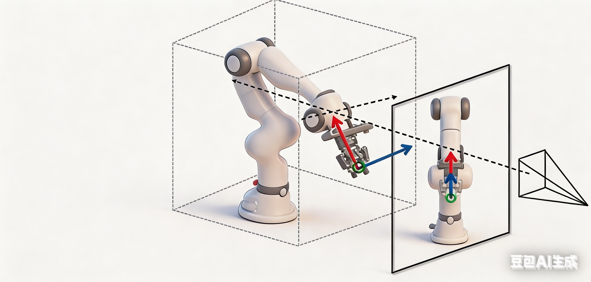

<a class="back-btn" href="../">← 返回 2026-05-28</a>

# 闭环视频世界模拟器，用于机器人操作策略学习

### GE-Sim 2.0: A Roadmap Towards Comprehensive Closed-loop Video World Simulators for Robotic Manipulation

👀
⭐ 10.0
world-model
2605.27491

📄 <a href="http://arxiv.org/abs/2605.27491v1">arXiv 摘要页</a> &nbsp;·&nbsp; 📑 <a href="https://arxiv.org/pdf/2605.27491v1">PDF 全文</a>

*Boxiang Qiu, Liliang Chen, Yue Liao, Nan Wang 等 15 位*

<figure markdown>
  
  <figcaption>Figure 1: Overview of GE-Sim 2.0. GE-Sim 2.0 is a closed-loop video world simulator for robotic manipulation, trained on millions of real-world episodes spanning teleoperation, on-robot policy deployment, and rich object interaction. Given </figcaption>
</figure>

## 💡 关键 Tricks

- ⭐ 核心 — **在Genie Envisioner基础上，用数千小时真实机器人数据（遥操作、接触丰富交互、策略部署）重新训练，大幅提升动作跟随保真度和轨迹覆盖。**
- 状态专家模块：从视频隐变量解码本体感觉状态，支持下游VLA策略的下一个块预测。
- 世界评判模块：根据任务指令对生成轨迹评分，提供机器可验证的成功信号和奖励，替代人工检查。
- 加速框架：单张H100上2.3秒生成25帧，推理时支持最多4倍跳帧，实现长时域评估。

## 📝 摘要

=== "中文"

    我们提出了GE-Sim 2.0（Genie Envisioner World Simulator 2.0），一个用于机器人操作的闭环视频世界模拟器。基于Genie Envisioner的动作条件视频生成框架，GE-Sim 2.0在数千小时的真实机器人数据（包括遥操作、接触丰富交互和机上策略部署）上重新训练，显著提高了动作跟随保真度和轨迹覆盖。在此基础上，三个新模块将视频模拟与策略学习闭环连接：状态专家从视频隐变量解码本体感觉状态，支持下游VLA策略的下一个块预测；世界评判根据任务指令对生成轨迹评分，提供机器可验证的成功信号和奖励，替代人工检查；加速框架在单张H100上2.3秒生成25帧，推理时支持最多4倍跳帧，实现长时域评估。GE-Sim 2.0仅用2B参数就登顶公共WorldArena排行榜，超越了专用机器人世界模型和闭源通用视频生成器，并且基于其轨迹和奖励训练的策略在真实世界中取得了可衡量的性能提升，确立了GE-Sim 2.0作为可扩展评估和闭环操作策略学习的实用平台。

=== "English"

    We introduce GE-Sim 2.0 (Genie Envisioner World Simulator 2.0), a closed-loop video world simulator for robotic manipulation. Building on the action-conditioned video generation framework of Genie Envisioner, GE-Sim 2.0 is re-trained on thousands of hours of real-world robot data spanning teleoperation, contact-rich interaction, and on-robot policy deployment, substantially improving action-following fidelity and trajectory coverage. On top of this foundation, three new modules close the loop from video simulation to policy learning: a state expert that decodes proprioceptive state from video latents to support next-chunk prediction by downstream VLA policies; a world judge that scores generated rollouts against task instructions, yielding machine-verifiable success signals and rewards in place of manual inspection; and an acceleration framework that delivers a 25-frame rollout in 2.3 seconds on a single H100, with up to 4* frame skipping at inference for long-horizon evaluation. GE-Sim 2.0 tops the public WorldArena leaderboard at only 2B parameters, outperforming both dedicated robotic world models and closed-source general video generators, and policies trained against its rollouts and rewards translate into measurable real-world gains, establishing GE-Sim 2.0 as a practical platform for scalable evaluation and closed-loop learning of manipulation policies.

## 🔗 与已有工作的关系

与Genie Envisioner相比，GE-Sim 2.0通过更大规模的真实数据训练和三个新模块（状态专家、世界评判、加速框架）实现了闭环模拟和策略学习。与UniSim、Dreamer等世界模型相比，GE-Sim 2.0在WorldArena上以更小参数量取得更好性能，且支持真实世界迁移。

👀 锐评

论文提出了一个实用的闭环视频世界模拟器，在数据规模、模块设计和真实世界迁移方面都有扎实贡献。但状态专家从视频隐变量解码本体感觉的精度和泛化性未详细分析，且加速框架的跳帧策略对长时域任务的影响需进一步验证。

---

**Tags**: `world-model` `video-simulation` `robotic-manipulation` `vla` `closed-loop`
