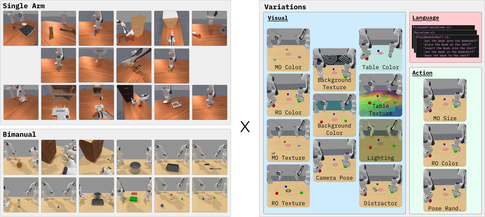

<a class="back-btn" href="../">← 返回 2026-05-28</a>

# VLA泛化性基准测试平台，含28任务和2种机器人形态。

### Colosseum V2: Benchmarking Generalization for Vision Language Action Models

👀
⭐ 9.0
VLA
2605.27759

📄 <a href="http://arxiv.org/abs/2605.27759v1">arXiv 摘要页</a> &nbsp;·&nbsp; 📑 <a href="https://arxiv.org/pdf/2605.27759v1">PDF 全文</a>

*Jeremy Morgan, Prajwal Vijay, Hyeonho Oh, Jincen Song 等 9 位*

<figure markdown>
  
  <figcaption>Fig. 2. Overview of COLOSSEUM V2. Left: the full set of tasks across two robot morphologies (Single-Arm and Bimanual), spanning diverse manipulation primitives and long-horizon behaviors. Right: the perturbations used to evaluate visual, la</figcaption>
</figure>

## 💡 关键 Tricks

- ⭐ 核心 — **基于ManiSkill模拟器实现GPU并行化快速评估，支持大规模域内和域外测试。**
- 包含28个任务覆盖13个类别和2种机器人形态，涵盖多种操作原语和长时域行为。
- 验证了仿真与真实世界指标之间的强相关性，支持基准的生态效度。
- 标准化任务、指标和评估协议，实现可重复公平比较，降低评估开销。

## 📝 摘要

=== "中文"

    视觉-语言-动作（VLA）模型在机器人操作中展现出有希望的泛化能力，这得益于大规模视觉和语言预训练的进步。然而，这种进展可能具有误导性。尽管VLA具有零样本感知和语言能力，但其整体任务性能在分布偏移下常常下降，揭示了这些系统将高层理解转化为鲁棒行为方面的差距。为了系统研究这一差距，我们引入了Colosseum V2，这是一个大规模仿真基准，用于评估机器人学习中VLA在不同条件下的泛化能力。该基准包含28个任务，涵盖13个任务类别和两种机器人形态，覆盖了广泛的操作原语和长时域行为。基于ManiSkill模拟器构建，Colosseum V2支持快速、GPU并行化的评估，并支持大规模域内和域外测试。我们评估了包括Action Chunking Transformers（ACT）和Pi0.5在内的最先进方法，揭示了基础性能和泛化能力方面的局限性。我们展示了仿真与真实世界指标之间的强相关性，支持了基准的生态效度。通过在一个统一基准中标准化任务、指标和评估协议，Colosseum V2实现了可重复和公平的比较，降低了评估开销，并加速了向通用机器人策略的进展。

=== "English"

    Vision-Language-Action (VLA) models demonstrate promising generalization in robotic manipulation, driven by advances in large-scale vision and language pre-training. This progress can be misleading. Despite the zero-shot perception and language capabilities of VLAs, their overall task performance often degrades under distribution shifts, revealing gaps in how these systems translate high-level understanding into robust behavior. To systematically study this gap, we introduce Colosseum V2, a large-scale simulation benchmark for evaluating VLA generalization in robot learning across diverse conditions. The benchmark comprises 28 tasks spanning 13 task categories and two robot morphologies, covering a wide range of manipulation primitives and long-horizon behaviors. Built on the ManiSkill simulator, Colosseum V2 enables fast, GPU-parallelized evaluation and supports both in-domain and out-of-domain testing at scale. We evaluate state-of-the-art methods, including Action Chunking Transformers (ACT) and Pi0.5, and reveal limitations in both base performance and generalization. We demonstrate strong correlations between simulation and real-world metrics that support the ecological validity of the benchmark. By standardizing tasks, metrics, and evaluation protocols within a unified benchmark, Colosseum V2 enables reproducible and fair comparisons, reduced evaluation overhead, and accelerated progress toward general-purpose robot policies.

## 🔗 与已有工作的关系

与现有仿真基准（如RLBench、MetaWorld）相比，Colosseum V2更专注于VLA模型的泛化性评估，并提供了GPU并行化加速。与ACT和Pi0.5等方法相比，该基准揭示了它们在分布偏移下的性能退化。

👀 锐评

基准设计扎实，28个任务和两种形态覆盖度不错，但缺乏真实世界实验验证（摘要仅提及仿真与真实指标相关，未直接进行真实实验）。此外，评估的方法仅包括ACT和Pi0.5，缺少更多最新VLA模型（如OpenVLA、RT-2）的比较，削弱了基准的时效性。

---

**Tags**: `benchmark` `vla` `generalization` `simulation` `manipulation`
