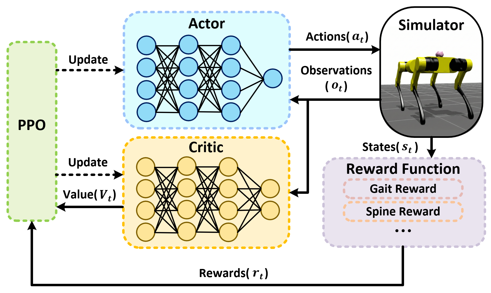

<a class="back-btn" href="../">← 返回 2026-05-28</a>

# 3-DOF仿生脊柱四足机器人S-Cheetah及其敏捷运动学习

### S-Cheetah: A Novel Quadrupedal Robot with a 3-DOF Active Spine Learning Agile Locomotion

👀
⭐ 10.0
locomotion
2605.27909

📄 <a href="http://arxiv.org/abs/2605.27909v1">arXiv 摘要页</a> &nbsp;·&nbsp; 📑 <a href="https://arxiv.org/pdf/2605.27909v1">PDF 全文</a>

*Zimu Li, Weibang Bai*

<figure markdown>
  
  <figcaption>Fig. 4: Basic framework of the reinforcement learning method used for training.</figcaption>
</figure>

## 💡 关键 Tricks

- ⭐ 核心 — **设计3-DOF仿生串联主动脊柱，实现空间三轴旋转，更接近生物脊柱运动能力。**
- 提出加速度课程学习策略，逐步增加训练难度，促进脊柱关节的充分利用。
- 设计专门奖励函数，包括奔跑步态奖励、脊柱波动奖励和脊柱转向奖励，引导脊柱参与敏捷运动。
- 通过强化学习框架，使机器人学会空中自复位行为，从任意姿态四足着地。

## 📝 摘要

=== "中文"

    四足动物的生物脊柱能够实现矢状面的屈伸、侧向弯曲和轴向旋转，在高度敏捷和灵巧的运动中起着关键作用。尽管许多研究已将主动脊柱关节集成到四足机器人中以增强敏捷性，但大多数设计通过减少脊柱自由度来简化控制复杂性，未能实现生物脊柱的空间三轴旋转特征。因此，复制多自由度仿生脊柱并有效利用它来增强四足机器人的敏捷运动仍然是一个重要的研究挑战。在本研究中，我们提出了S-Cheetah，一种具有3-DOF仿生串联主动脊柱的四足机器人，能够实现仿生的空间三轴旋转。为了使机器人充分利用这一主动脊柱，我们开发了一个专门的强化学习框架，通过集成加速度课程学习策略和定制奖励函数（如奔跑步态奖励、脊柱波动奖励和脊柱转向奖励），积极促进引入的脊柱的参与并最大化机器人的运动能力。实验结果表明，S-Cheetah使用旋转G2奔跑步态可以达到6.9米/秒的峰值速度，原地转向速率为7.2弧度/秒。此外，该系统表现出一种新兴的、受猫启发的空中自复位能力，使其在自由落体中从任意方向稳定地四足着地。最后，通过在不同运动任务中的广泛评估，我们证明了所提出的3-DOF脊柱的引入全面增强了四足机器人的运动敏捷性。项目网站：himmy-robotics.github.io/scheetah

=== "English"

    The biological spine of quadrupeds enables sagittal flexion/extension, lateral bending, and axial rotation, playing a crucial role in highly agile and dexterous locomotion. While numerous studies have integrated active spinal joints into quadrupedal robots to enhance agility, most designs simplify control complexity by reducing spinal degrees of freedom (DOF), failing to achieve the spatial tri-axial rotation characteristic of biological spines. Consequently, replicating a multi-DOF biomimetic spine and effectively leveraging it to empower the agile locomotion of quadrupedal robots remains a significant research challenge. In this study, we present S-Cheetah, a quadrupedal robot featuring a 3-DOF bio-inspired serial active spine capable of biomimetic spatial tri-axial rotation. To empower the robot to fully utilize this active spine, we developed a specialized reinforcement learning framework to actively promote the engagement of the introduced spine and maximize the robot's locomotive capabilities by integrating an acceleration curriculum learning strategy with tailored reward functions, such as a gallop gait reward, a spine undulation reward, and a spine steering reward. Experimental results demonstrate that S-Cheetah can achieve a peak speed of 6.9 m/s using the rotary G2 gallop gait and an in-place turning rate of 7.2 rad/s. Besides, the system exhibits an emergent, feline-inspired aerial self-righting capability, allowing it to land stably on four feet from arbitrary orientations during free fall. Finally, through extensive evaluations across diverse locomotion tasks, we prove that the introduction of the proposed 3-DOF spine comprehensively enhances the locomotive agility of quadrupedal robots. Project website: himmy-robotics.github.io/scheetah

## 🔗 与已有工作的关系

与现有四足机器人主动脊柱研究相比，S-Cheetah首次实现了3-DOF仿生脊柱，而大多数工作仅采用1-DOF或2-DOF简化设计。在控制方法上，不同于传统基于模型的控制，本文采用强化学习框架并设计课程学习与奖励函数来主动利用脊柱自由度，与近期基于RL的敏捷运动控制方法（如针对MIT Cheetah的工作）形成对比。

👀 锐评

硬件设计上3-DOF脊柱是亮点，但强化学习框架的贡献相对常规，课程学习和奖励函数设计在四足机器人领域已有较多先例。实验部分展示了速度、转向和自复位能力，但缺乏与无脊柱或低自由度脊柱基线的定量对比，难以直接量化3-DOF脊柱带来的增益。此外，空中自复位行为是否完全依赖脊柱还是腿部协调也需进一步分析。

---

**Tags**: `quadrupedal-robot` `active-spine` `reinforcement-learning` `agile-locomotion` `bio-inspired`
