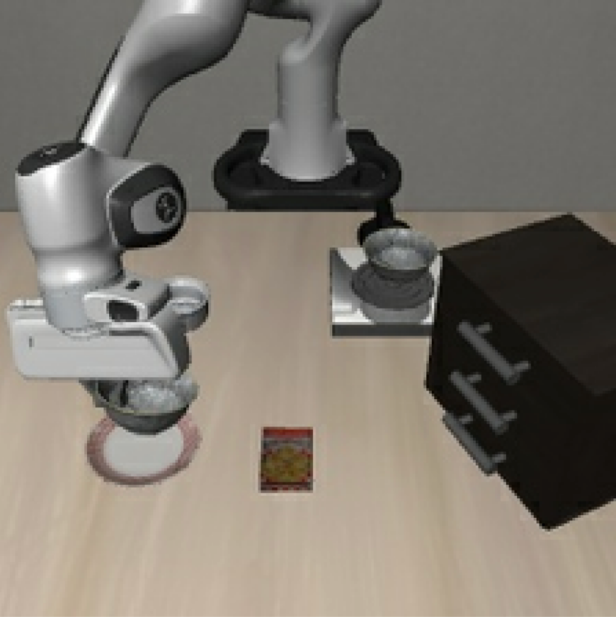

<a class="back-btn" href="../">← 返回 2026-05-28</a>

# 通过视觉本体感知劫持实现跨架构黑盒对抗补丁攻击

### VLA-Hijack: A Transferable Patch Attack against Vision-Language-Action Models via Visual Proprioception Hijacking

👀
⭐ 9.0
VLA
2605.28083

📄 <a href="http://arxiv.org/abs/2605.28083v1">arXiv 摘要页</a> &nbsp;·&nbsp; 📑 <a href="https://arxiv.org/pdf/2605.28083v1">PDF 全文</a>

*Jiyuan Fu, Kaixun Jiang, Jingkai Jia, Zhaoyu Chen 等 10 位*

<figure markdown>
  
  <figcaption>Fig. 2: Visualization of Proprioceptive Conflict. Unlike UADA (Col 3), which splits attention between the real arm and the patch, our method (Col 4) completely suppresses the real arm and redirects focus exclusively to the adversarial patch</figcaption>
</figure>

## 💡 关键 Tricks

- ⭐ 核心 — **Attention-Guided Proprioceptive Suppression: 利用注意力图引导抑制真实机械臂特征，使模型无法定位自身**
- Multimodal Proprioceptive Injection: 将对抗补丁注入为替代的“幻影本体”，建立虚假视觉本体感知
- 交替优化语义锚定与视觉原型投影，切断真实本体与控制策略的语义关联

## 📝 摘要

=== "中文"

    虽然视觉-语言-动作（VLA）模型已成为强大的通用策略，但其对对抗补丁的严重脆弱性显著阻碍了其在安全关键领域的部署。此外，现有补丁攻击主要关注白盒设置，过度拟合目标模型的特定动作输出空间，导致跨架构迁移性差。为克服这一局限，我们提出VLA-Hijack，一个统一的对抗框架，通过利用本工作中发现的一个基本漏洞来打破迁移性瓶颈：在规划任何运动之前，VLA模型必须首先使用视觉信息在环境中定位自己的机械臂。针对这一共享的视觉自定位过程，我们的方法同时优化注意力引导的本体感知抑制（抑制真实机械臂特征）和多模态本体感知注入（将补丁建立为替代的“幻影本体”）。通过在语义概念锚定和视觉原型投影之间交替，VLA-Hijack有效切断了智能体真实本体与其控制策略之间的语义关系。在多种架构（OpenVLA、UniVLA和CronusVLA）上的大量实验表明，VLA-Hijack在白盒设置中实现了优越的优化效率，并在跨架构和跨域黑盒迁移性上达到了新的SOTA。

=== "English"

    While Vision-Language-Action (VLA) models have emerged as powerful generalist policies, their severe vulnerability to adversarial patches significantly hinders their deployment in safety-critical domains. Moreover, existing patch attacks primarily focus on white-box settings, heavily overfitting to the specific action output space of the target model, which results in poor cross-architecture transferability. To overcome this limitation, we propose VLA-Hijack, a unified adversarial framework that breaks the transferability bottleneck by exploiting a fundamental vulnerability identified in this work: before planning any motion, a VLA model must first use visual information to locate its own robotic arm within the environment. Targeting this shared visual self-localization process, our approach concurrently optimizes Attention-Guided Proprioceptive Suppression to inhibit the real robotic arm's features, and Multimodal Proprioceptive Injection to establish the patch as a surrogate "phantom embodiment". By alternating between semantic concept anchoring and visual prototype projection, VLA-Hijack effectively severs the semantic relationship between the agent's true embodiment and its control policy. Extensive experiments across diverse architectures (OpenVLA, UniVLA, and CronusVLA) demonstrate that VLA-Hijack achieves superior optimization efficiency in white-box settings and sets a new SOTA for cross-architecture and cross-domain black-box transferability.

## 🔗 与已有工作的关系

与现有对抗补丁攻击（如针对图像分类或目标检测的攻击）不同，VLA-Hijack专门针对VLA模型中的视觉本体感知过程，而非直接攻击动作输出。相比仅关注白盒迁移性的工作，该方法通过攻击共享的视觉自定位模块实现了跨架构黑盒迁移。

👀 锐评

攻击视角新颖，抓住了VLA模型依赖视觉本体感知这一关键共性，实验覆盖多种架构且迁移性结果亮眼。但摘要未提及防御措施或对真实机器人部署的影响，需确认补丁在物理世界中的有效性（如光照、视角变化下的鲁棒性）。此外，攻击假设补丁可放置在机器人视野内，实际场景中可能受限。

---

**Tags**: `vla` `adversarial-attack` `patch-attack` `transferability` `robustness`
