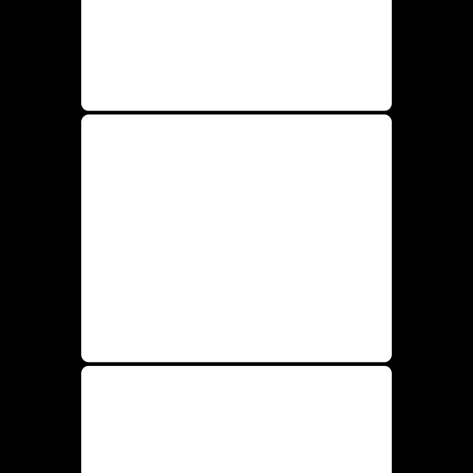

<a class="back-btn" href="../">← 返回 2026-05-28</a>

# 利用生成模型内部信号自评分与推理时优化提升物理合理性

### Proprio: Latent Self-Scoring and Inference-Time Refinement for Physically Plausible Video Generation

👀
⭐ 6.0
world-model
2605.28230

📄 <a href="http://arxiv.org/abs/2605.28230v1">arXiv 摘要页</a> &nbsp;·&nbsp; 📑 <a href="https://arxiv.org/pdf/2605.28230v1">PDF 全文</a>

*Mariam Hassan, Kaouther Messaoud, Wuyang Li, Alexandre Alahi*

<figure markdown>
  
  <figcaption>Figure 2: Proprio method overview. For a generated latent video, Proprio computes a per-video self-scoring signal by perturbing the latent at multiple timesteps, measuring denoising residuals with the frozen generator, weighting timesteps b</figcaption>
</figure>

## 💡 关键 Tricks

- ⭐ 核心 — **将可控潜在扰动下的流残差作为自评分信号：通过分析扰动前后模型内部流特征的稳定性，量化生成视频的物理合理性，扰动下残差越小说明样本越符合模型学到的物理动态。**
- 动态时空掩码聚焦运动相关区域：聚合多时间步和多扰动的残差信号，并用掩码过滤掉静态背景，使评分更集中于物理关键的运动区域。
- 结合最佳N选与梯度自优化：利用自评分信号进行推理时搜索（best-of-N）和/或梯度回传微调潜在表示，无需额外训练即可提升输出质量。

## 📝 摘要

=== "中文"

    现代视频生成模型能产生视觉上令人印象深刻的结果，但经常违反基本的物理原理。我们提出Proprio，一个无需训练框架，使冻结的视频生成器能够评估并改进自身输出的物理合理性。受本体感觉（生物对自身运动的感知）启发，Proprio将模型在受控潜在扰动下的流残差作为自评分信号。那些能被生成器学习到的动态更好地解释的样本会产生更小且更稳定的残差。我们跨时间步和扰动聚合该信号，通过动态时空掩码聚焦于运动相关区域，并将其用于最佳N选搜索、基于梯度的自优化或两者结合。在文生视频和图生视频基准上，Proprio持续提升物理合理性，在多个设置中优于基于VLM的评分和外部世界模型基线。使用TurboWan2.2，Proprio将Physics-IQ从32.2提升至37.5（+16.5%），VideoPhy2-hard物理常识从45.6提升至55.0（+20.6%）。人工评估进一步表明，在约三分之二的比较中，评估者更偏好Proprio选择或优化的视频的物理合理性。这些结果表明，冻结的视频生成器包含可操作的内部信号，用于评估和改进自身输出的物理合理性。

=== "English"

    Modern video generative models produce visually impressive results, yet frequently violate basic physical principles. We propose Proprio, a training-free framework that enables a frozen video generator to assess and improve the physical plausibility of its own outputs. Inspired by proprioception, the biological sense of one's own movement, Proprio treats the model's flow residual under controlled latent perturbations as a self-scoring signal. Samples that are better explained by the generator's learned dynamics induce smaller and more stable residuals. We aggregate this signal across timesteps and perturbations, focus it on motion-relevant regions with a dynamic spatiotemporal mask, and use it for best-of-N search, gradient-based self-refinement, or both. Across text-to-video and image-to-video benchmarks, Proprio consistently improves physical plausibility, outperforming VLM-based scoring, and external world-model baselines in several settings. With TurboWan2.2, Proprio improves Physics-IQ from 32.2 to 37.5 (+16.5%) and VideoPhy2-hard physical commonsense from 45.6 to 55.0 (+20.6%). Human evaluation further shows that raters prefer Proprio-selected or refined videos for physical plausibility in roughly two-thirds of comparisons. These results suggest that frozen video generators contain actionable internal signals for evaluating and improving the physical plausibility of their own outputs.

## 🔗 与已有工作的关系

与VLM-based评分和外部世界模型基线相比，Proprio无需额外模型或训练，仅利用生成器内部信号。不同于传统后处理或外部物理模拟器，该方法在推理时通过自评分和优化直接提升物理合理性。

👀 锐评

方法设计巧妙，利用模型内部信号进行自评分和优化，无需训练或外部模型，具有实用价值。实验在多个基准上提升显著，且有人工评估支持。但依赖生成器内部流特征的可解释性，对于不同架构的通用性需进一步验证。此外，最佳N选的计算成本可能较高，实际部署时需权衡。

---

**Tags**: `video-generation` `self-scoring` `physical-plausibility` `inference-time-optimization` `diffusion-model`
