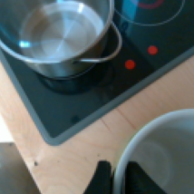

<a class="back-btn" href="../">← 返回 2026-05-28</a>

# 紧凑VLA模型，用进度感知和重采样提升长程操作

### ProgVLA: Progress-Aware Robot Manipulation Skill Learning

👀
⭐ 9.0
VLA
2605.28231

📄 <a href="http://arxiv.org/abs/2605.28231v1">arXiv 摘要页</a> &nbsp;·&nbsp; 📑 <a href="https://arxiv.org/pdf/2605.28231v1">PDF 全文</a>

*Seungsu Kim, Jinyoung Choi, Seungmin Baek, Jean-Michel Renders*

<figure markdown>
  
  <figcaption>Figure 1: ProgVLA architecture. Per-modality Perceiver resamplers compress vision and language features to fixed-size token sets; a fusion Transformer and a post-fusion resampler then distill these into a small set of control-ready context </figcaption>
</figure>

## 💡 关键 Tricks

- ⭐ 核心 — **两阶段Perceiver重采样方案，将多模态序列压缩为固定数量的上下文令牌，大幅降低序列长度同时保持跨模态对齐。**
- 离线RL训练的进度头，学习归一化剩余步长的critic，提供任务进度内部估计，实现优势加权和成功加权的流匹配模仿学习。
- 任务自适应视觉微调，作为最大贡献者之一，提升视觉特征对具体任务的适应性。
- 进度感知训练在长程和多物体任务上提供一致增益。

## 📝 摘要

=== "中文"

    我们提出ProgVLA，一种紧凑的视觉-语言-动作（VLA）模型，专为在严格计算和内存预算下实现可靠机器人操作而设计。该模型通过维护任务进度的显式表示，专注于高效处理长多模态序列。为此，ProgVLA集成了两个关键组件。首先，一个带有两阶段Perceiver重采样方案的多模态编码器，将可变长度的视觉、语言和本体感受流压缩为一组固定的控制就绪上下文令牌，大幅减少序列长度同时保持跨模态对齐。其次，一组辅助进度头通过离线强化学习目标进行训练，共同学习归一化剩余步长目标的critic。这为策略提供了任务进度的内部估计，并实现了优势加权和成功加权的流匹配模仿学习。在两个成熟的多任务机器人操作基准上，一个0.1B参数的ProgVLA模型达到了与更大预训练基线竞争的成功率，并在长程和更难任务层级上超越它们。消融实验表明，学习的上下文重采样器和任务自适应视觉微调是最大的单一贡献者，而进度感知训练在长程和多物体任务上提供了一致的额外增益。我们还在真实世界的玩具厨房环境中验证了该方法。

=== "English"

    We present ProgVLA, a compact vision-language-action (VLA) model designed for reliable robot manipulation under tight compute and memory budgets. The model specifically focuses on efficiently processing long multi-modal sequences by maintaining an explicit representation of task progress over extended horizons. To this end, ProgVLA integrates two key components. First, a multi-modal encoder with a two-stage Perceiver resampling scheme compresses variable-length visual, language, and proprioceptive streams into a fixed set of control-ready context tokens, substantially reducing sequence length while preserving cross-modal grounding. Second, an auxiliary set of progress heads is trained with offline reinforcement learning (RL) objectives to jointly learn critics over normalized remaining-horizon targets. This provides the policy with an internal estimate of task progress and enables advantage- and success-weighted flow-matching imitation learning. On two well-established multi-task robot manipulation benchmarks, a 0.1B-parameter ProgVLA model reaches success rates that are competitive with, and on long-horizon and harder task tiers exceed, substantially larger pretrained baselines. Ablations indicate that the learned context resampler and task-adaptive visual fine-tuning are the largest single contributors, while progress-aware training provides a consistent additional gain that is concentrated on long-horizon and multi-object tasks. We further validate the approach in real-world toy-kitchen environments.

## 🔗 与已有工作的关系

与现有VLA模型（如OpenVLA、RT-2）相比，ProgVLA通过显式进度表示和紧凑架构解决了长序列处理问题，而非依赖大规模预训练。其进度感知训练借鉴了离线RL中的critic学习，但创新性地用于流匹配模仿学习。

👀 锐评

0.1B参数达到与更大模型竞争的性能，进度感知设计在长程任务上确实有效，消融实验也扎实。但进度头的训练需要离线RL数据，可能增加数据收集成本；且真实世界实验仅在单一厨房场景，泛化性存疑。

---

**Tags**: `vla` `progress-aware` `flow-matching` `imitation-learning` `robot-manipulation`
