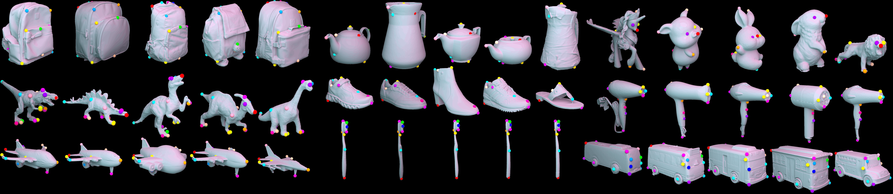

<a class="back-btn" href="../">← 返回 2026-05-28</a>

# 从单图预测类别级3D对应，无需显式监督

### Category-Level 3D Correspondence in Camera Space via Morphable Object Priors

👀
⭐ 6.0
3d-foundation
2605.28257

📄 <a href="http://arxiv.org/abs/2605.28257v1">arXiv 摘要页</a> &nbsp;·&nbsp; 📑 <a href="https://arxiv.org/pdf/2605.28257v1">PDF 全文</a>

*Leonhard Sommer, Artur Jesslen, Basavaraj Sunagad, Adam Kortylewski*

<figure markdown>
  
  <figcaption>Fig. 2: Dataset Overview. We annotate up to 19 3D keypoints directly on CAD meshes for 5–13 instances per category, covering 50 common household object classes. The keypoints are chosen to be semantically consistent and shared across all in</figcaption>
</figure>

## 💡 关键 Tricks

- ⭐ 核心 — **通过解耦规范形状、形变和物体姿态学习可变形类别先验，隐式产生语义对应**
- 构建大规模基准HouseCorr3D，包含50类、28万实例、17.8万图像，提供遮挡区域的无模态标注和对称性标注
- 利用共享规范空间使不同实例的对应点自然对齐，无需直接对应监督

## 📝 摘要

=== "中文"

    理解图像中的3D物体是机器人和AR/VR应用的基础。尽管近期工作在类别级姿态估计方面取得了进展，但现有表示无法捕捉推理物体部件、功能和交互所需的细粒度语义。本文研究相机空间中的类别级3D对应——从单张图像预测在类别内实例间一致的3D位置——并展示通过学习共享的可变形物体先验，该对应可以在没有显式对应监督的情况下涌现。为促进该方向研究，我们引入HouseCorr3D，首个大规模单目类别级3D对应基准，包含50个家居物体类别、280个独特实例、17.8万张图像，以及直接在CAD模型上的3D关键点标注。关键的是，HouseCorr3D提供了遮挡区域的无模态对应标签和显式对称性标注，解决了现有数据集的主要局限。我们进一步提出Morpheus方法，通过解耦规范形状、形变和物体姿态来学习可变形类别级形状先验。通过这种共享规范基础，相机空间中语义上有意义的3D对应隐式涌现。这些涌现的3D对应在HouseCorr3D上达到了新最优，表明语义3D物体理解可以在没有直接对应监督的情况下产生。数据和代码公开于https://github.com/GenIntel/HouseCorr3D。

=== "English"

    Understanding 3D objects from images is fundamental to robotics and AR/VR applications. While recent work has made progress in category-level pose estimation, current representations fail to capture the fine-grained semantics needed for reasoning about object parts, functions, and interactions. In this work, we study category-level 3D correspondence in camera space -- predicting, from a single image, 3D locations that remain consistent across instances within a category -- and show that it can emerge without explicit correspondence supervision by learning a shared morphable object prior. To enable research in this direction, we introduce HouseCorr3D, the first large-scale benchmark for monocular category-level 3D correspondence with 178k images across 50 household object categories, 280 unique instances, and 3D keypoint annotations directly on CAD models. Crucially, HouseCorr3D provides amodal correspondence labels for occluded regions and explicit symmetry annotations, addressing key limitations of existing datasets. We further propose Morpheus, a method that learns morphable category-level shape priors by disentangling canonical shape, deformation, and object pose. Through this shared canonical grounding, semantically meaningful 3D correspondences in camera space emerge implicitly. These emerging 3D correspondences set a new state of the art on HouseCorr3D, demonstrating that semantic 3D object understanding can arise without direct correspondence supervision. Data and code are publicly available at https://github.com/GenIntel/HouseCorr3D.

## 🔗 与已有工作的关系

与类别级姿态估计方法（如NOCS、UMOP）不同，本文关注更细粒度的3D对应而非仅姿态。通过可变形形状先验隐式学习对应，区别于需要密集对应标注的监督方法。与C3DP等基于模板的方法相比，Morpheus无需实例级模板，更具泛化性。

👀 锐评

核心贡献在于证明了无需显式对应监督即可从单图学习类别级3D对应，这一insight有价值。但方法本身（可变形先验+解耦）并非全新，类似思路在人体姿态估计中已有应用。实验仅在自建数据集上进行，缺乏与现有方法在标准姿态估计基准（如Pascal3D+）上的对比，说服力有限。

---

**Tags**: `category-level` `3d-correspondence` `morphable-model` `single-image` `benchmark`
