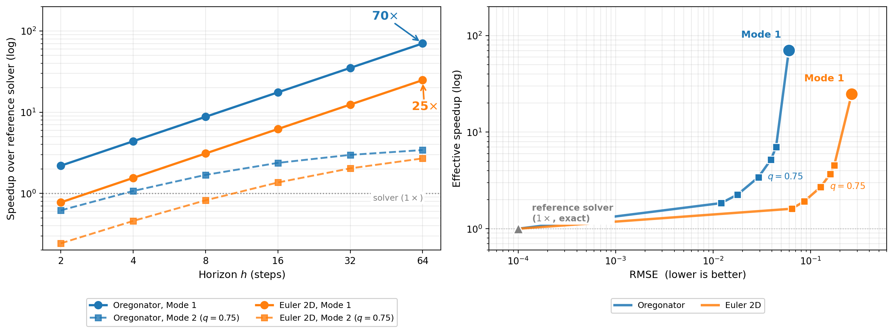

<a class="back-btn" href="../">← 返回 2026-05-28</a>

# 混合神经世界模型：物理动力学的高效代理与误差感知

### Hybrid Neural World Models

👀
⭐ 6.0
world-model
2605.28317

📄 <a href="http://arxiv.org/abs/2605.28317v1">arXiv 摘要页</a> &nbsp;·&nbsp; 📑 <a href="https://arxiv.org/pdf/2605.28317v1">PDF 全文</a>

*Pranav Lakshmanan, Paras Chopra*

<figure markdown>
  
  <figcaption>Figure 1: Wall-clock speed comparison for hybrid neural world models. (a) CPU-CPU wall-clock speedup vs horizon for Mode 1 (surrogate alone, solid) and Mode 2 (with trust-aware fallback at q=0.75, dashed); the two PDE environments reach 25×</figcaption>
</figure>

## 💡 关键 Tricks

- ⭐ 核心 — **连续时间跨度条件：单个网络通过直接监督学习预测任意未来状态，支持多时间跨度预测，无需多个模型。**
- 隐式误差图提取：从网络前向传播中提取每轨迹误差图，无需额外训练或标签，自动聚焦于不连续区域（激波、接触等）。
- 双模式运行：模式1单独运行代理实现高吞吐量（CPU加速26-72倍）；模式2利用误差图触发参考求解器回退，降低残差误差约一半。
- 无需校准集或控制方程知识：误差图与标准无标签基线（深度集成、学习误差头等）相比具有竞争力或更优。

## 📝 摘要

=== "中文"

    神经代理方法有望比经典求解器大幅加速物理动力学模拟，但在激波、锋面和接触等剧烈动态事件中会无声失败。我们提出了物理动力学的混合神经世界模型：一种在物理状态空间中训练和部署多时间跨度代理的配方，其中单个具有连续时间跨度条件的网络通过直接监督（对照教科书参考求解器）进行训练，以在一次前向传播中预测任意未来状态（时间跨度T）。尽管训练数据、损失函数或架构中没有任何部分监督不连续位置，但训练后的代理隐式地对其进行了编码，仅通过其前向传播即可恢复为每轨迹误差图，该误差图集中在激波、锋面和接触上，而在其他区域保持较小。该误差图与标准无标签基线（包括深度集成、学习误差头、梯度幅度指示器和局部自适应共形预测）相比具有竞争力或更优，且仅使用单个训练网络，无需校准集或控制方程知识。该配方支持两种运行模式。模式1单独运行代理以获得最大吞吐量，在PDE环境中与教科书求解器相比，相同硬件上的CPU加速比为26倍至72倍。模式2使用误差图来触发参考求解器回退，推迟不确定的轨迹，并在默认工作点将代理的残差误差大致减半。该配方无需修改即可应用于反应扩散、可压缩欧拉和刚体碰撞动力学。

=== "English"

    Neural surrogates promise large speedups over classical solvers for physical dynamics but fail silently at sharp dynamical events such as shocks, fronts, and contact. We present hybrid neural world models for physical dynamics: a recipe for training and deploying multi-horizon surrogates in physical state space, where a single network with continuous horizon conditioning is trained with direct supervision against textbook reference solvers to predict any future state at horizon T in one forward pass. Although no part of the training data, loss function, or architecture supervises discontinuity location, the trained surrogate encodes it implicitly, recoverable from its forward passes alone as a per-trajectory error map that concentrates on shocks, fronts, and contacts, and stays small elsewhere. The map is competitive with or better than standard label-free baselines including deep ensembles, learned error heads, gradient-magnitude indicators, and locally-adaptive conformal prediction, while using only a single trained network and requiring no calibration set or governing-equation knowledge. The recipe supports two operating points. Mode 1 runs the surrogate alone for maximum throughput, with same-hardware CPU speedups of 26x to 72x against textbook solvers on the PDE environments. Mode 2 uses the error map to gate a reference-solver fallback, deferring uncertain trajectories and roughly halving the surrogate's residual error at the default operating point. The recipe applies without modification across reaction-diffusion, compressible Euler, and rigid-body collision dynamics.

## 🔗 与已有工作的关系

与传统的神经代理方法（如深度集成、学习误差头）相比，本文提出的混合神经世界模型通过隐式误差图实现了对不连续位置的自动检测，无需额外训练或校准集。与基于物理信息的神经网络（PINNs）不同，本文方法直接监督参考求解器输出，而非偏微分方程残差。与多模型集成或贝叶斯方法相比，本文仅需单个网络，计算开销更低。

👀 锐评

方法设计巧妙，隐式误差图的概念新颖且实用，双模式运行兼顾了速度与精度。实验覆盖了多种物理系统，加速比显著。但误差图的有效性依赖于参考求解器的准确性，在参考求解器本身不精确时可能失效。此外，模式2中回退策略的阈值如何选择未详细讨论，可能影响实际部署的鲁棒性。

---

**Tags**: `world-model` `neural-surrogate` `physical-dynamics` `error-detection` `hybrid-model`
