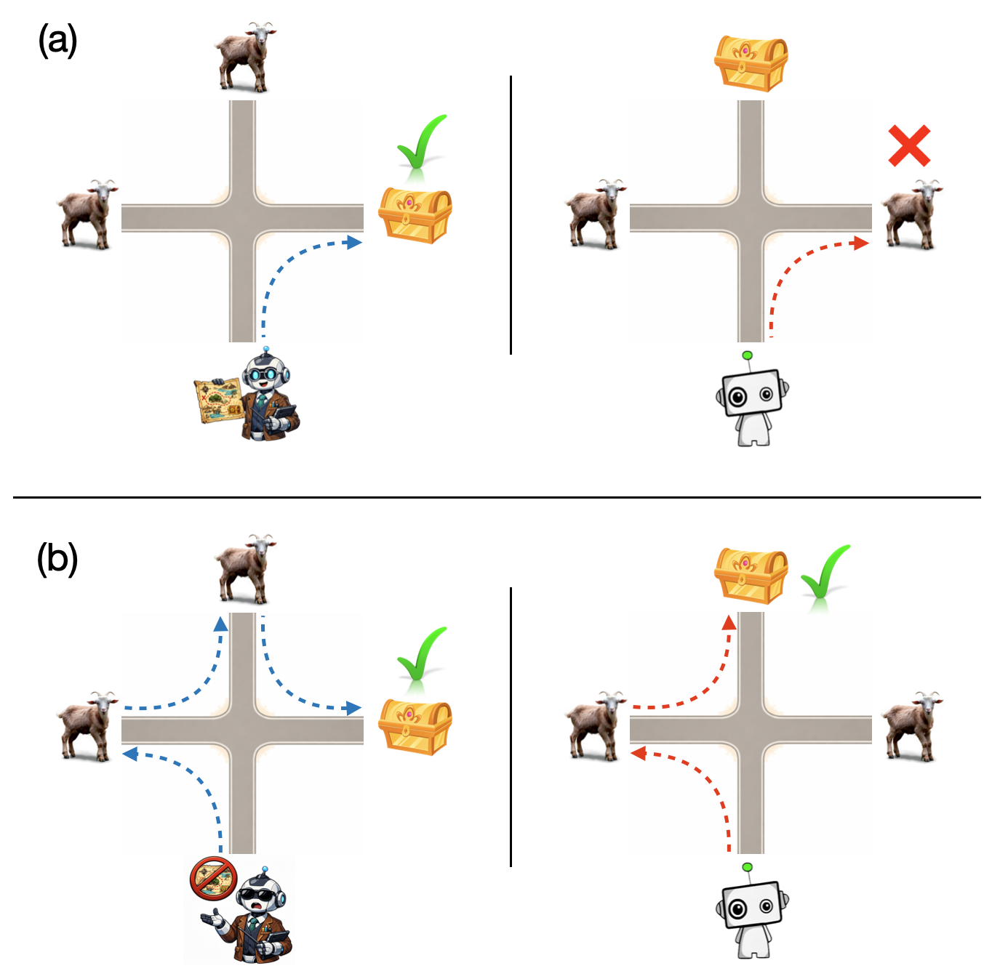

<a class="back-btn" href="../">← 返回 2026-05-28</a>

# 共享嵌入空间减少师生模仿差距

### Teacher-Student Representational Alignment for Reinforcement Learning-Driven Imitation Learning

👀
⭐ 8.0
policy-learning
ICRA 2026 Workshop
2605.28372

📄 <a href="http://arxiv.org/abs/2605.28372v1">arXiv 摘要页</a> &nbsp;·&nbsp; 📑 <a href="https://arxiv.org/pdf/2605.28372v1">PDF 全文</a>

*Meraj Mammadov, Pedro Zuidberg Dos Martires, Johannes Andreas Stork*

<figure markdown>
  
  <figcaption>Fig. 1: Illustration of the imitation gap: (a) Training the teacher (left) and student (right) in isolation leads to non- imitable teacher behavior in presence of private information, such as the goal location. (b) Our approach automaticall</figcaption>
</figure>

## 💡 关键 Tricks

- ⭐ 核心 — **通过自监督对比学习训练共享嵌入空间，隐藏智能体特定观测，使教师策略天然可模仿。**
- 限制梯度从共享嵌入空间更新编码器，防止教师提取私有信息。
- 在教师策略训练期间并行学习共享嵌入空间，无需事后RL微调。

## 📝 摘要

=== "中文"

    从基于状态的强化学习（RL）策略进行模仿学习（IL）是克服机器人复杂高维观测空间中维度灾难的常用方法。本文解决了当教师和学生策略独立学习时出现的不可约模仿差距，即教师策略可以依赖学生无法从观测中推断的特权状态信息。我们提出了一种新算法，学习一个共享嵌入空间，隐藏智能体特定观测，从而通过构造训练可模仿的教师策略，而不是在IL后通过RL微调来改善学生性能（这通常需要全新的训练设置）。我们通过自监督对比学习与教师策略并行训练共享嵌入空间，并通过限制其梯度更新编码器来防止提取私有信息。我们在多个示例领域上进行了评估，并与最先进的基线进行了比较，结果表明我们的算法能够实现更高的学生性能，并显著减少模仿差距。

=== "English"

    Imitation learning (IL) from a state-based reinforcement learning (RL) policy is a common approach to overcome the curse of dimensionality in complex and high-dimensional observation spaces prevalent in robotics. This paper addresses the irreducible imitation gap that emerges when teacher and student are learned in isolation, and the teacher policy has the liberty to rely on privileged state information that the student cannot infer from its observations. Instead of improving poor student performance with RL finetuning after IL, which often requires a whole new training setup, we propose a novel algorithm which learns a shared embedding space that hides agent-specific observations and thus trains imitable teacher policies by construction. We train the shared embedding space with self-supervised contrastive learning in parallel to the teacher policy and prevent it from extracting private information by limiting its gradients from updating the encoder networks. We perform evaluations on several example domains and compare to state-of-the-art baselines showing that our algorithm enables higher student performance with substantially reduced imitation gap.

## 🔗 与已有工作的关系

与传统模仿学习（如行为克隆）相比，该方法通过共享嵌入空间减少教师特权信息导致的模仿差距，避免了事后RL微调（如DAgger或RL fine-tuning）。与GAIL等对抗式IL方法不同，本文不依赖判别器，而是通过对比学习对齐表示。

👀 锐评

想法简洁有效，共享嵌入空间加梯度限制的设计有洞察力，实验在多个领域验证了模仿差距的减小。但论文仅6页，实验规模较小（未提及真实机器人），且对比基线可能不够全面（如未与GAIL或SQIL比较）。此外，共享嵌入空间是否完全消除私有信息仍需理论保证。

---

**Tags**: `imitation-learning` `reinforcement-learning` `representation-learning` `contrastive-learning` `robotics`
