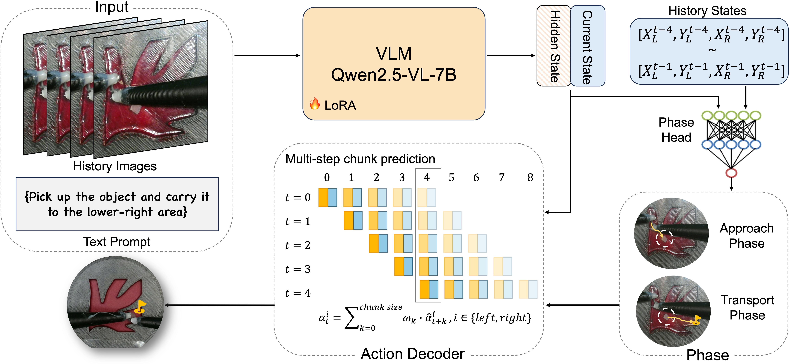

<a class="back-btn" href="../">← 返回 2026-05-28</a>

# 双机械臂磁控微机器人的VLA模型

### Mag-VLA: Vision-Language-Action Model for Bimanual Magnetically Actuated Microrobot Manipulation

👀
⭐ 9.0
VLA
2026 MARSS
2605.28486

📄 <a href="http://arxiv.org/abs/2605.28486v1">arXiv 摘要页</a> &nbsp;·&nbsp; 📑 <a href="https://arxiv.org/pdf/2605.28486v1">PDF 全文</a>

*Yongchen Wang, Kangyi Lu, Lan Wei, Dandan Zhang*

<figure markdown>
  
  <figcaption>Fig. 2. Overview of the proposed Mag-VLA framework. A history of four RGB observations and a language instruction are encoded by a LoRA-adapted Qwen2.5-VL-7B backbone. The resulting multimodal hidden states are augmented with the current ro</figcaption>
</figure>

## 💡 关键 Tricks

- ⭐ 核心 — **采用Qwen2.5-VL-7B作为视觉语言骨干，通过LoRA微调，实现视觉-语言到动作的映射。**
- 引入运动感知相位分类器，根据任务进度动态切换控制策略，提升多步操作的连贯性。
- 使用相位条件化的Action Chunking Transformer (ACT)解码器，生成时间上一致的动作序列。
- 构建遥操作数据集，覆盖三种任务配置，支持双机械臂协同的磁控微操作。

## 📝 摘要

=== "中文"

    磁驱动微机器人作为无线、非接触式微尺度操作工具，在微创应用中具有潜力。然而，由于间接驱动、有限传感和非线性磁相互作用，其控制仍具挑战。本文提出Mag-VLA，一种用于灵巧磁控微机器人操作的视觉-语言-动作（VLA）模型，使用两个装有磁铁的机械臂构建动态磁场。双机械臂协调实现了单臂难以完成的微机器人重定向等能力，但也引入了耦合控制挑战，策略需在共享工作空间内为两个执行器生成协调轨迹。我们的框架采用Qwen2.5-VL-7B骨干网络，通过低秩适应（LoRA）处理视觉观察和语言指令以预测动作。为捕捉任务进展，我们引入运动感知相位分类器和相位条件化的动作分块变换器（ACT）解码器，实现时间上连贯的多步控制。我们还构建了一个遥操作磁控微机器人操作数据集，涵盖三种任务配置。消融实验表明，基于ACT的解码器显著优于其他生成式动作头。在真实机器人实验中，Mag-VLA在所有任务中达到90%的接近成功率，运输成功率随任务难度增加分别为80%、70%和50%。这些结果表明，层次化VLA建模为磁控微机器人操作提供了一个有前景的框架。

=== "English"

    Magnetically actuated microrobots have been used as wireless, non-contact manipulation tools at microscales, making them promising for minimally invasive applications. However, their control remains challenging due to indirect actuation, limited sensing, and nonlinear magnetic interactions. In this work, we propose Mag-VLA, a vision-language-action (VLA) model for dexterous magnetic microrobot manipulation using two robotic arms with mounted magnets for dynamic magnetic-field construction. Bimanual coordination enables capabilities such as microrobot reorientation that are difficult or infeasible with a single arm, but it also introduces coupled control challenges, as the policy must generate coordinated trajectories for both actuators within a shared workspace. Our framework adapts a Qwen2.5-VL-7B backbone using Low-Rank Adaptation (LoRA) to process visual observations and language instructions for action prediction. To capture task progression, we introduce a motion-aware phase classifier and a phase-conditioned Action Chunking Transformer (ACT) decoder for temporally coherent multi-step control. We further construct a teleoperated magnetic microrobot manipulation dataset covering three task configurations. Ablation studies show that the ACT-based decoder substantially outperforms alternative generative action heads. In real-robot experiments, Mag-VLA achieves a 90% approach success rate across all tasks and transport success rates of 80%, 70%, and 50% as task difficulty increases. These results demonstrate that hierarchical VLA modeling provides a promising framework for magnetic microrobot manipulation.

## 🔗 与已有工作的关系

与现有VLA模型（如OpenVLA）相比，Mag-VLA针对双机械臂磁控微操作这一特定场景，引入了相位分类器和ACT解码器以处理多步协调控制。与传统模仿学习方法相比，该方法利用预训练视觉语言模型和LoRA微调，减少了数据需求并提升了泛化能力。

👀 锐评

针对磁控微机器人这一小众但实际的应用场景，Mag-VLA展示了VLA模型在非传统机器人平台上的可行性，实验设计考虑了任务难度梯度，结果有说服力。但论文声称的“层次化VLA建模”本质上只是将相位分类器作为条件输入到ACT，创新性有限，更像是一个工程组合。此外，数据集规模未提及，且仅在单一平台验证，泛化性存疑。

---

**Tags**: `vla` `microrobot` `bimanual` `magnetic-actuation` `action-chunking`
